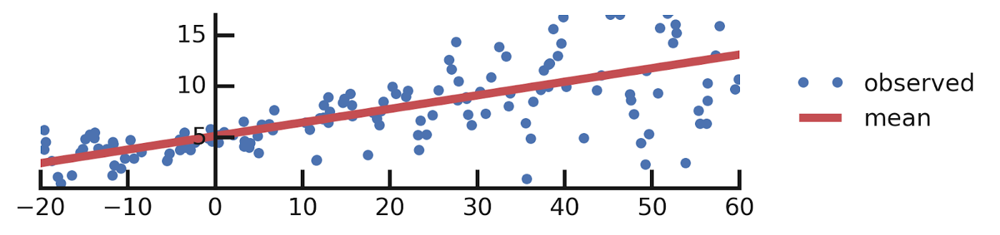

# Bayesian Neural Network

The usual Neural Network are optimized in way to get fixed value of weights and biases that allows the model perform specific task successfully. Instead in 
Bayesian Neural Network the weights and biases are the distribution, this type of model could be treated as a ensemble of many neural networks trained by the Bayesian inference.

Bayesian approach for the neural networks allows to estimate the uncertainty and make the decision of the model more robust according to the input data.


### Difference between usual NN and BNN


### Training of NN and BNN
=== "NN"
    
    The parameters   are optimized in order to minimaze the loss function

=== "BNN"
    
     The process is to learn the probability distributions for weights and biases that maximize the likelihood of getting a high probability for the correct data/label  ) pairs.
    The parameters of the weights distributions - mean and standart deviation are the product of the loss function optimization

#### Training Procedure
    1. Introduce the prior distribution over model parameter w
    2. Compute posterio p(w|D) using Bayesian rule
    3. Make the average over the posterior distribution


### Prediction of NN and BNN
=== "NN"
    

=== "BNN"
    


### Uncertainty
The uncertainty that are quatified by the BNN are categorized in the next way:
=== "Alletonic"
    Alletonic - uncertainties due to the lack of knowledge, comes from data or enviroment 
     )
=== "Epistemic"
    Epistemic - uncertainties of the model parameter 
    )


## Packages
The are several packages for the probabilistic neural network, the tensorflow probability and pyro are the most consistent

=== "Tensorflow"
    ```python linenums="1"  
        pip install --upgrade tensorflow-probability
    ```
=== "Pyro"
    ```python linenums="1"  
        pip install pyro
    ```


## Modules Description:

### Distribution and sampling

=== "Tensorflow"

=== "Pyro"

### Distribution and sampling

=== "Tensorflow"

=== "Pyro"


Let's consider simple linear regression as an example and compare it to the bayesian analog.

## Linear Regression

Lets consider simple dataset D(x, y) and we want to fit some linear function:
y=ax+b+e, where a,b are learnable parameters and e is observation noise.

### Synthetic dataset
=== "Synthetic dataset"
    ```python linenums="1"

    import numpy as np
    w0 = 0.125
    b0 = 5.
    x_range = [-20, 60]

    def load_dataset(n=150, n_tst=150):
        np.random.seed(43)
        def s(x):
            g = (x - x_range[0]) / (x_range[1] - x_range[0])
            return 3 * (0.25 + g**2.)
        x = (x_range[1] - x_range[0]) * np.random.rand(n) + x_range[0]
        eps = np.random.randn(n) * s(x)
        y = (w0 * x * (1. + np.sin(x)) + b0) + eps
        x = x[..., np.newaxis]
        x_tst = np.linspace(*x_range, num=n_tst).astype(np.float32)
        x_tst = x_tst[..., np.newaxis]
        return y, x, x_tst

    y, x, x_tst = load_dataset()
    ```

### Probabilistic Linear regression
=== "tensorflow_probability"

    Let's consider you write your network model in a single `tf.function`.

    ```python linenums="1"
    import tensorflow as tf
    import tensorflow_probability as tfp
    tfd = tfp.distributions

    # Build model.
    model = tf.keras.Sequential([
    tf.keras.layers.Dense(1),
    tfp.layers.DistributionLambda(lambda t: tfd.Normal(loc=t, scale=1)),
    ])

    # Define the loss:
    negloglik = lambda y, rv_y: -rv_y.log_prob(y)

    # Do inference.
    model.compile(optimizer=tf.optimizers.Adam(learning_rate=0.05), loss=negloglik)
    model.fit(x, y, epochs=500, verbose=False)

    # Make predictions.
    yhat = model(x_tst)
    ```
    
=== "pyro"

    ```python linenums="1"
    # coding: utf-8

    from pyro.nn import PyroSample

    # Specify model.

    class BayesianRegression(PyroModule):
        def __init__(self, in_features, out_features):
            super().__init__()
            self.linear = PyroModule[nn.Linear](in_features, out_features)
            self.linear.weight = PyroSample(dist.Normal(0., 1.).expand([out_features, in_features]).to_event(2))
            self.linear.bias = PyroSample(dist.Normal(0., 10.).expand([out_features]).to_event(1))

        def forward(self, x, y=None):
            sigma = pyro.sample("sigma", dist.Uniform(0., 10.))
            mean = self.linear(x).squeeze(-1)
            with pyro.plate("data", x.shape[0]):
                obs = pyro.sample("obs", dist.Normal(mean, sigma), obs=y)
            return mean


    # Build model.
    model = BayesianRegression()

    # Fit model given data.
    coeffs, linear_response, is_converged, num_iter = tfp.glm.fit(
    model_matrix=features[:, tf.newaxis],
    response=tf.cast(labels, dtype=tf.float32),
    model=model)
    # ==> coeffs is approximately [1.618] (We're golden!)

    # Do inference.
    model.compile(optimizer=tf.optimizers.Adam(learning_rate=0.01), loss=negloglik)
    model.fit(x, y, epochs=1000, verbose=False);

    # Profit.
    [print(np.squeeze(w.numpy())) for w in model.weights];
    yhat = model(x_tst)
    assert isinstance(yhat, tfd.Distribution)

    ```


The output of the model:




## Variational Autoencoder

The generative models could be build using the bayesian neural network.
The Variantional Autoencoder is the popular way for data synthethis.

Let's consider the example of generating the images:

The generating process consist of two steps:

1. Samling the latent variable from prior distribution

2. Drawing the sample from stochastic process ) 

Objective:

) the prior on the latent representation  ,
), the variational encoder, and
), the decoder — how likely is the image x given the latent representation z.

### Loss

Once we define the procedure for the generation process the Objective function should be chosen for the optimization process. In order to train the network, we maximize the ELBO (Evidence Lower Bound) objective.


### Prior
p(z), the prior on the latent representation z,

q(z|x), the variational encoder, and

p(x|z), the decoder — how likely is the image x given the latent representation z.


### Encoder and Decoder
=== "tensorflow"

    ```python linenums="1"
    ```
=== "pyro"

    ```python linenums="1"
    ```

### Training
=== "tensorflow"

    ```python linenums="1"
    ```
=== "pyro"

    ```python linenums="1"
    ```


### Results
=== "tensorflow"

    ```python linenums="1"
    ```
=== "pyro"

    ```python linenums="1"
    ```


## Normalizing Flows

### Defition

=== "tensorflow"

    ```python linenums="1"
    ```
=== "pyro"

    ```python linenums="1"
    ```

### Training
=== "tensorflow"

    ```python linenums="1"
    ```
=== "pyro"

    ```python linenums="1"
    ```

### Inference
=== "tensorflow"

    ```python linenums="1"
    ```
=== "pyro"

    ```python linenums="1"
    ```

## Resources


### Bayesian NN

    1. https://arxiv.org/pdf/2007.06823.pdf
    2. http://krasserm.github.io/2019/03/14/bayesian-neural-networks/
    3. https://arxiv.org/pdf/1807.02811.pdf

### Normalizing Flow:

    1. https://arxiv.org/abs/1908.09257
    2. https://arxiv.org/pdf/1505.05770.pdf

### Variational AutoEncoder:

    1. https://arxiv.org/abs/1312.6114
    2. https://pyro.ai/examples/vae.html
    3. https://www.tensorflow.org/probability/examples/Probabilistic_Layers_VAE


