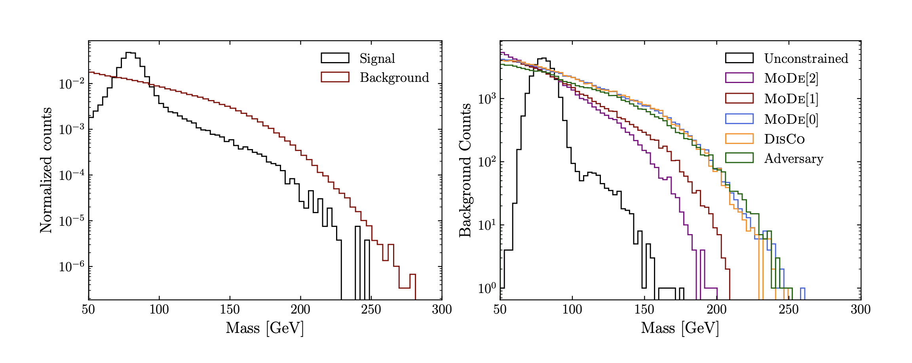

After the necessary steps to design the ML experiment has been made, the training has been performed and verified to be stable and consistent, there are still a few things to be checked to further solidify the confidence in the model performance.

## Final evaluation

Before the training, initial data set is to be [split](../before/inputs.md) into the train and test parts, where the former is used to train the model (possibly, with [cross-validation](../during/xvalidation.md)), while the latter remains blinded. Once all the optimisations to the model architecture have been made and the model is "frozen", one proceeds to the **evaluation of the metrics' values on the test set**. This would be the very last check of the model for overfitting and in case there is none, one expects to see little or no difference comparing to the values on (cross)validation set used throughout the training. In turn, any discrepancies could point to possible overfitting happening in the training stage (or also possibly [data leakage](https://en.wikipedia.org/wiki/Leakage_(machine_learning))), which requires further investigation.

The next step to check is the output score of the model (probability[^1]) for each class. It can be done, for example, in the form of a TMVA-like overtraining check (see Figure 1) which also allows to spot overtraining:

<figure>

<figcaption>Figure 1.  Comparison of model output for signal and background classes overlaid for train and test data sets. [source: root-forum.cern.ch]</figcaption>
</figure>

In general, what is important to look at is that in the category for class C (defined as `argmax(score_i)`), the score for a class C peaks at values closer to 1. Whereas the other classes doesn't have such property with peaking on the left side of 1 and smoothly falling down to zero as the model score in the category approaches 1. Or, in other words, that the distributions of the **model score for various classes are not overlapping** and are as far apart as possible. This would be an indication that the model indeed distinguishes between the classes.

Another thing to look at is the **data/simulation agreement for class categories**. Since it is the output of the model for each category which is used in further statistical inference step, it is important to verify that data/simulation agreement of input features is properly propagated through the model into categories' distribution. This can be achieved by producing the plot similar to the one shown on Figure 2: the stacked templates for backround processes are fitted and compared with the actual predictions for the data for the set of events classified to be in the given category (jet-fakes in the example). If the output data/simulation agreement is worse than the input one, it might point to an existing bias of the model in the way it treats data and simulation events.

<figure>

<figcaption>Figure 2.  Postfit jet-fake NN score for the mutau channel. Note that the distribution for jet-fakes class is dominant in this category and also peaks at value 1 (mind the log scale), which is an indication of good identification of this background process by the model. Furthermore, ratio of data and MC templates is equal to 1 within uncertainties. [source: CMS-PAS-HIG-20-006]</figcaption>
</figure>

## Robustness

Once there is high confidence that the model isn't overtrained and no distortion in the input feature data/MC agreement is introduced, one can consider studying the robustness of the model to the parameter/input variations. Effectively, the model can be considered as a "point estimate", and any **variations are helpful to understand the variance of the model outputs** - hence, the model's robustness to changes.

A simple example would be a hyperparameter optimisation, where various model parameters a varied to find the best one in terms of performance. Moreover, in HEP there is a helpful (for this particular case) notion of **systematic uncertainties**, which is a perfect tool to study model robustness to input data variations.

Since in any case they need to be incorporated into the final statistical fit (to be performed on some interpretation of the model score), it implies that these uncertainties need to be "propagated" through the model. A sizeable fraction of those uncertainties are so-called "up/down" (or shape) variations, and therefore it is a good opportunity to study, how the model output responds to those up/down input feature changes. If there is a high sensitivity observed, one need to consider removing the most influencing feature from the training, or trying [decorrelation techniques](https://arxiv.org/abs/2010.09745) to decrease the impact of systematic-affected feature on the model output.

## Systematic biases

Lastly, possible systematic biases arising the ML approach should be estimated. Being a broad and not fully formalised topic, a few examples will be given below to outline the possible sources of those.

* The first one could be a [**domain shift**](../before/domains.md), that is the situation where the model is trained on one data domain, but is apllied to a different one (e.g. trained on simulated data, applied on real one). In order to account for that, corresponding scale factor corrections are traditionally derived, and those will come with some uncertainty as well.  
* Another example would be the case of **undertraining**. Consider the case of fitting a complex polynomial data with a simple linear function. In that case, the model has high bias (and low variance) which results in a systematic shift of its prediction to be taken into account.
* Care needs to be taken in cases where a **cut is applied on the model output**. Cuts might potentially introduce shifts and in case of the model score, which is a variable with a complex and non-linear relationship with input features, it might create undesirable biases. For example, in case of cutting on the output score and looking at the invariant mass distribution (e.g. of two jets), one can observe an effect which is known as [mass sculpting](https://arxiv.org/pdf/1603.00027.pdf) (see Figure 3). In that case, the background distribution peaks at the mass of the signal resonance used as a signal in the classification task. After applying such cut, signal and background shapes overlap and become very similar, which dillutes the discrimination power between two hypotheses if invariant mass was to be used as the observable to be fitted.

<figure>

<figcaption>Figure 3.  Left: Distributions of signal and background events without selection. Right: Background distributions at 50% signal efficiency (true positive rate) for different classifiers. The unconstrained classifier sculpts a peak at the W-boson mass, while other classifiers do not. [source: arXiv:2010.09745]</figcaption>
</figure>

[^1]: Here it is assumed that it can be treated as probability to be assigned to a given class. This is mostly the case if there is a sigmoid/softmax used on the output layer of the neural network and the model is trained with a cross-entropy loss function.
