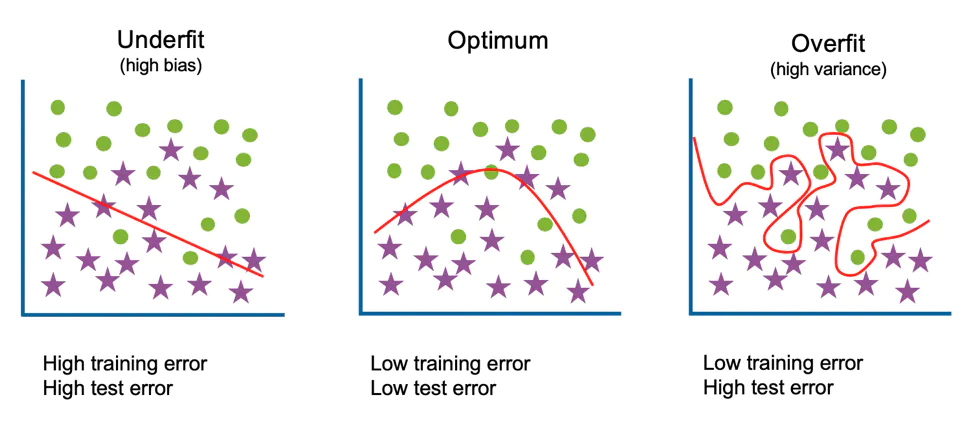

After data is preprocessed as a whole, there is a question of how this data should be supplied to the model. On its way there it potentially needs to undergo a few splits which will be described below. Plus, a few additional comments about training weights and motivation for their choice will be outlined.

## Data split

The first thing one should consider to do is to **perform a split of the entire data set into train/validation(/test) data sets.** This is an important one because it serves the purpose of diagnosis for _overfitting_. The topic will be covered in more details in the corresponding [section](../during/overfitting.md) and here a brief introduction will be given.

<figure>

<figcaption>Figure 1.  Decision boundaries for underfitted, optimal and overfitted models. [source: ibm.com/cloud/learn/overfitting]</figcaption>
</figure>

The trained model is called to be **overfitted** (or overtrained) when it fails to generalise to solve a given problem.

One of examples would be that the model learns to predict _exactly_ the training data and once given a new unseen data drawn from the same distribution it fails to predict the target corrrectly (right plot on Figure 1). Obviously, this is an undesirable behaviour since one wants their model to be "universal" and provide robust and correct decisions regardless of the data subset sampled from the same population.

Hence the solution to check for ability to generalise and **to spot overfitting**: test a trained model on a separate data set, which is the same[^1] as the training one. If the model performance gets significantly worse there, it is a sign that something went wrong and the model's predictive power isn't generalising to the same population.       

<figure>

<figcaption>Figure 2.  Data split worflow before the training. Also cross-validation is shown as the technique to find optimal hyperparameters. [source: scikit-learn.org/stable/modules/cross_validation.html]</figcaption>
</figure>

Clearly, the simplest way to find this data set is to put aside a part of the original one and leave it untouched until the final model is trained - this is what is called "test" data set in the first paragraph of this subsection. When the model has been finalised and optimised, this data set is "unblinded" and model performance on it is evaluated. Practically, this split can be easily performed with [`train_test_split()`](https://scikit-learn.org/stable/modules/generated/sklearn.model_selection.train_test_split.html) method of `sklearn` library.

??? warning "But it might be not that simple"
    Indeed, there are few things to be aware of. Firstly, there is a question of how much data needs to be left for validation. Usually it is common to take the test fraction in the range [0.1, 0.4], however it is mostly up for analyzers to decide. The important trade-off which needs to be taken into account here is that between robustness of the test metric estimate (too small test data set - poorly estimated metric) and robustness of the trained model (too little training data - less performative model).

    Secondly, note that the split should be done in a way that each subset is as close as possible to the one which the model will face at the final inference stage. But since usually it isn't feasible to bridge the [gap between domains](domains.md), the split at least should be uniform between training/testing to be able to judge fairly the model performance.

    Lastly, in extreme case there might be no sufficient amount of data to perform the training, not even speaking of setting aside a part of it for validation. Here a way out would be to go for a [few-shot learning](https://research.aimultiple.com/few-shot-learning/), [using cross-validation](../during/xvalidation.md) during the training, [regularising the model](https://en.wikipedia.org/wiki/Regularization_(mathematics)) to avoid overfitting or to try to find/generate more (possibly similar) data.

Lastly, one can also considering to put aside yet another fraction of original data set, what was called "validation" data set. This can be used to monitor the model during the training and more details on that will follow in the [overfitting](../during/overfitting.md) section.

## Batches
Usually it is the case the training/validation/testing data set can't entirely fit into the memory due to a large size. That is why it gets split into _batches_ (chunks) of a given size which are then fed one by one into the model during the training/testing.

> While forming the batches it is important to keep in mind that **batches should be sampled uniformly** (i.e. from the same underlying PDF as of the original data set).

That means that each batch is populated similarly to the others according to features which are important to the given task (e.g. particles' pt/eta, number of jets, etc.). This is needed to ensure that gradients computed for each batch aren't different from each other and therefore the gradient descent doesn't encounter any sizeable stochasticities during the optimisation step.[^2]

Lastly, it was already mentioned that one should perform preprocessing of the data set prior to training. However, this step can be substituted and/or complemented with an addition of a layer into the architecture, which will essentially do a specified part of preprocessing on every batch as they go through the model. One of the most prominent examples could be an addition of [batch/group normalization](https://arxiv.org/abs/1803.08494), coupled with [weight standardization layers](https://arxiv.org/abs/1903.10520) which turned out to sizeably boost the performance on the large variety of benchmarks.

## Training weights
Next, one can zoom into the batch and consider the level of single entries there (e.g. events). This is where the training weights come into play. Since the value of a loss function for a given batch is represented as a sum over all the entries in the batch, this sum can be naturally turned into a weighted sum. For example, in case of a cross-entropy loss with `y_pred`, `y_true`, `w` being vectors of predicted labels, true labels and weights respectively:

```python
def CrossEntropy(y_pred, y_true, w): # assuming y_true = {0, 1}
    return -w*[y_true*log(y_pred) + (1-y_true)*log(1-y_pred)]
```

It is important to disentangle here two factors which define the weight to be applied on a per-event basis because of the different motivations behind them:

* accounting for imbalance in _training data_
* accounting for imbalance in _nature_

### Imbalance in training data
The first point is related to the fact, that in case of classification we may have significantly more (`>O(1)` times) training data for one class than for the other. Since the training data usually comes from MC simulation, that corresponds to the case when there is more events generated for one physical process than for another. Therefore, here we want to make sure that model is equally presented with instances of each class - this may have a significant impact on the model performance depending on the loss/metric choice.

??? example "Example"
    Consider the case when there is 1M events of `target = 0` and 100 events of `target = 1` in the training data set and a model is fitted by minimising cross-entropy to distinguish between those classes. In that case the resulted model can easily turn out to be a constant function predicting the majority `target = 0`, simply because this would be the optimal solution in terms of the loss function minimisation. If using accuracy as a metric for validation, this will result in a value close to 1 on the training data.

To account for this type of imbalance, the following weight simply needs to be introduced according to the `target` label of an object:
```python
train_df['weight'] = 1
train_df.loc[train_df.target == 0, 'weight'] /= np.sum(train_df.loc[train_df.target == 0, 'weight'])
train_df.loc[train_df.target == 1, 'weight'] /= np.sum(train_df.loc[train_df.target == 1, 'weight'])
```

Alternatively, one can consider using other ways of balancing classes aside of those with training weights. For a more detailed description of them and also a general problem statement see `imbalanced-learn` [documentation](https://imbalanced-learn.org/stable/user_guide.html).

### Imbalance in nature
The second case corresponds to the fact that in experiment we _expect_ some classes to be more represented than the others. For example, the signal process usually has way smaller cross-section than background ones and therefore we expect to have in the end fewer events of the signal class. So the motivation of using weights in that case would be to augment the optimisation problem with additional knowledge of expected contribution of physical processes.

Practically, the notion of expected number of events is incorporated into the weights per physical process so that the following conditions hold[^3]:


As a part of this reweighting, one would naturally need to perform the normalisation as of the previous point, however the difference between those two is something which is worth emphasising.

[^1]: That is, sampled independently and identically (i.i.d) from the same distribution.
[^2]:  Although this is a somewhat intuitive statement which may or may not be impactful for a given task and depends on the training procedure itself, it is advisable to keep this aspect in mind while preparing batches for training.  
[^3]: See also Chapter 2 of the [HiggsML overview document](https://higgsml.lal.in2p3.fr/files/2014/04/documentation_v1.8.pdf)
