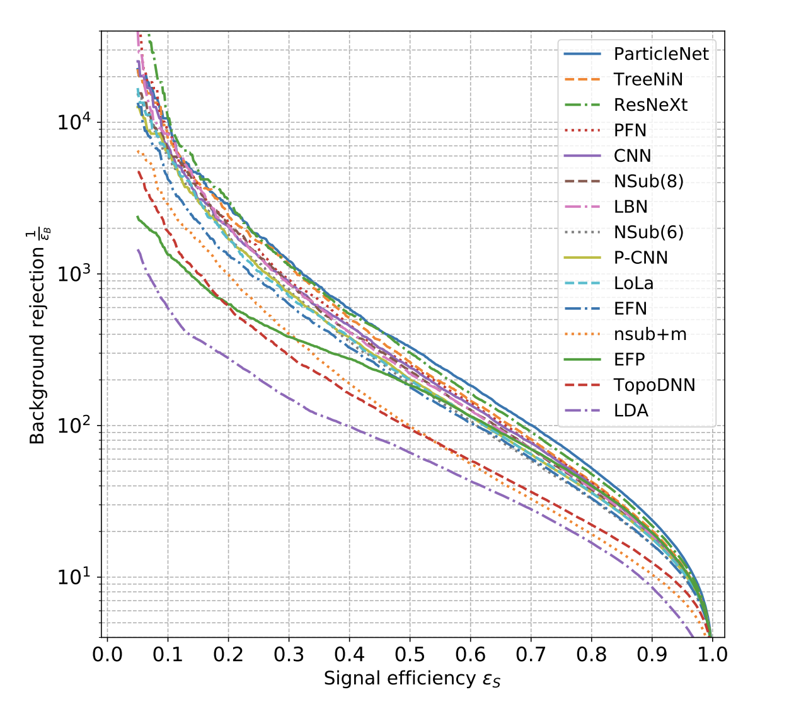

There is definitely an enormous variety of ML models available on the market, which makes the choice of a suitable one for a given problem at hand not entirely straightforward. So far being to a large extent an experimental field, the general advice here would be to **try various** and pick the one giving the best *physical* result.

However, there are in any case several common remarks to be pointed out, all glued together with a simple underlying idea:

> Start off from a simple baseline, then gradually increase the complexity to improve upon it.

1. In the first place, one need to carefully consider whether there is a need for training an ML model *at all*. There might be problems where this approach would be a (time-consuming) overkill and a simple conventional statistical methods would deliver results faster and even better.

2. If ML methods are expected to bring improvement, then it makes sense to try out simple models first. Assuming a proper set of high-level features [has been selected](../../optimization/importance.md), [ensemble of trees](https://en.wikipedia.org/wiki/Ensemble_learning) (random forest/boosted decision tree) or simple [feedforward neural networks](https://en.wikipedia.org/wiki/Feedforward_neural_network) might be a good choice here. If time and resources permit, it might be beneficial to compare the results of these trainings to a no-ML approach (e.g. cut-based) to get the feeling of how much the gain in performance is. In most of the use cases, those models will be already sufficient to solve a given classification/regression problem in case of dealing with high-level variables.

3. If it feels like there is still room for improvement, try [hyperparameter tuning](../../optimization/model_optimization.md) first to see if it is possible to squeeze more performance out of the current model and data. It can easily be that the model is sensitive to a hyperparameter choice and a have a sizeable variance in performance across hyperparameter space.

4. If the hyperparameter space has been thoroughly explored and optimal point has been found, one can additionally try to play around with the data, for example, by [augmenting](../../optimization/data_augmentation.md) the current data set with more samples. Since in general the model performance profits from having more training data, augmentation might also boost the overall performance.  

5. Lastly, more advanced architectures can be probed. At this point the choice of *data representation* plays a crucial role since more complex architectures are designed to adopt more sophisticated patterns in data. While in ML research is still ongoing to [unify together](https://arxiv.org/abs/2104.13478) all the complexity of such models (and promisingly, also [using effective field theory approach](https://ai.facebook.com/blog/advancing-ai-theory-with-a-first-principles-understanding-of-deep-neural-networks/)), in HEP there's an ongoing process of probing various architectures to see which type fits the most in HEP field.

??? example "Models in HEP"
    One of the most prominent benchmarks so far is the one done by [G. Kasieczka et. al](https://arxiv.org/abs/1902.09914) on the top tagging data set, where in particular [ParticleNet](../../inference/particlenet.md) turned out to be a state of the art. This had been a yet another solid argument in favour of using [graph neural networks in HEP](https://arxiv.org/abs/2007.13681) due to its natural suitability in terms of data representation.

    <figure>
    
    <figcaption>Illustration from G. Kasieczka et. al showing ROC curves for all evaluated algorithms.</figcaption>
    </figure>
