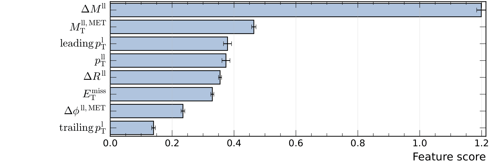
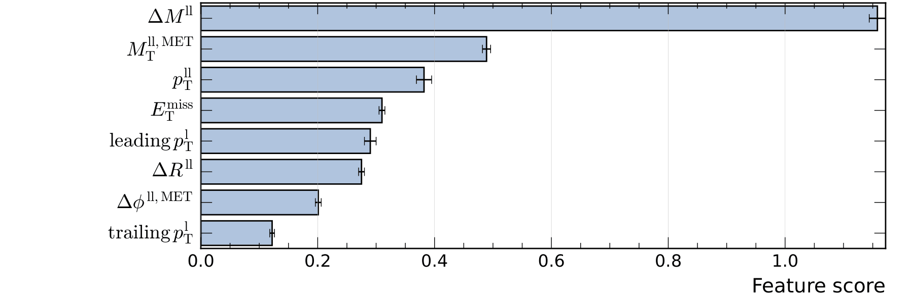

Regularization is used in machine learning models to reduce overfitting, that is, to prevent the neural network from adapting too closely to the training data and performing poorly on unseen data.
In neural networks, three commonly used methods are L1, L2, and dropout. Although all of them can reduce overfitting, they work in different ways.

### L1 Regularization

In L1 regularization, we add a term to the loss function that is proportional to the sum of the absolute values of the network weights:

\[
\mathcal{L}_{\mathrm{L1}}
=
\mathcal{L}_{\mathrm{original}}
+
\lambda \sum_i |w_i|,
\]

where \(w_i\) represents a weight in the network and \(\lambda\) controls the strength of the regularization.

An important characteristic of L1 is that it tends to produce weights that are exactly zero.
For example, imagine that a layer has weights

\[
(0.84,\;0.10,\;0.13,\;-0.05).
\]

With sufficiently strong L1 regularization, some of these weights can be made to

\[
(0.84,\;0,\;0,\;0).
\]

This results in a sparse representation. Therefore, L1 can be particularly useful when the goal is for the model to implicitly select a subset of relevant features.

### L2 Regularization

In L2 regularization, we add the sum of the squares of the weights to the loss function:

\[
\mathcal{L}_{\mathrm{L2}}
=
\mathcal{L}_{\mathrm{original}}
+
\lambda \sum_i w_i^2.
\]

Once again, \(\lambda\) determines the strength of the regularization. The network is then penalized for having weights that are too large.

Unlike L1, L2 does not typically set the weights exactly to zero. Instead, it tends to make the weights smaller:

\[
(0.8,\;0.13,\;0.04,\;-0.01).
\]

For example, they could evolve into something like

\[
(0.55,\;0.08,\;0.02,\;-0.007).
\]

The idea is to prevent certain weights from becoming too large and to reduce the extent to which the network relies excessively on certain features. L2 is one of the most commonly used forms of regularization in neural networks.

In some implementations, such as PyTorch, the effect of L2 regularization can be controlled by the optimizer’s **weight_decay** parameter. However, **weight_decay** and L2 regularization are not necessarily equivalent for all optimization algorithms, especially in the case of adaptive optimizers such as Adam.

### Dropout

Dropout works quite differently from L1 and L2. Instead of directly modifying the loss function, it modifies the network itself during training. For each example $(\mathbf{x}_i,y_i)$ presented to the network, some neurons are randomly selected to be temporarily deactivated. If the dropout rate is \(p=0.2\), for example, approximately 20% of the neurons are randomly deactivated for each example presented to the network during training.

For example, consider a layer with 5 neurons:

\[
\boxed{\mathrm{N1}}
\quad
\boxed{\mathrm{N2}}
\quad
\boxed{\mathrm{N3}}
\quad
\boxed{\mathrm{N4}}
\quad
\boxed{\mathrm{N5}}
\]

If we use an X to indicate that a neuron has been turned off due to dropout, for a dropout rate of \(p=0.2\), we can have the following configuration when an example $(\mathbf{x}_i,y_i)$ is presented to the network:

\[
\boxed{\mathrm{N1}}
\quad
\boxed{\mathrm{X}}
\quad
\boxed{\mathrm{N3}}
\quad
\boxed{\mathrm{N4}}
\quad
\boxed{\mathrm{N5}}
\]

Then, we have a new configuration when a new example $(\mathbf{x}_j, y_j)$, where $j \neq i$, is presented to the network:

\[
\boxed{\mathrm{N1}}
\quad
\boxed{\mathrm{N2}}
\quad
\boxed{\mathrm{N3}}
\quad
\boxed{\mathrm{N4}}
\quad
\boxed{\mathrm{X}}
\]

During inference, however, dropout is disabled, and the entire network is used.

Dropout prevents the network from becoming overly dependent on certain neurons or specific combinations of neurons. It forces the network to learn representations that are more robust and distributed. Dropout can be particularly useful when the network has many parameters and is highly prone to overfitting.

??? example "Example"

    Consider the case where we want to discriminate a BSM signal from the SM process in the final state with two charged leptons in events that pass the **baseline selection** defined below.

    - Two oppositely charged leptons
    - \(p^{ll}_{T} > 40\) GeV
    - \(p^\text{miss}_{T} > 65\) GeV
    - \(\Delta M^{ll} < 25\) GeV
    - \(N_\text{bjets} \geq 1\)

    The **class definitions** for this case are as follows.

    - Signal - BSM process with a Heavy Higgs $H$ production in association with a $b\bar{b}$ pair ($b\bar{b} H$), where the heavy scalar and a new pseudoscalar $a$ particles decay as $H \to Za \to (l\bar{l})(\chi \bar{\chi})$ in which $\chi$ and $\bar{\chi}$ denote a Dark Matter particle and antiparticle, respectively. The masses considered for the introduced BSM particles are $m_H = 1000\,\mathrm{GeV}$, $m_a = 100\,\mathrm{GeV}$, and $m_\chi = 45\,\mathrm{GeV}$.
    - Background - Standard Model processes including Drell-Yan, $t\bar{t}$, SingleTop, and VV. The contributions from each process are normalized to the same integrated luminosity.

    The total weights of the signal and background samples are equalised so the MLP gives both classes equal importance during training.

    The list of **input features** provided to the neural network model is shown below.

    - \( \mathrm{leading}\,p_\mathrm{T}^\mathrm{l} \) — highest lepton \(p_\mathrm{T}\) of the dilepton system;
    - \( \mathrm{trailing}\,p_\mathrm{T}^\mathrm{l} \) — lowest lepton \(p_\mathrm{T}\) of the dilepton system;
    - \(p_\mathrm{T}^\mathrm{ll}\) — dilepton \(p_\mathrm{T}\);
    - \(\Delta R^\mathrm{ll}\) — distance between the two leptons of the dilepton system in the \((\eta-\phi)\) plane;
    - \(\Delta M^\mathrm{ll}\) — absolute difference between the dilepton invariant mass, \(M^\mathrm{ll}\), and the boson \(Z\) mass value taken from the PDG;
    - \(E_\mathrm{T}^\mathrm{miss}\) — magnitude of the opposite of the vector sum of the transverse momentum of all particles \(i\) in the final state that have been detected,

    \[
    E_\mathrm{T}^\mathrm{miss} \equiv \left|-\sum_i \vec{p}_{\mathrm{T},i} \right|;
    \]

    - \(M_\mathrm{T}^\mathrm{ll,MET}\) — transverse mass of the dilepton plus MET system;
    - \(\Delta \phi^\mathrm{ll,MET}\) — azimuthal angular separation between the dilepton system and \(\vec{E}_\mathrm{T}^\mathrm{miss}\).

    During training, both signal and background samples are split, with 50% of the events used for testing and 50% for training.
    The models are trained with a maximum number of allowed iterations equal to 10000. Nevertheless, they always finish earlier when satisfying the early stopping requirement, which consists of 20 consecutive iterations without any decrease in the loss function value for the test sample. In this way, the model corresponding to the minimum loss value is selected, avoiding overfitting.

    In this example, we used a Multilayer Perceptron (MLP) model with 2 layers and 50 neurons per layer. In addition, Binary Cross Entropy (BCE) was used as the loss function, ReLU as the activation function in the hidden layers, the Adam algorithm as the optimizer, a batch size of 500 events, and a learning rate of 0.005. For this configuration, MLP models were trained with and without regularization. In the table below, we can compare the results obtained. For the models with L1 and L2 regularization, different $\lambda$ values were considered, but only the models with the best performance were included in the table, using the minimum loss value for the test sample as the metric. The AUC metric is also included in the table.

    | **Model** | **Loss** | **AUC** |
    |:----------|---------:|--------:|
    | L1 (\(\lambda = 0.0001\)) | 0.31497 | 0.943 |
    | L2 (\(\lambda = 0.001\)) | 0.31529 | 0.944 |
    | No regularization | 0.31593 | 0.944 |
    | Dropout (\(p=0.2\)) | 0.32095 | 0.942 |
    | Dropout (\(p=0.5\)) | 0.33175 | 0.940 |

    *Table: Performance of the models with and without regularization methods.*

    Using the minimum loss value as a metric, the model with L1 regularization achieved the best performance, followed by the model with L2 regularization. These results show that regularization can even slightly improve model performance in some cases. On the other hand, the models with dropout had the worst results. This shows the importance of evaluating the impact of different regularization methods on model performance. It seems that dropout, which can be more effective for more complex models, is penalizing the model performance too much in this example.

    In order to obtain information about which features contributed most to the discriminant performance, the [Permutation Importance method](../../optimization/importance.md) was used.

    <figure markdown>
    
    
    <figcaption>Feature score for the MLP model without regularization (top) and with L1 regularization (bottom).</figcaption>
    </figure>

    The plots show a reduction in the importance of the features at the bottom of the list when L1 regularization is applied. This result is probably caused by the sparse representation discussed previously, which reduces the contribution of less relevant features. The sparse representation may also explain the reduced importance of $\mathrm{leading},p_\mathrm{T}^\mathrm{l}$ and $\Delta R^\mathrm{ll}$, which have some degree of correlation with $p_\mathrm{T}^\mathrm{ll}$.

