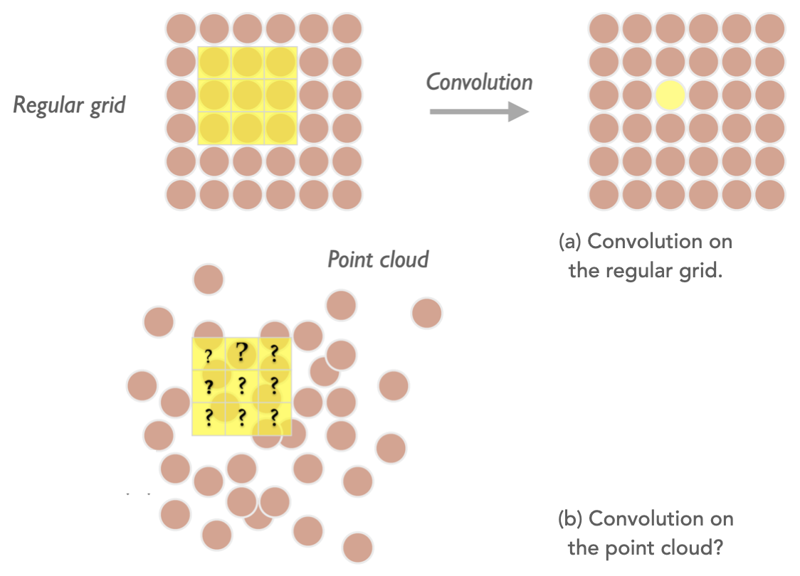
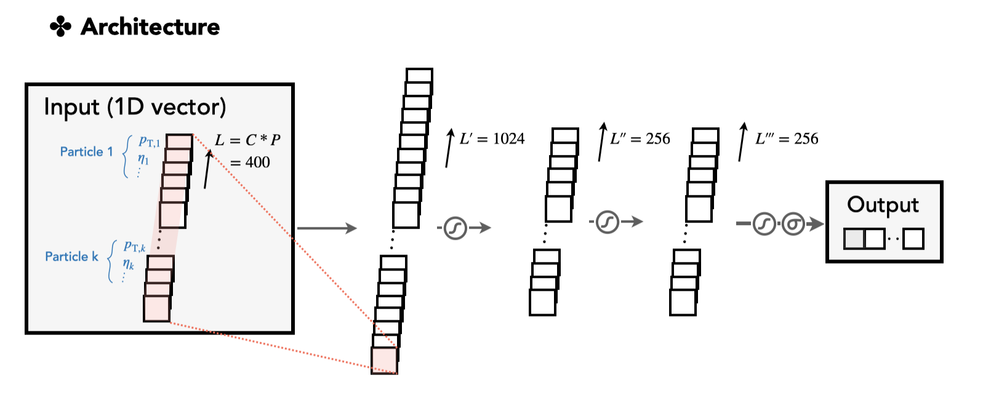
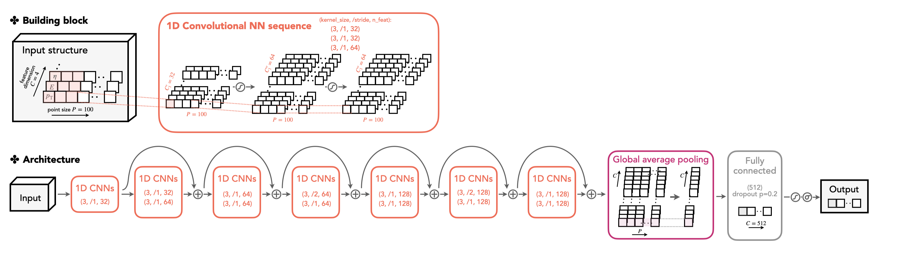
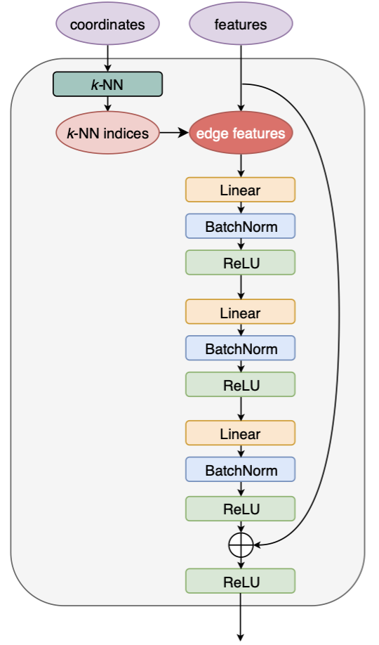
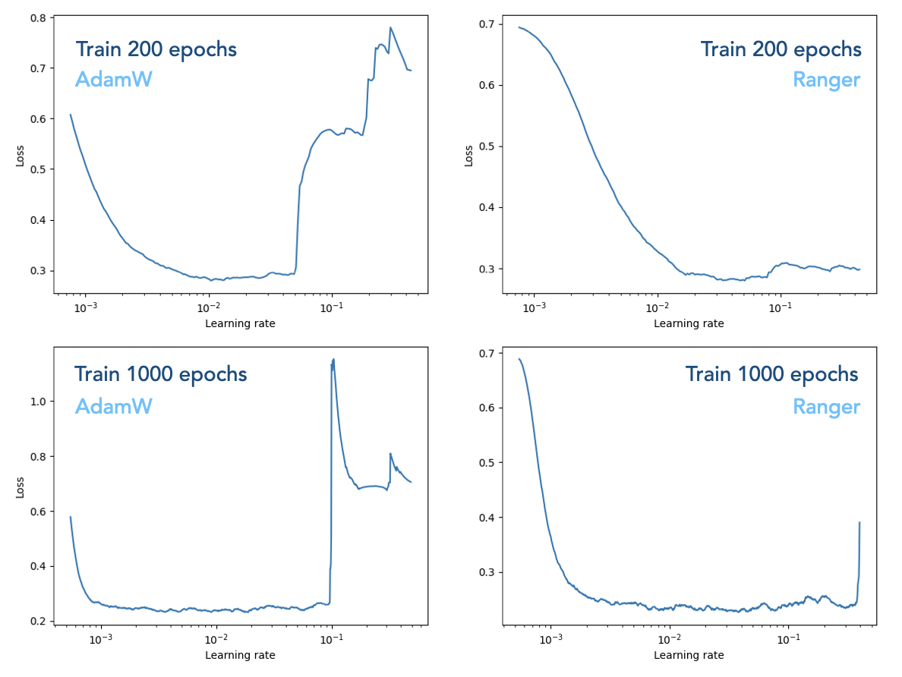

# ParticleNet

ParticleNet [[arXiv:1902.08570](https://arxiv.org/abs/1902.08570)] is an advanced neural network architecture that has many applications in CMS, including heavy flavour jet tagging, jet mass regression, etc. The network is fed by various low-level point-like objects as input, e.g., the particle-flow candidates, to predict a feature of a jet.

<figure>

<figcaption>The full architecture of the ParticleNet model. We'll walk through the details in the following sections.</figcaption>
</figure>

On this page, we introduce several user-specific aspects of the ParticleNet model. We cover the following items in three sections:

1. **[An introduction to ParticleNet](#introduction-to-particlenet)**, including
    - a general description of ParticleNet
    - the advantages brought from the architecture by concept
    - a sketch of ParticleNet applications in CMS and other relevant works
  
2. **[An introduction to `Weaver` and model implementations](#introduction-to-weaver-and-model-implementations)**, introduced in a step-by-step manner:
    - build three network models and understand them from the technical side; use the out-of-the-box commands to run these examples on a benchmark task. The three networks are (1) a simple feed-forward NN, (2) a DeepAK8 model (based on 1D CNN), and eventually (3) the ParticleNet model (based on DGCNN).
    - try to reproduce the original performance and make the ROC plots.

    ==This section is friendly to the ML newcomers. The goal is to help readers understand the underlying structure of the "ParticleNet".==

3. **[Tuning the ParticleNet model](#tuning-the-particlenet-model)**, including
    - tips for readers who are using/modifying the ParticleNet model to achieve a better performance

    ==This section can be helpful in practice. It provides tips on model training, tunning, validation, etc. It targets the situations when readers apply their own ParticleNet (or ParticleNet-like) model to the custom task.==

<!-- 4. **[Integration of ParticleNet](#inference-of-particlenet-in-cmssw)**, including
    - how the ParticleNet model is integrated in `cmssw`. -->

-----

Corresponding persons:

 - Huilin Qu, Loukas Gouskos (original developers of ParticleNet)
 - Congqiao Li (author of the page)

-----

## Introduction to ParticleNet

### 1. General description

ParticleNet is a graph neural net (GNN) model. The key ingredient of ParticleNet is the graph convolutional operation, i.e., the edge convolution (EdgeConv) and the dynamic graph CNN (DGCNN) method [[arXiv:1801.07829](https://arxiv.org/abs/1801.07829)] applied on the "point cloud" data structure.

We will disassemble the ParticleNet model and provide a detailed exploration in the next section, but here we briefly explain the key features of the model.

Intuitively, ParticleNet treats all candidates inside an object as a "point cloud", which is a permutational-invariant set of points (e.g. a set of PF candidates), each carrying a feature vector (*η*, *φ*, *p*<sub>T</sub>, charge, etc.). The DGCNN uses the EdgeConv operation to exploit their spatial correlations (two-dimensional on the *η*-*φ* plain) by finding the *k*-nearest neighbours of each point and generate a new latent graph layer where points are scattered on a high-dimensional latent space. This is a graph-type analogue of the classical 2D convolution operation, which acts on a regular 2D grid (e.g., a picture) using a 3×3 local patch to explore the relations of a single-pixel with its 8 nearest pixels, then generates a new 2D grid.

<figure>

<figcaption>The cartoon illustrates the convolutional operation acted on the regular grid and on the point cloud (plot from <a href="https://indico.cern.ch/event/745718/contributions/3202526/attachments/1753880/2842817/jet_as_particle_cloud_ml4jets_20181115_hqu.pdf">ML4Jets 2018</a> talk).</figcaption>
</figure>

As a consequence, the EdgeConv operation transforms the graph to a new graph, which has a changed spatial relationship among points. It then acts on the second graph to produce the third graph, showing the stackability of the convolution operation. This illustrates the "dynamic" property as the graph topology changes after each EdgeConv layer.

### 2. Advantage

By concept, the advantage of the network may come from exploiting the permutational-invariant symmetry of the points, which is intrinsic to our physics objects. This symmetry is held naturally in a point cloud representation.

In a recent study on jet physics or event-based analysis using ML techniques, there are increasing interest to explore the point cloud data structure. 
We explain here conceptually why a "point cloud" representation outperforms the classical ones, including the variable-length 2D vector structure passing to a 1D CNN or any type of RNN, and imaged-based representation passing through a 2D CNN. 
By using the 1D CNN, the points (PF candidates) are more often ordered by *p*<sub>T</sub> to fix on the 1D grid. Only correlations with neighbouring points with similar *p*<sub>T</sub> are learned by the network with a convolution operation. 
The Long Short-Term Memory (LSTM) type recurrent neural network (RNN) provides the flexibility to feed in a variant-length sequence and has a "memory" mechanism to cooperate the information it learns from an early node to the latest node. The concern is that such ordering of the sequence is somewhat artificial, and not an underlying property that an NN must learn to accomplish the classification task. As a comparison, in the task of the natural language processing where LSTM has a huge advantage, the order of words are important characteristic of a language itself (reflects the "grammar" in some circumstances) and is a feature the NN must learn to master the language. 
The imaged-based data explored by a 2D CNN stems from the image recognition task. A jet image with proper standardization is usually performed before feeding into the network. In this sense, it lacks local features which the 2D local patch is better at capturing, e.g. the ear of the cat that a local patch can capture by scanning over the entire image. The jet image is appearing to hold the features globally (e.g. two-prong structure for W-tagging). The sparsity of data is another concern in that it introduces redundant information to present a jet on the regular grid, making the network hard to capture the key properties.

### 3. Applications and other related work

Here we briefly summarize the applications and ongoing works on ParticleNet. Public CMS results include

 - large-*R* jet with *R*=0.8 tagging (for W/Z/H/t) using ParticleNet [[CMS-DP-2020/002](https://cds.cern.ch/record/2707946/files/DP2020_002.pdf)]
 - regression on the large-*R* jet mass based on the ParticleNet model [[CMS-DP-2021/017](https://cds.cern.ch/record/2777006/files/DP2021_017.pdf)]

ParticleNet architecture is also applied on small radius *R*=0.4 jets for the b/c-tagging and quark/gluon classification (see [this talk (CMS internal)](https://indico.cern.ch/event/956305/contributions/4027291/attachments/2111830/3552486/ParticleNet_AK4_JMAR_20200929_H_Qu.pdf)). A recent ongoing work applies the ParticleNet architecture in heavy flavour tagging at HLT (see [this talk (CMS internal)](https://indico.cern.ch/event/1037711/contributions/4357618/attachments/2242179/3801855/Raffaele_10_05_2021.pdf)). The ParticleNet model is recently updated to ParticleNeXt and see further improvement (see the [ML4Jets 2021 talk](https://indico.cern.ch/event/980214/contributions/4413544/attachments/2277334/3868991/ParticleNeXt_ML4Jets2021_H_Qu.pdf)).

Recent works in the joint field of HEP and ML also shed light on exploiting the point cloud data structure and GNN-based architectures. We see very active progress in recent years. Here list some useful materials for the reader's reference.

 - Some pheno-based work are summarized in the HEP × ML [living review](https://iml-wg.github.io/HEPML-LivingReview/), especially in the "graph" and "sets" categories.
 - An overview of GNN applications to CMS, See [CMS ML forum (CMS internal)](https://indico.cern.ch/event/952419/). Also see more recent GNN application progress in ML forums: [Oct 20](https://indico.cern.ch/event/1051967/), [Nov 3](https://indico.cern.ch/event/1081541/).
 - At the time of writing, various novel GNN-based models are explored and introduced in the recent [ML4Jets2021](https://indico.cern.ch/event/980214/timetable/?view=standard) meeting.


## Introduction to `Weaver` and model implementations

[`Weaver`](https://github.com/hqucms/weaver) is a machine learning R&D framework for high energy physics (HEP) applications. It trains the neural net with PyTorch and is capable of exporting the model to the ONNX format for fast inference. A detailed guide is presented on `Weaver` README page.

Now we walk through three solid examples to get you familiar with `Weaver`. We use the benchmark of the top tagging task [[arXiv:1707.08966](https://arxiv.org/abs/1707.08966)] in the following example. Some useful information can be found in the "top tagging" section in the [IML public datasets webpage](https://iml.web.cern.ch/public-datasets) (the [gDoc](https://docs.google.com/document/d/1Hcuc6LBxZNX16zjEGeq16DAzspkDC4nDTyjMp1bWHRo/edit)).

Our goal is to do some warm-up with `Weaver`, and more importantly, to explore from a technical side the neural net architectures, from a simple multi-layer perceptron (MLP) model, to a more complicated "DeepAK8 tagger" model based on 1D CNN with ResNet, and eventually to the "ParticleNet model" which is based on DGCNN. We will dig deeper into their implementations in `Weaver` and try to illustrate as many details as possible. Finally, we compare their performance and see if we can reproduce the benchmark record with the model. Please clone the repo `weaver-benchmark` and we'll get started. The `Weaver` repo will be cloned as a submodule.
```bash
git clone --recursive https://github.com/colizz/weaver-benchmark.git

# Create a soft link inside weaver so that it can find data/model cards
ln -s ../top_tagging weaver-benchmark/weaver/top_tagging
```


### 1. Build models in `Weaver`

When implementing a new training in `Weaver`, two key elements are crucial: the model and the data configuration file. The model defines the network architecture we are using, and the data configuration includes which variables to use for training, which pre-selection to apply and how to assign truth labels, etc.

Technically, The model configuration file includes a `get_model` function that returns a `torch.nn.Module` type model and a dictionary of model info used to export an ONNX-format model. The data configuration is a YAML file describing how to process the input data. Please see the `Weaver` README for details.

Before moving on, we need a preprocessing of the benchmark datasets. The original sample is an H5 file including branches like energy `E_i` and 3-momenta `PX_i`, `PY_i`, `PZ_i` for each jet constituent *i* (*i*=0, ..., 199) inside a jet. All branches are in the 1D flat structure. We reconstruct the data in a way that the jet features are 2D vectors (e.g., in the `vector<float>` format): `Jet_E`, `Jet_PX`, `Jet_PY`, `Jet_PZ`, with variable-length that corresponds to the number of constituents. Note that this is a commonly used data structure, similar to the NanoAOD format in CMS.

The datasets can be found at CERN EOS space `/eos/user/c/coli/public/weaver-benchmark/top_tagging/samples`. The input files used in this page are in fact the ROOT files produced by the preprocessing step, stored under `prep/` subdirectory. It includes three sets of data for training, validation, and test.

!!! note
    To preprocess the input files from the original datasets manually, direct to the `weaver-benchmark` base directory and run
    ```python
    python utils/convert_top_datasets.py -i <your-sample-dir>
    ```
    This will convert the `.h5` file to ROOT ntuples and create some new variables for each jet, including the relative *η* and *φ* value w.r.t. main axis of the jet of each jet constituent. The converted files are stored in `prep/` subfolder of the original directory.

Then, we show three NN model configurations below and provide detailed explanations of the code. We make meticulous efforts on the illustration of the model architecture, especially in the ParticleNet case.


=== "A simple MLP"

    <figure>
    
    <figcaption>The full architecture of the proof-of-concept multi-layer perceptron model.</figcaption>
    </figure>

    A simple multi-layer perceptron model is first provided here as proof of the concept. All layers are based on the linear transformation of the 1D vectors. The model configuration card is shown in `top_tagging/networks/mlp_pf.py`. First, we implement an MLP network in the `nn.Module` class.

    ???+ hint "MLP implementation"
        Also, see [`top_tagging/networks/mlp_pf.py`](https://github.com/colizz/weaver-benchmark/blob/main/top_tagging/networks/mlp_pf.py). We elaborate here on several aspects.

         - A sequence of linear layers and ReLU activation functions is defined in `nn.Sequential(nn.Linear(channels[i], channels[i + 1]), nn.ReLU())`. By combining multiple of them, we construct a simple multi-layer perceptron.

         - The input data `x` takes the 3D format, in the dimension `(N, C, P)`, which is decided by our data structure and the data configuration card. Here, `N` is the mini-batch size, `C` is the feature size, and `P` is the size of constituents per jet. To feed into our MLP, we flatten the last two dimensions by `x = x.flatten(start_dim=1)` to form the vector of dimension `(N, L)`.

        ```python linenums="1"
        class MultiLayerPerceptron(nn.Module):
            r"""Parameters
            ----------
            input_dims : int
                Input feature dimensions.
            num_classes : int
                Number of output classes.
            layer_params : list
                List of the feature size for each layer.
            """

            def __init__(self, input_dims, num_classes,
                        layer_params=(1024, 256, 256),
                        **kwargs):
                        
                super(MultiLayerPerceptron, self).__init__(**kwargs)
                channels = [input_dims] + list(layer_params) + [num_classes]
                layers = []
                for i in range(len(channels) - 1):
                    layers.append(nn.Sequential(nn.Linear(channels[i], channels[i + 1]),
                                                nn.ReLU()))
                self.mlp = nn.Sequential(*layers)

            def forward(self, x):
                # x: the feature vector initally read from the data structure, in dimension (N, C, P)
                x = x.flatten(start_dim=1) # (N, L), where L = C * P
                return self.mlp(x)
        ```

    Then, we write the `get_model` and `get_loss` functions which will be sent into `Weaver`'s training code.

    ???+ hint "`get_model` and `get_loss` function"
        Also see [`top_tagging/networks/mlp_pf.py`](https://github.com/colizz/weaver-benchmark/blob/main/top_tagging/networks/mlp_pf.py). We elaborate here on several aspects.

         - Inside `get_model`, the `model` is essentially the MLP class we define, and the `model_info` takes the default definition, including the input/output shape, the dimensions of the dynamic axes for the input/output data shape that will guide the ONNX model exportation. 
         - The `get_loss` function is not changed as in the classification task we always use the cross-entropy loss function.

        ```python linenums="1"
        def get_model(data_config, **kwargs):
            layer_params = (1024, 256, 256)
            _, pf_length, pf_features_dims = data_config.input_shapes['pf_features']
            input_dims = pf_length * pf_features_dims
            num_classes = len(data_config.label_value)
            model = MultiLayerPerceptron(input_dims, num_classes, layer_params=layer_params)

            model_info = {
                'input_names':list(data_config.input_names),
                'input_shapes':{k:((1,) + s[1:]) for k, s in data_config.input_shapes.items()},
                'output_names':['softmax'],
                'dynamic_axes':{**{k:{0:'N', 2:'n_' + k.split('_')[0]} for k in data_config.input_names}, **{'softmax':{0:'N'}}},
                }

            print(model, model_info)
            return model, model_info


        def get_loss(data_config, **kwargs):
            return torch.nn.CrossEntropyLoss()
        ```      

    Below shows the full structure of the MLP network printed by PyTorch. You will see it in the `Weaver` output during the training.

    ??? hint "The full-scale structure of the MLP network"
        ```
        MultiLayerPerceptron(
          |0.739 M, 100.000% Params, 0.001 GMac, 100.000% MACs|
          (mlp): Sequential(
            |0.739 M, 100.000% Params, 0.001 GMac, 100.000% MACs|
            (0): Sequential(
              |0.411 M, 55.540% Params, 0.0 GMac, 55.563% MACs|
              (0): Linear(in_features=400, out_features=1024, bias=True, |0.411 M, 55.540% Params, 0.0 GMac, 55.425% MACs|)
              (1): ReLU(|0.0 M, 0.000% Params, 0.0 GMac, 0.138% MACs|)
            )
            (1): Sequential(
              |0.262 M, 35.492% Params, 0.0 GMac, 35.452% MACs|
              (0): Linear(in_features=1024, out_features=256, bias=True, |0.262 M, 35.492% Params, 0.0 GMac, 35.418% MACs|)
              (1): ReLU(|0.0 M, 0.000% Params, 0.0 GMac, 0.035% MACs|)
            )
            (2): Sequential(
              |0.066 M, 8.899% Params, 0.0 GMac, 8.915% MACs|
              (0): Linear(in_features=256, out_features=256, bias=True, |0.066 M, 8.899% Params, 0.0 GMac, 8.880% MACs|)
              (1): ReLU(|0.0 M, 0.000% Params, 0.0 GMac, 0.035% MACs|)
            )
            (3): Sequential(
              |0.001 M, 0.070% Params, 0.0 GMac, 0.070% MACs|
              (0): Linear(in_features=256, out_features=2, bias=True, |0.001 M, 0.070% Params, 0.0 GMac, 0.069% MACs|)
              (1): ReLU(|0.0 M, 0.000% Params, 0.0 GMac, 0.000% MACs|)
            )
          )
        )
        ```

    The data card is shown in `top_tagging/data/pf_features.yaml`. It defines one input group, `pf_features`, which takes four variables `Etarel`, `Phirel`, `E_log`, `P_log`. This is based on our data structure, where these variables are 2D vectors with variable lengths. The `length` is chosen as 100 in a way that the last dimension (the jet constituent dimension) is always truncated or padded to have length 100.
    
    ???+ hint "MLP data config `top_tagging/data/pf_features.yaml`"
        Also see [`top_tagging/data/pf_features.yaml`](https://github.com/colizz/weaver-benchmark/blob/main/top_tagging/data/pf_features.yaml). See a tour guide to the data configuration card in [`Weaver` README](https://github.com/hqucms/weaver).
        ```yaml linenums="1"
        selection:
        ### use `&`, `|`, `~` for logical operations on numpy arrays
        ### can use functions from `math`, `np` (numpy), and `awkward` in the expression

        new_variables:
        ### [format] name: formula
        ### can use functions from `math`, `np` (numpy), and `awkward` in the expression
        is_bkg: np.logical_not(is_signal_new)

        preprocess:
        ### method: [manual, auto] - whether to use manually specified parameters for variable standardization
        method: manual
        ### data_fraction: fraction of events to use when calculating the mean/scale for the standardization
        data_fraction: 

        inputs:
        pf_features:
            length: 100
            vars: 
            ### [format 1]: var_name (no transformation)
            ### [format 2]: [var_name, 
            ###              subtract_by(optional, default=None, no transf. if preprocess.method=manual, auto transf. if preprocess.method=auto), 
            ###              multiply_by(optional, default=1), 
            ###              clip_min(optional, default=-5), 
            ###              clip_max(optional, default=5), 
            ###              pad_value(optional, default=0)]
                - Jet_Etarel
                - Jet_Phirel
                - [Jet_E_log, 2, 1]
                - [Jet_P_log, 2, 1]

        labels:
        ### type can be `simple`, `custom`
        ### [option 1] use `simple` for binary/multi-class classification, then `value` is a list of 0-1 labels
        type: simple
        value: [
            is_signal_new, is_bkg
            ]
        ### [option 2] otherwise use `custom` to define the label, then `value` is a map
        # type: custom
        # value: 
            # target_mass: np.where(fj_isQCD, fj_genjet_sdmass, fj_gen_mass) 

        observers:
        - origIdx
        - idx
        - Jet_E_tot
        - Jet_PX_tot
        - Jet_PY_tot
        - Jet_PZ_tot
        - Jet_P_tot
        - Jet_Eta_tot
        - Jet_Phi_tot

        # weights:
        ### [option 1] use precomputed weights stored in the input files
        # use_precomputed_weights: true
        # weight_branches: [weight, class_weight]
        ### [option 2] compute weights on-the-fly using reweighting histograms
        ```

    In the following two models (i.e., the DeepAK8 and the ParticleNet model) you will see that the data card is very similar. The change will only be the way we present the input group(s).
    
=== "DeepAK8 (1D CNN)"

    <figure>
    
    <figcaption>The full architecture of the DeepAK8 model, which is based on 1D CNN with ResNet architecture.</figcaption>
    </figure>

    !!! note
        The DeepAK8 tagger is a widely used highly-boosted jet tagger in the CMS community. The design of the model can be found in the CMS paper [[arXiv:2004.08262](https://arxiv.org/abs/2004.08262)]. The original model is trained on MXNet and its configuration can be found [here](https://github.com/hqucms/NNTools/blob/master/training/symbols/sym_ak8_pfcand_sv_resnet_v1.py). 
        
        We now migrate the model architecture to `Weaver` and train it on PyTorch. Also, we narrow the multi-class output score to the binary output to adapt our binary classification task (top vs. QCD jet).

    The model card is given in `top_tagging/networks/deepak8_pf.py`. The DeepAK8 model is inspired by the ResNet architecture. The key ingredient is the ResNet unit constructed by multiple CNN layers with a shortcut connection. First, we define the ResNet unit in the model card.
    
    ???+ hint "ResNet unit implementation"
        See [`top_tagging/networks/deepak8_pf.py`](https://github.com/colizz/weaver-benchmark/blob/main/top_tagging/networks/deepak8_pf.py). We elaborate here on several aspects.

         - A ResNet unit is made of two 1D CNNs with batch normalization and ReLU activation function.
         - The shortcut is introduced here by directly adding the input data to the processed data after passing the CNN layers. The shortcut connection help to ease the training for the "deeper" model [[arXiv:1512.03385](https://arxiv.org/pdf/1512.03385.pdf)]. Note that a trivial linear transformation is applied (`self.conv_sc`) if the feature dimension of the input and output data does not match.

        ```python linenums="1"
        class ResNetUnit(nn.Module):
            r"""Parameters
            ----------
            in_channels : int
                Number of channels in the input vectors.
            out_channels : int
                Number of channels in the output vectors.
            strides: tuple
                Strides of the two convolutional layers, in the form of (stride0, stride1)
            """

            def __init__(self, in_channels, out_channels, strides=(1,1), **kwargs):
                
                super(ResNetUnit, self).__init__(**kwargs)
                self.conv1 = nn.Conv1d(in_channels, out_channels, kernel_size=3, stride=strides[0], padding=1)
                self.bn1 = nn.BatchNorm1d(out_channels)
                self.conv2 = nn.Conv1d(out_channels, out_channels, kernel_size=3, stride=strides[1], padding=1)
                self.bn2 = nn.BatchNorm1d(out_channels)
                self.relu = nn.ReLU()
                self.dim_match = True
                if not in_channels == out_channels or not strides == (1,1): # dimensions not match
                    self.dim_match = False
                    self.conv_sc = nn.Conv1d(in_channels, out_channels, kernel_size=1, stride=strides[0]*strides[1], bias=False)

            def forward(self, x):
                identity = x
                x = self.conv1(x)
                x = self.bn1(x)
                x = self.relu(x)
                x = self.conv2(x)
                x = self.bn2(x)
                x = self.relu(x)
                # print('resnet unit', identity.shape, x.shape, self.dim_match)
                if self.dim_match:
                    return identity + x
                else:
                    return self.conv_sc(identity) + x
        ```

    With the ResNet unit, we construct the DeepAK8 model. The model hyperparameters are chosen as follows.
    ```python
    conv_params = [(32,), (64, 64), (64, 64), (128, 128)]
    fc_params = [(512, 0.2)]
    ```

    ???+ hint "DeepAK8 model implementation"
        See [`top_tagging/networks/deepak8_pf.py`](https://github.com/colizz/weaver-benchmark/blob/main/top_tagging/networks/deepak8_pf.py). Note that the main architecture is a PyTorch re-implementation of the code [here](https://github.com/hqucms/NNTools/blob/master/training/symbols/sym_ak8_pfcand_sv_resnet_v1.py) based on the MXNet.

        ```python linenums="1"
        class ResNet(nn.Module):
            r"""Parameters
            ----------
            features_dims : int
                Input feature dimensions.
            num_classes : int
                Number of output classes.
            conv_params : list
                List of the convolution layer parameters. 
                The first element is a tuple of size 1, defining the transformed feature size for the initial feature convolution layer.
                The following are tuples of feature size for multiple stages of the ResNet units. Each number defines an individual ResNet unit.
            fc_params: list
                List of fully connected layer parameters after all EdgeConv blocks, each element in the format of
                (n_feat, drop_rate)
            """

            def __init__(self, features_dims, num_classes,
                        conv_params=[(32,), (64, 64), (64, 64), (128, 128)],
                        fc_params=[(512, 0.2)],
                        **kwargs):
                
                super(ResNet, self).__init__(**kwargs)
                self.conv_params = conv_params
                self.num_stages = len(conv_params) - 1
                self.fts_conv = nn.Sequential(nn.Conv1d(in_channels=features_dims, out_channels=conv_params[0][0], kernel_size=3, stride=1, padding=1),
                                            nn.BatchNorm1d(conv_params[0][0]),
                                            nn.ReLU())

                # define ResNet units for each stage. Each unit is composed of a sequence of ResNetUnit block
                self.resnet_units = nn.ModuleDict()
                for i in range(self.num_stages):
                    # stack units[i] layers in this stage
                    unit_layers = []
                    for j in range(len(conv_params[i + 1])):
                        in_channels, out_channels = (conv_params[i][-1], conv_params[i + 1][0]) if j == 0 \
                                                    else (conv_params[i + 1][j - 1], conv_params[i + 1][j])
                        strides = (2, 1) if (j == 0 and i > 0) else (1, 1)
                        unit_layers.append(ResNetUnit(in_channels, out_channels, strides))

                    self.resnet_units.add_module('resnet_unit_%d' % i, nn.Sequential(*unit_layers))
                
                # define fully connected layers
                fcs = []
                for idx, layer_param in enumerate(fc_params):
                    channels, drop_rate = layer_param
                    in_chn = conv_params[-1][-1] if idx == 0 else fc_params[idx - 1][0]
                    fcs.append(nn.Sequential(nn.Linear(in_chn, channels), nn.ReLU(), nn.Dropout(drop_rate)))
                fcs.append(nn.Linear(fc_params[-1][0], num_classes))
                self.fc = nn.Sequential(*fcs)

            def forward(self, x):
                # x: the feature vector, (N, C, P)
                x = self.fts_conv(x)
                for i in range(self.num_stages):
                    x = self.resnet_units['resnet_unit_%d' % i](x) # (N, C', P'), P'<P due to kernal_size>1 or stride>1
                
                # global average pooling
                x = x.sum(dim=-1) / x.shape[-1] # (N, C')
                # fully connected
                x = self.fc(x) # (N, out_chn)
                return x


        def get_model(data_config, **kwargs):
            conv_params = [(32,), (64, 64), (64, 64), (128, 128)]
            fc_params = [(512, 0.2)]

            pf_features_dims = len(data_config.input_dicts['pf_features'])
            num_classes = len(data_config.label_value)
            model = ResNet(pf_features_dims, num_classes,
                        conv_params=conv_params,
                        fc_params=fc_params)

            model_info = {
                'input_names':list(data_config.input_names),
                'input_shapes':{k:((1,) + s[1:]) for k, s in data_config.input_shapes.items()},
                'output_names':['softmax'],
                'dynamic_axes':{**{k:{0:'N', 2:'n_' + k.split('_')[0]} for k in data_config.input_names}, **{'softmax':{0:'N'}}},
                }

            print(model, model_info)
            print(data_config.input_shapes)
            return model, model_info


        def get_loss(data_config, **kwargs):
            return torch.nn.CrossEntropyLoss()
        ```
    
    Below shows the full structure of the DeepAK8 model based on 1D CNN with ResNet. It is printed by PyTorch and you will see it in the `Weaver` output during training.
    
    ??? hint "The full-scale structure of the DeepAK8 architecture"

        ```
        ResNet(
          |0.349 M, 100.000% Params, 0.012 GMac, 100.000% MACs|
          (fts_conv): Sequential(
            |0.0 M, 0.137% Params, 0.0 GMac, 0.427% MACs|
            (0): Conv1d(4, 32, kernel_size=(3,), stride=(1,), padding=(1,), |0.0 M, 0.119% Params, 0.0 GMac, 0.347% MACs|)
            (1): BatchNorm1d(32, eps=1e-05, momentum=0.1, affine=True, track_running_stats=True, |0.0 M, 0.018% Params, 0.0 GMac, 0.053% MACs|)
            (2): ReLU(|0.0 M, 0.000% Params, 0.0 GMac, 0.027% MACs|)
          )
          (resnet_units): ModuleDict(
            |0.282 M, 80.652% Params, 0.012 GMac, 99.010% MACs|
            (resnet_unit_0): Sequential(
              |0.046 M, 13.124% Params, 0.005 GMac, 38.409% MACs|
              (0): ResNetUnit(
                |0.021 M, 5.976% Params, 0.002 GMac, 17.497% MACs|
                (conv1): Conv1d(32, 64, kernel_size=(3,), stride=(1,), padding=(1,), |0.006 M, 1.778% Params, 0.001 GMac, 5.175% MACs|)
                (bn1): BatchNorm1d(64, eps=1e-05, momentum=0.1, affine=True, track_running_stats=True, |0.0 M, 0.037% Params, 0.0 GMac, 0.107% MACs|)
                (conv2): Conv1d(64, 64, kernel_size=(3,), stride=(1,), padding=(1,), |0.012 M, 3.538% Params, 0.001 GMac, 10.296% MACs|)
                (bn2): BatchNorm1d(64, eps=1e-05, momentum=0.1, affine=True, track_running_stats=True, |0.0 M, 0.037% Params, 0.0 GMac, 0.107% MACs|)
                (relu): ReLU(|0.0 M, 0.000% Params, 0.0 GMac, 0.107% MACs|)
                (conv_sc): Conv1d(32, 64, kernel_size=(1,), stride=(1,), bias=False, |0.002 M, 0.587% Params, 0.0 GMac, 1.707% MACs|)
              )
              (1): ResNetUnit(
                |0.025 M, 7.149% Params, 0.003 GMac, 20.912% MACs|
                (conv1): Conv1d(64, 64, kernel_size=(3,), stride=(1,), padding=(1,), |0.012 M, 3.538% Params, 0.001 GMac, 10.296% MACs|)
                (bn1): BatchNorm1d(64, eps=1e-05, momentum=0.1, affine=True, track_running_stats=True, |0.0 M, 0.037% Params, 0.0 GMac, 0.107% MACs|)
                (conv2): Conv1d(64, 64, kernel_size=(3,), stride=(1,), padding=(1,), |0.012 M, 3.538% Params, 0.001 GMac, 10.296% MACs|)
                (bn2): BatchNorm1d(64, eps=1e-05, momentum=0.1, affine=True, track_running_stats=True, |0.0 M, 0.037% Params, 0.0 GMac, 0.107% MACs|)
                (relu): ReLU(|0.0 M, 0.000% Params, 0.0 GMac, 0.107% MACs|)
              )
            )
            (resnet_unit_1): Sequential(
              |0.054 M, 15.471% Params, 0.003 GMac, 22.619% MACs|
              (0): ResNetUnit(
                |0.029 M, 8.322% Params, 0.001 GMac, 12.163% MACs|
                (conv1): Conv1d(64, 64, kernel_size=(3,), stride=(2,), padding=(1,), |0.012 M, 3.538% Params, 0.001 GMac, 5.148% MACs|)
                (bn1): BatchNorm1d(64, eps=1e-05, momentum=0.1, affine=True, track_running_stats=True, |0.0 M, 0.037% Params, 0.0 GMac, 0.053% MACs|)
                (conv2): Conv1d(64, 64, kernel_size=(3,), stride=(1,), padding=(1,), |0.012 M, 3.538% Params, 0.001 GMac, 5.148% MACs|)
                (bn2): BatchNorm1d(64, eps=1e-05, momentum=0.1, affine=True, track_running_stats=True, |0.0 M, 0.037% Params, 0.0 GMac, 0.053% MACs|)
                (relu): ReLU(|0.0 M, 0.000% Params, 0.0 GMac, 0.053% MACs|)
                (conv_sc): Conv1d(64, 64, kernel_size=(1,), stride=(2,), bias=False, |0.004 M, 1.173% Params, 0.0 GMac, 1.707% MACs|)
              )
              (1): ResNetUnit(
                |0.025 M, 7.149% Params, 0.001 GMac, 10.456% MACs|
                (conv1): Conv1d(64, 64, kernel_size=(3,), stride=(1,), padding=(1,), |0.012 M, 3.538% Params, 0.001 GMac, 5.148% MACs|)
                (bn1): BatchNorm1d(64, eps=1e-05, momentum=0.1, affine=True, track_running_stats=True, |0.0 M, 0.037% Params, 0.0 GMac, 0.053% MACs|)
                (conv2): Conv1d(64, 64, kernel_size=(3,), stride=(1,), padding=(1,), |0.012 M, 3.538% Params, 0.001 GMac, 5.148% MACs|)
                (bn2): BatchNorm1d(64, eps=1e-05, momentum=0.1, affine=True, track_running_stats=True, |0.0 M, 0.037% Params, 0.0 GMac, 0.053% MACs|)
                (relu): ReLU(|0.0 M, 0.000% Params, 0.0 GMac, 0.053% MACs|)
              )
            )
            (resnet_unit_2): Sequential(
              |0.182 M, 52.057% Params, 0.005 GMac, 37.982% MACs|
              (0): ResNetUnit(
                |0.083 M, 23.682% Params, 0.002 GMac, 17.284% MACs|
                (conv1): Conv1d(64, 128, kernel_size=(3,), stride=(2,), padding=(1,), |0.025 M, 7.075% Params, 0.001 GMac, 5.148% MACs|)
                (bn1): BatchNorm1d(128, eps=1e-05, momentum=0.1, affine=True, track_running_stats=True, |0.0 M, 0.073% Params, 0.0 GMac, 0.053% MACs|)
                (conv2): Conv1d(128, 128, kernel_size=(3,), stride=(1,), padding=(1,), |0.049 M, 14.114% Params, 0.001 GMac, 10.269% MACs|)
                (bn2): BatchNorm1d(128, eps=1e-05, momentum=0.1, affine=True, track_running_stats=True, |0.0 M, 0.073% Params, 0.0 GMac, 0.053% MACs|)
                (relu): ReLU(|0.0 M, 0.000% Params, 0.0 GMac, 0.053% MACs|)
                (conv_sc): Conv1d(64, 128, kernel_size=(1,), stride=(2,), bias=False, |0.008 M, 2.346% Params, 0.0 GMac, 1.707% MACs|)
              )
              (1): ResNetUnit(
                |0.099 M, 28.375% Params, 0.002 GMac, 20.698% MACs|
                (conv1): Conv1d(128, 128, kernel_size=(3,), stride=(1,), padding=(1,), |0.049 M, 14.114% Params, 0.001 GMac, 10.269% MACs|)
                (bn1): BatchNorm1d(128, eps=1e-05, momentum=0.1, affine=True, track_running_stats=True, |0.0 M, 0.073% Params, 0.0 GMac, 0.053% MACs|)
                (conv2): Conv1d(128, 128, kernel_size=(3,), stride=(1,), padding=(1,), |0.049 M, 14.114% Params, 0.001 GMac, 10.269% MACs|)
                (bn2): BatchNorm1d(128, eps=1e-05, momentum=0.1, affine=True, track_running_stats=True, |0.0 M, 0.073% Params, 0.0 GMac, 0.053% MACs|)
                (relu): ReLU(|0.0 M, 0.000% Params, 0.0 GMac, 0.053% MACs|)
              )
            )
          )
          (fc): Sequential(
            |0.067 M, 19.210% Params, 0.0 GMac, 0.563% MACs|
            (0): Sequential(
              |0.066 M, 18.917% Params, 0.0 GMac, 0.555% MACs|
              (0): Linear(in_features=128, out_features=512, bias=True, |0.066 M, 18.917% Params, 0.0 GMac, 0.551% MACs|)
              (1): ReLU(|0.0 M, 0.000% Params, 0.0 GMac, 0.004% MACs|)
              (2): Dropout(p=0.2, inplace=False, |0.0 M, 0.000% Params, 0.0 GMac, 0.000% MACs|)
            )
            (1): Linear(in_features=512, out_features=2, bias=True, |0.001 M, 0.294% Params, 0.0 GMac, 0.009% MACs|)
          )
        )
        ```

    The data card is the same as the MLP case, shown in `top_tagging/data/pf_features.yaml`.
    

=== "ParticleNet (DGCNN)"

    <figure>
    
    <figcaption>The full architecture of the ParticleNet model, which is based on DGCNN and EdgeConv.</figcaption>
    </figure>

    !!! note
        The ParticleNet model applied to the CMS analysis is provided in [`weaver/networks/particle_net_pf_sv.py`](https://github.com/hqucms/weaver/blob/master/networks/particle_net_pf_sv.py), and the data card in [`weaver/data/ak15_points_pf_sv.yaml`](https://github.com/hqucms/weaver/blob/master/data/ak15_points_pf_sv.yaml). Here we use a similar configuration card to deal with the benchmark task.
    
    We will elaborate on the ParticleNet model and focus more on the technical side in this section. The model is defined in `top_tagging/networks/particlenet_pf.py`, but it imports some constructor, the EdgeConv block, in `weaver/utils/nn/model/ParticleNet.py`. The EdgeConv is illustrated in the cartoon.

    <figure>
    
    <figcaption>Illustration of the EdgeConv block</figcaption>
    </figure>
    
    From an EdgeConv block's point of view, it requires two classes of features as input: the "coordinates" and the "features". These features are the per point properties, in the 2D shape with dimensions `(C, P)`, where `C` is the size of the features (the feature size of "coordinates" and the "features" can be different, marked as `C_pts`, `C_fts` in the following code), and P is the number of points. The block outputs the new features that the model learns, also in the 2D shape with dimensions `(C_fts_out, P)`.

    What happens inside the EdgeConv block? And how is the output feature vector transferred from the input features using the topology of the point cloud? The answer is encoded in the edge convolution (EdgeConv).

    { loading=lazy align=left width=200 }

    The edge convolution is an analogue convolution method defined on a point cloud, whose shape is given by the "coordinates" of points. Specifically, the input "coordinates" provide a view of spatial relations of the points in the Euclidean space. It determines the *k*-nearest neighbouring points for each point that will guide the update of the feature vector of a point. For each point, the updated feature vector is based on the current state of the point and its *k* neighbours. Guided by this spirit, all features of the point cloud forms a 3D vector with dimensions `(C, P, K)`, where `C` is the per-point feature size (e.g., *η*, *φ*, *p*<sub>T</sub>，...), `P` is the number of points, and K the *k*-NN number. The structured vector is linearly transformed by acting 2D CNN on the feature dimension `C`. This helps to aggregate the feature information and exploit the correlations of each point with its adjacent points. A shortcut connection is also introduced inspired by the ResNet.

    !!! note
        The feature dimension `C` after exploring the *k* neighbours of each point actually doubles the value of the initial feature dimension. Here, a new set of features is constructed by subtracting the feature a point carries to the features its *k* neighbours carry (namely *x*<sub>*i*</sub> – *x*<sub>*i_j*</sub> for point *i*, and *j*=1,...,*k*). This way, the correlation of each point with its neighbours are well captured.

    Below shows how the EdgeConv structure is implemented in the code. 

    ???+ hint "EdgeConv block implementation"
        See [`weaver/utils/nn/model/ParticleNet.py`](https://github.com/hqucms/weaver/blob/master/utils/nn/model/ParticleNet.py), or the following code block annotated with more comments. We elaborate here on several aspects.

          - The `EdgeConvBlock` takes the feature dimension `in_feat`, `out_feats` which are `C_fts`, `C_fts_out` we introduced above.
          - The input data vectors to `forward()` are "coordinates" and "features" vector, in the dimension of `(N, C_pts(C_fts), P)` as introduced above. The first dimension is the mini-batch size.
          - `self.get_graph_feature()` helps to aggregate *k*-nearest neighbours for each point. The resulting vector is in the dimension of `(N, C_fts(0), P, K)` as we discussed above, `K` being the *k*-NN number. Note that the `C_fts(0)` doubles the value of the original input feature dimension `C_fts` as mentioned above.
          - After convolutions, the per-point features are merged by taking the mean of all *k*-nearest neighbouring vectors:
          ```python
          fts = x.mean(dim=-1)  # (N, C, P)
          ```

        ```python linenums="1"
        class EdgeConvBlock(nn.Module):
            r"""EdgeConv layer.
            Introduced in "`Dynamic Graph CNN for Learning on Point Clouds
            <https://arxiv.org/pdf/1801.07829>`__".  Can be described as follows:
            .. math::
            x_i^{(l+1)} = \max_{j \in \mathcal{N}(i)} \mathrm{ReLU}(
            \Theta \cdot (x_j^{(l)} - x_i^{(l)}) + \Phi \cdot x_i^{(l)})
            where :math:`\mathcal{N}(i)` is the neighbor of :math:`i`.
            Parameters
            ----------
            in_feat : int
                Input feature size.
            out_feat : int
                Output feature size.
            batch_norm : bool
                Whether to include batch normalization on messages.
            """

            def __init__(self, k, in_feat, out_feats, batch_norm=True, activation=True, cpu_mode=False):
                super(EdgeConvBlock, self).__init__()
                self.k = k
                self.batch_norm = batch_norm
                self.activation = activation
                self.num_layers = len(out_feats)
                self.get_graph_feature = get_graph_feature_v2 if cpu_mode else get_graph_feature_v1

                self.convs = nn.ModuleList()
                for i in range(self.num_layers):
                    self.convs.append(nn.Conv2d(2 * in_feat if i == 0 else out_feats[i - 1], out_feats[i], kernel_size=1, bias=False if self.batch_norm else True))

                if batch_norm:
                    self.bns = nn.ModuleList()
                    for i in range(self.num_layers):
                        self.bns.append(nn.BatchNorm2d(out_feats[i]))

                if activation:
                    self.acts = nn.ModuleList()
                    for i in range(self.num_layers):
                        self.acts.append(nn.ReLU())

                if in_feat == out_feats[-1]:
                    self.sc = None
                else:
                    self.sc = nn.Conv1d(in_feat, out_feats[-1], kernel_size=1, bias=False)
                    self.sc_bn = nn.BatchNorm1d(out_feats[-1])

                if activation:
                    self.sc_act = nn.ReLU()

            def forward(self, points, features):
                # points:   (N, C_pts, P) 
                # features: (N, C_fts, P) 
                # N: batch size, C: feature size per point, P: number of points

                topk_indices = knn(points, self.k) # (N, P, K)
                x = self.get_graph_feature(features, self.k, topk_indices) # (N, C_fts(0), P, K)

                for conv, bn, act in zip(self.convs, self.bns, self.acts):
                    x = conv(x)  # (N, C', P, K)
                    if bn:
                        x = bn(x)
                    if act:
                        x = act(x)

                fts = x.mean(dim=-1)  # (N, C, P)

                # shortcut
                if self.sc:
                    sc = self.sc(features)  # (N, C_out, P)
                    sc = self.sc_bn(sc)
                else:
                    sc = features

                return self.sc_act(sc + fts)  # (N, C_out, P)
        ```
    
    With the EdgeConv architecture as the building block, the ParticleNet model is constructed as follow.

    { loading=lazy align=left width=200 }

    The ParticleNet model stacks three EdgeConv blocks to construct higher-level features and passing them through the pipeline. The points (i.e., in our case, the particle candidates inside a jet) are not changing, but the per-point "coordinates" and "features" vectors changes, in both values and dimensions.

    For the first EdgeConv block, the "coordinates" only include the relative *η* and *φ* value of each particle. The "features" is a vector with a standard length of 32, which is linearly transformed from the initial feature vectors including the components of relative *η*, *φ*, the log of *p*<sub>T</sub>, etc. The first EdgeConv block outputs a per-point feature vector of length 64, which is taken as both the "coordinates" and "features" to the next EdgeConv block. That is to say, the next *k*-NN is applied on the 64D high-dimensional spatial space to capture the new relations of points learned by the model. This is visualized by the input/output arrows showing the data flow of the model. We see that this architecture illustrates the stackability of the EdgeConv block, and is the core to the Dynamic Graph CNN (DGCNN), as the model can dynamically change the correlations of each point based on learnable features. 
    
    A fusion technique is also used by concatenating the three EdgeConv output vectors together (adding the dimensions), instead of using the last EdgeConv output, to form an output vector. This is also one form of shortcut implementations that helps to ease the training for a complex and deep convolutional network model.

    The concatenated vectors per point are then averaged over points to produce a single 1D vector of the whole point cloud. The vector passes through one fully connected layer, with a dropout rate of p=0.1 to prevent overfitting. Then, in our example, the full network outputs two scores after a softmax, representing the one-hot encoding of the top vs. QCD class.

    The ParticleNet implementation is shown below.

    ???+ hint "ParticleNet model implementation"
        See [`weaver/utils/nn/model/ParticleNet.py`](https://github.com/hqucms/weaver/blob/master/utils/nn/model/ParticleNet.py), or the following code block annotated with more comments. We elaborate here on several mean points.

          - The stack of multiple EdgeConv blocks are implemented in
            ```python
            for idx, conv in enumerate(self.edge_convs):
                pts = (points if idx == 0 else fts) + coord_shift
                fts = conv(pts, fts) * mask
            ```
          - The multiple EdgeConv layer parameters are given by `conv_params`, which takes a list of tuples, each tuple in the format of `(K, (C1, C2, C3))`. `K` for the *k*-NN number, `C1,2,3` for convolution feature sizes of three layers in an EdgeConv block.
          - The fully connected layer parameters are given by `fc_params`, which takes a list of tuples, each tuple in the format of `(n_feat, drop_rate)`.

        ```python linenums="1"
        class ParticleNet(nn.Module):
            r"""Parameters
            ----------
            input_dims : int
                Input feature dimensions (C_fts).
            num_classes : int
                Number of output classes.
            conv_params : list
                List of convolution parameters of EdgeConv blocks, each element in the format of (K, (C1, C2, C3)).
                K for the kNN number, C1,2,3 for convolution feature sizes of three layers in an EdgeConv block.
            fc_params: list
                List of fully connected layer parameters after all EdgeConv blocks, each element in the format of
                (n_feat, drop_rate)
            use_fusion: bool
                If true, concatenates all output features from each EdgeConv before the fully connected layer.
            use_fts_bn: bool
                If true, applies a batch norm before feeding to the EdgeConv block.
            use_counts: bool
                If true, uses the real count of points instead of the padded size (the max point size).
            for_inference: bool
                Whether this is an inference routine. If true, applies a softmax to the output.
            for_segmentation: bool
                Whether the model is set up for the point cloud segmentation (instead of classification) task. If true, 
                does not merge the features after the last EdgeConv, and apply Conv1D instead of the linear layer. 
                The output is hence each output_features per point, instead of output_features.
            """


            def __init__(self,
                        input_dims,
                        num_classes,
                        conv_params=[(7, (32, 32, 32)), (7, (64, 64, 64))],
                        fc_params=[(128, 0.1)],
                        use_fusion=True,
                        use_fts_bn=True,
                        use_counts=True,
                        for_inference=False,
                        for_segmentation=False,
                        **kwargs):
                super(ParticleNet, self).__init__(**kwargs)

                self.use_fts_bn = use_fts_bn
                if self.use_fts_bn:
                    self.bn_fts = nn.BatchNorm1d(input_dims)

                self.use_counts = use_counts

                self.edge_convs = nn.ModuleList()
                for idx, layer_param in enumerate(conv_params):
                    k, channels = layer_param
                    in_feat = input_dims if idx == 0 else conv_params[idx - 1][1][-1]
                    self.edge_convs.append(EdgeConvBlock(k=k, in_feat=in_feat, out_feats=channels, cpu_mode=for_inference))

                self.use_fusion = use_fusion
                if self.use_fusion:
                    in_chn = sum(x[-1] for _, x in conv_params)
                    out_chn = np.clip((in_chn // 128) * 128, 128, 1024)
                    self.fusion_block = nn.Sequential(nn.Conv1d(in_chn, out_chn, kernel_size=1, bias=False), nn.BatchNorm1d(out_chn), nn.ReLU())

                self.for_segmentation = for_segmentation

                fcs = []
                for idx, layer_param in enumerate(fc_params):
                    channels, drop_rate = layer_param
                    if idx == 0:
                        in_chn = out_chn if self.use_fusion else conv_params[-1][1][-1]
                    else:
                        in_chn = fc_params[idx - 1][0]
                    if self.for_segmentation:
                        fcs.append(nn.Sequential(nn.Conv1d(in_chn, channels, kernel_size=1, bias=False),
                                                nn.BatchNorm1d(channels), nn.ReLU(), nn.Dropout(drop_rate)))
                    else:
                        fcs.append(nn.Sequential(nn.Linear(in_chn, channels), nn.ReLU(), nn.Dropout(drop_rate)))
                if self.for_segmentation:
                    fcs.append(nn.Conv1d(fc_params[-1][0], num_classes, kernel_size=1))
                else:
                    fcs.append(nn.Linear(fc_params[-1][0], num_classes))
                self.fc = nn.Sequential(*fcs)

                self.for_inference = for_inference

            def forward(self, points, features, mask=None):
        #         print('points:\n', points)
        #         print('features:\n', features)
                if mask is None:
                    mask = (features.abs().sum(dim=1, keepdim=True) != 0)  # (N, 1, P)
                points *= mask
                features *= mask
                coord_shift = (mask == 0) * 1e9
                if self.use_counts:
                    counts = mask.float().sum(dim=-1)
                    counts = torch.max(counts, torch.ones_like(counts))  # >=1

                if self.use_fts_bn:
                    fts = self.bn_fts(features) * mask
                else:
                    fts = features
                outputs = []
                for idx, conv in enumerate(self.edge_convs):
                    pts = (points if idx == 0 else fts) + coord_shift
                    fts = conv(pts, fts) * mask
                    if self.use_fusion:
                        outputs.append(fts)
                if self.use_fusion:
                    fts = self.fusion_block(torch.cat(outputs, dim=1)) * mask

        #         assert(((fts.abs().sum(dim=1, keepdim=True) != 0).float() - mask.float()).abs().sum().item() == 0)
                
                if self.for_segmentation:
                    x = fts
                else:
                    if self.use_counts:
                        x = fts.sum(dim=-1) / counts  # divide by the real counts
                    else:
                        x = fts.mean(dim=-1)

                output = self.fc(x)
                if self.for_inference:
                    output = torch.softmax(output, dim=1)
                # print('output:\n', output)
                return output
        ```

    Above are the capsulation of all ParticleNet building blocks. Eventually, we have the model defined in the model card `top_tagging/networks/particlenet_pf.py`, in the `ParticleNetTagger1Path` class, meaning we only use the ParticleNet pipeline that deals with one set of the point cloud (i.e., the particle candidates).

    ???+ info
         Two sets of point clouds in the CMS application, namely the particle-flow candidates and secondary vertices, are used. This requires special handling to merge the clouds before feeding them to the first layer of EdgeConv.
    
    ???+ hint "ParticleNet model config"
        Also see [`top_tagging/networks/particlenet_pf.py`](https://github.com/colizz/weaver-benchmark/blob/main/top_tagging/networks/particlenet_pf.py).
        ```python linenums="1"
        import torch
        import torch.nn as nn
        from utils.nn.model.ParticleNet import ParticleNet, FeatureConv


        class ParticleNetTagger1Path(nn.Module):

            def __init__(self,
                        pf_features_dims,
                        num_classes,
                        conv_params=[(7, (32, 32, 32)), (7, (64, 64, 64))],
                        fc_params=[(128, 0.1)],
                        use_fusion=True,
                        use_fts_bn=True,
                        use_counts=True,
                        pf_input_dropout=None,
                        for_inference=False,
                        **kwargs):
                super(ParticleNetTagger1Path, self).__init__(**kwargs)
                self.pf_input_dropout = nn.Dropout(pf_input_dropout) if pf_input_dropout else None
                self.pf_conv = FeatureConv(pf_features_dims, 32)
                self.pn = ParticleNet(input_dims=32,
                                    num_classes=num_classes,
                                    conv_params=conv_params,
                                    fc_params=fc_params,
                                    use_fusion=use_fusion,
                                    use_fts_bn=use_fts_bn,
                                    use_counts=use_counts,
                                    for_inference=for_inference)

            def forward(self, pf_points, pf_features, pf_mask):
                if self.pf_input_dropout:
                    pf_mask = (self.pf_input_dropout(pf_mask) != 0).float()
                    pf_points *= pf_mask
                    pf_features *= pf_mask

                return self.pn(pf_points, self.pf_conv(pf_features * pf_mask) * pf_mask, pf_mask)


        def get_model(data_config, **kwargs):
            conv_params = [
                (16, (64, 64, 64)),
                (16, (128, 128, 128)),
                (16, (256, 256, 256)),
                ]
            fc_params = [(256, 0.1)]
            use_fusion = True

            pf_features_dims = len(data_config.input_dicts['pf_features'])
            num_classes = len(data_config.label_value)
            model = ParticleNetTagger1Path(pf_features_dims, num_classes,
                                    conv_params, fc_params,
                                    use_fusion=use_fusion,
                                    use_fts_bn=kwargs.get('use_fts_bn', False),
                                    use_counts=kwargs.get('use_counts', True),
                                    pf_input_dropout=kwargs.get('pf_input_dropout', None),
                                    for_inference=kwargs.get('for_inference', False)
                                    )
            model_info = {
                'input_names':list(data_config.input_names),
                'input_shapes':{k:((1,) + s[1:]) for k, s in data_config.input_shapes.items()},
                'output_names':['softmax'],
                'dynamic_axes':{**{k:{0:'N', 2:'n_' + k.split('_')[0]} for k in data_config.input_names}, **{'softmax':{0:'N'}}},
                }

            print(model, model_info)
            print(data_config.input_shapes)
            return model, model_info


        def get_loss(data_config, **kwargs):
            return torch.nn.CrossEntropyLoss()
        ```
    
    The most important parameters are `conv_params` and `fc_params`, which decides the model parameters of EdgeConv blocks and the fully connected layer. See details in the above "ParticleNet model implementation" box.
        
    ```python
    conv_params = [
        (16, (64, 64, 64)),
        (16, (128, 128, 128)),
        (16, (256, 256, 256)),
        ]
    fc_params = [(256, 0.1)]
    ```

    A full structure printed from PyTorch is shown below. It will appear in the `Weaver` output during training.

    ??? hint "ParticleNet full-scale structure"
        ```
        ParticleNetTagger1Path(
          |0.577 M, 100.000% Params, 0.441 GMac, 100.000% MACs|
          (pf_conv): FeatureConv(
            |0.0 M, 0.035% Params, 0.0 GMac, 0.005% MACs|
            (conv): Sequential(
              |0.0 M, 0.035% Params, 0.0 GMac, 0.005% MACs|
              (0): BatchNorm1d(4, eps=1e-05, momentum=0.1, affine=True, track_running_stats=True, |0.0 M, 0.001% Params, 0.0 GMac, 0.000% MACs|)
              (1): Conv1d(4, 32, kernel_size=(1,), stride=(1,), bias=False, |0.0 M, 0.022% Params, 0.0 GMac, 0.003% MACs|)
              (2): BatchNorm1d(32, eps=1e-05, momentum=0.1, affine=True, track_running_stats=True, |0.0 M, 0.011% Params, 0.0 GMac, 0.001% MACs|)
              (3): ReLU(|0.0 M, 0.000% Params, 0.0 GMac, 0.001% MACs|)
            )
          )
          (pn): ParticleNet(
            |0.577 M, 99.965% Params, 0.441 GMac, 99.995% MACs|
            (edge_convs): ModuleList(
              |0.305 M, 52.823% Params, 0.424 GMac, 96.047% MACs|
              (0): EdgeConvBlock(
                |0.015 M, 2.575% Params, 0.021 GMac, 4.716% MACs|
                (convs): ModuleList(
                  |0.012 M, 2.131% Params, 0.02 GMac, 4.456% MACs|
                  (0): Conv2d(64, 64, kernel_size=(1, 1), stride=(1, 1), bias=False, |0.004 M, 0.710% Params, 0.007 GMac, 1.485% MACs|)
                  (1): Conv2d(64, 64, kernel_size=(1, 1), stride=(1, 1), bias=False, |0.004 M, 0.710% Params, 0.007 GMac, 1.485% MACs|)
                  (2): Conv2d(64, 64, kernel_size=(1, 1), stride=(1, 1), bias=False, |0.004 M, 0.710% Params, 0.007 GMac, 1.485% MACs|)
                )
                (bns): ModuleList(
                  |0.0 M, 0.067% Params, 0.001 GMac, 0.139% MACs|
                  (0): BatchNorm2d(64, eps=1e-05, momentum=0.1, affine=True, track_running_stats=True, |0.0 M, 0.022% Params, 0.0 GMac, 0.046% MACs|)
                  (1): BatchNorm2d(64, eps=1e-05, momentum=0.1, affine=True, track_running_stats=True, |0.0 M, 0.022% Params, 0.0 GMac, 0.046% MACs|)
                  (2): BatchNorm2d(64, eps=1e-05, momentum=0.1, affine=True, track_running_stats=True, |0.0 M, 0.022% Params, 0.0 GMac, 0.046% MACs|)
                )
                (acts): ModuleList(
                  |0.0 M, 0.000% Params, 0.0 GMac, 0.070% MACs|
                  (0): ReLU(|0.0 M, 0.000% Params, 0.0 GMac, 0.023% MACs|)
                  (1): ReLU(|0.0 M, 0.000% Params, 0.0 GMac, 0.023% MACs|)
                  (2): ReLU(|0.0 M, 0.000% Params, 0.0 GMac, 0.023% MACs|)
                )
                (sc): Conv1d(32, 64, kernel_size=(1,), stride=(1,), bias=False, |0.002 M, 0.355% Params, 0.0 GMac, 0.046% MACs|)
                (sc_bn): BatchNorm1d(64, eps=1e-05, momentum=0.1, affine=True, track_running_stats=True, |0.0 M, 0.022% Params, 0.0 GMac, 0.003% MACs|)
                (sc_act): ReLU(|0.0 M, 0.000% Params, 0.0 GMac, 0.001% MACs|)
              )
              (1): EdgeConvBlock(
                |0.058 M, 10.121% Params, 0.081 GMac, 18.437% MACs|
                (convs): ModuleList(
                  |0.049 M, 8.523% Params, 0.079 GMac, 17.825% MACs|
                  (0): Conv2d(128, 128, kernel_size=(1, 1), stride=(1, 1), bias=False, |0.016 M, 2.841% Params, 0.026 GMac, 5.942% MACs|)
                  (1): Conv2d(128, 128, kernel_size=(1, 1), stride=(1, 1), bias=False, |0.016 M, 2.841% Params, 0.026 GMac, 5.942% MACs|)
                  (2): Conv2d(128, 128, kernel_size=(1, 1), stride=(1, 1), bias=False, |0.016 M, 2.841% Params, 0.026 GMac, 5.942% MACs|)
                )
                (bns): ModuleList(
                  |0.001 M, 0.133% Params, 0.001 GMac, 0.279% MACs|
                  (0): BatchNorm2d(128, eps=1e-05, momentum=0.1, affine=True, track_running_stats=True, |0.0 M, 0.044% Params, 0.0 GMac, 0.093% MACs|)
                  (1): BatchNorm2d(128, eps=1e-05, momentum=0.1, affine=True, track_running_stats=True, |0.0 M, 0.044% Params, 0.0 GMac, 0.093% MACs|)
                  (2): BatchNorm2d(128, eps=1e-05, momentum=0.1, affine=True, track_running_stats=True, |0.0 M, 0.044% Params, 0.0 GMac, 0.093% MACs|)
                )
                (acts): ModuleList(
                  |0.0 M, 0.000% Params, 0.001 GMac, 0.139% MACs|
                  (0): ReLU(|0.0 M, 0.000% Params, 0.0 GMac, 0.046% MACs|)
                  (1): ReLU(|0.0 M, 0.000% Params, 0.0 GMac, 0.046% MACs|)
                  (2): ReLU(|0.0 M, 0.000% Params, 0.0 GMac, 0.046% MACs|)
                )
                (sc): Conv1d(64, 128, kernel_size=(1,), stride=(1,), bias=False, |0.008 M, 1.420% Params, 0.001 GMac, 0.186% MACs|)
                (sc_bn): BatchNorm1d(128, eps=1e-05, momentum=0.1, affine=True, track_running_stats=True, |0.0 M, 0.044% Params, 0.0 GMac, 0.006% MACs|)
                (sc_act): ReLU(|0.0 M, 0.000% Params, 0.0 GMac, 0.003% MACs|)
              )
              (2): EdgeConvBlock(
                |0.231 M, 40.128% Params, 0.322 GMac, 72.894% MACs|
                (convs): ModuleList(
                  |0.197 M, 34.091% Params, 0.315 GMac, 71.299% MACs|
                  (0): Conv2d(256, 256, kernel_size=(1, 1), stride=(1, 1), bias=False, |0.066 M, 11.364% Params, 0.105 GMac, 23.766% MACs|)
                  (1): Conv2d(256, 256, kernel_size=(1, 1), stride=(1, 1), bias=False, |0.066 M, 11.364% Params, 0.105 GMac, 23.766% MACs|)
                  (2): Conv2d(256, 256, kernel_size=(1, 1), stride=(1, 1), bias=False, |0.066 M, 11.364% Params, 0.105 GMac, 23.766% MACs|)
                )
                (bns): ModuleList(
                  |0.002 M, 0.266% Params, 0.002 GMac, 0.557% MACs|
                  (0): BatchNorm2d(256, eps=1e-05, momentum=0.1, affine=True, track_running_stats=True, |0.001 M, 0.089% Params, 0.001 GMac, 0.186% MACs|)
                  (1): BatchNorm2d(256, eps=1e-05, momentum=0.1, affine=True, track_running_stats=True, |0.001 M, 0.089% Params, 0.001 GMac, 0.186% MACs|)
                  (2): BatchNorm2d(256, eps=1e-05, momentum=0.1, affine=True, track_running_stats=True, |0.001 M, 0.089% Params, 0.001 GMac, 0.186% MACs|)
                )
                (acts): ModuleList(
                  |0.0 M, 0.000% Params, 0.001 GMac, 0.279% MACs|
                  (0): ReLU(|0.0 M, 0.000% Params, 0.0 GMac, 0.093% MACs|)
                  (1): ReLU(|0.0 M, 0.000% Params, 0.0 GMac, 0.093% MACs|)
                  (2): ReLU(|0.0 M, 0.000% Params, 0.0 GMac, 0.093% MACs|)
                )
                (sc): Conv1d(128, 256, kernel_size=(1,), stride=(1,), bias=False, |0.033 M, 5.682% Params, 0.003 GMac, 0.743% MACs|)
                (sc_bn): BatchNorm1d(256, eps=1e-05, momentum=0.1, affine=True, track_running_stats=True, |0.001 M, 0.089% Params, 0.0 GMac, 0.012% MACs|)
                (sc_act): ReLU(|0.0 M, 0.000% Params, 0.0 GMac, 0.006% MACs|)
              )
            )
            (fusion_block): Sequential(
              |0.173 M, 29.963% Params, 0.017 GMac, 3.925% MACs|
              (0): Conv1d(448, 384, kernel_size=(1,), stride=(1,), bias=False, |0.172 M, 29.830% Params, 0.017 GMac, 3.899% MACs|)
              (1): BatchNorm1d(384, eps=1e-05, momentum=0.1, affine=True, track_running_stats=True, |0.001 M, 0.133% Params, 0.0 GMac, 0.017% MACs|)
              (2): ReLU(|0.0 M, 0.000% Params, 0.0 GMac, 0.009% MACs|)
            )
            (fc): Sequential(
              |0.099 M, 17.179% Params, 0.0 GMac, 0.023% MACs|
              (0): Sequential(
                |0.099 M, 17.090% Params, 0.0 GMac, 0.022% MACs|
                (0): Linear(in_features=384, out_features=256, bias=True, |0.099 M, 17.090% Params, 0.0 GMac, 0.022% MACs|)
                (1): ReLU(|0.0 M, 0.000% Params, 0.0 GMac, 0.000% MACs|)
                (2): Dropout(p=0.1, inplace=False, |0.0 M, 0.000% Params, 0.0 GMac, 0.000% MACs|)
              )
              (1): Linear(in_features=256, out_features=2, bias=True, |0.001 M, 0.089% Params, 0.0 GMac, 0.000% MACs|)
            )
          )
        )
        ```

    The data card is shown in `top_tagging/data/pf_points_features.yaml`, given in a similar way as in the MLP example. Here we group the inputs into three classes: `pf_points`, `pf_features` and `pf_masks`. They correspond to the `forward(self, pf_points, pf_features, pf_mask)` prototype of our `nn.Module` model, and will send in these 2D vectors in the mini-batch size for each iteration during training/prediction.
    
    ???+ hint "ParticleNet data config `top_tagging/data/pf_points_features.yaml`"
        See [`top_tagging/data/pf_points_features.yaml`](https://github.com/colizz/weaver-benchmark/blob/main/top_tagging/data/pf_points_features.yaml).
        ```yaml linenums="1"
        selection:
        ### use `&`, `|`, `~` for logical operations on numpy arrays
        ### can use functions from `math`, `np` (numpy), and `awkward` in the expression

        new_variables:
        ### [format] name: formula
        ### can use functions from `math`, `np` (numpy), and `awkward` in the expression
        pf_mask: awkward.JaggedArray.ones_like(Jet_E)
        is_bkg: np.logical_not(is_signal_new)

        preprocess:
        ### method: [manual, auto] - whether to use manually specified parameters for variable standardization
        method: manual
        ### data_fraction: fraction of events to use when calculating the mean/scale for the standardization
        data_fraction: 

        inputs:
        pf_points:
            length: 100
            vars: 
                - Jet_Etarel
                - Jet_Phirel
        pf_features:
            length: 100
            vars: 
            ### [format 1]: var_name (no transformation)
            ### [format 2]: [var_name, 
            ###              subtract_by(optional, default=None, no transf. if preprocess.method=manual, auto transf. if preprocess.method=auto), 
            ###              multiply_by(optional, default=1), 
            ###              clip_min(optional, default=-5), 
            ###              clip_max(optional, default=5), 
            ###              pad_value(optional, default=0)]
                - Jet_Etarel
                - Jet_Phirel
                - [Jet_E_log, 2, 1]
                - [Jet_P_log, 2, 1]
        pf_mask:
            length: 100
            vars: 
                - pf_mask

        labels:
        ### type can be `simple`, `custom`
        ### [option 1] use `simple` for binary/multi-class classification, then `value` is a list of 0-1 labels
        type: simple
        value: [
            is_signal_new, is_bkg
            ]
        ### [option 2] otherwise use `custom` to define the label, then `value` is a map
        # type: custom
        # value: 
            # target_mass: np.where(fj_isQCD, fj_genjet_sdmass, fj_gen_mass) 

        observers:
        - origIdx
        - idx
        - Jet_E_tot
        - Jet_PX_tot
        - Jet_PY_tot
        - Jet_PZ_tot
        - Jet_P_tot
        - Jet_Eta_tot
        - Jet_Phi_tot

        # weights:
        ### [option 1] use precomputed weights stored in the input files
        # use_precomputed_weights: true
        # weight_branches: [weight, class_weight]
        ### [option 2] compute weights on-the-fly using reweighting histograms
        ```

-----------

Now we have walked through the detailed description of three networks in their architecture as well as their implementations in `Weaver`. 

Before ending this section, we summarize the three networks on their (1) model and data configuration cards, (2) the number of parameters, and (3) computational complexity in the following table. Note that we'll refer to the shell variables provided here in the following training example.

| Model               | `${PREFIX}`   | `${MODEL_CONFIG}`                   | `${DATA_CONFIG}`                     | Parameters | Computational complexity |
| ------------------- | ------------- | ----------------------------------- | ------------------------------------ | ---------- | ------------------------ |
| MLP                 | `mlp`         | `mlp_pf.py`         | `pf_features.yaml`        | 739k       | 0.001 GMac               |
| DeepAK8 (1D CNN)    | `deepak8`     | `deepak8_pf.py`        | `pf_features.yaml`        | 349k       | 0.012 GMac               |
| ParticleNet (DGCNN) | `particlenet` | `particlenet_pf.py` | `pf_points_features.yaml` | 577k       | 0.441 GMac               |


### 2. Start training!

Now we train the three neural networks based on the provided model and data configurations. 

Here we present three ways of training. For readers who have a local machine with CUDA GPUs, please try out training on the local GPUs. Readers who would like to try on CPUs can also refer to the local GPU instruction. It is also possible to borrow the GPU resources from the lxplus HTCondor or CMS Connect. Please find in the following that meets your situation.

=== "Train on local GPUs"

    The three networks can be trained with a universal script. Enter the `weaver` base folder and run the following command. Note that `${DATA_CONFIG}`, `${MODEL_CONFIG}`, and `${PREFIX}` refers to the value in the above table for each example, and the fake path should be replaced with the correct one.

    ```python
    PREFIX='<prefix-from-table>'
    MODEL_CONFIG='<model-config-from-table>'
    DATA_CONFIG='<data-config-from-table>'
    PATH_TO_SAMPLES='<your-path-to-samples>'

    python train.py \
     --data-train ${PATH_TO_SAMPLES}'/prep/top_train_*.root' \
     --data-val ${PATH_TO_SAMPLES}'/prep/top_val_*.root' \
     --fetch-by-file --fetch-step 1 --num-workers 3 \
     --data-config top_tagging/data/${DATA_CONFIG} \
     --network-config top_tagging/networks/${MODEL_CONFIG} \
     --model-prefix output/${PREFIX} \
     --gpus 0,1 --batch-size 1024 --start-lr 5e-3 --num-epochs 20 --optimizer ranger \
     --log output/${PREFIX}.train.log
    ```

    Here `--gpus 0,1` specifies the GPUs to run with the device ID 1 and 2. For training on CPUs, please use `--gpu ''`.
    
    A detailed description of the training command can be found in [`Weaver` README](https://github.com/hqucms/weaver). We would say a few more words in the data loading options, because it depends on the scenarios we feed in the input data. Here are several caveats.

    !!! warning "Caveats on the data loading options"
        Our goal in data loading is to guarantee that the data loaded in every mini-batch is evenly distributed with different labels, though they are not necessarily stored evenly in the file. Besides, we also need to ensure that the on-the-fly loading and preprocessing of data should be smooth and not be a bottleneck of the data delivering pipeline. The total amount of loaded data also need to be controlled so as not to explode the entire memory. These all guide us on how we choose the correct option.

         - in the default case, data are loaded from every input file with a small proportion per fetch-step, provided by `--fetch-step` (default is 0.01). This adapts to the case when we have multiple classes of input, each class having multiple files (e.g., it adapts to the real CMS application because we may have multiple `nano_i.root` files for different input classes). The strategy gathered all pieces per fetch-step from all input files, shuffle them, and present the data we need in each regular mini-batch. One can also append `--num-workers n` with `n` being the number of paralleled workers to load the data.
         - `--fetch-step 1 --num-workers 1`. This strategy helps in the case we have few input files with data in different labels not evenly distributed. In the extreme case, we only have 1 file, with all data at the top being one class (signal) and data at the bottom being another class (background), or we have 2 or multiple files, each containing a specific class. In this option, `--fetch-step 1` guarantees the entire data in the file is loaded and participate in the shuffle. Therefore all classes are safely mixed before sending to the mini-batch. `--num-workers 1` means we only use one worker that takes care of all files to avoid inconsistent loading speeds of multiple workers (depending on CPUs). This strategy can further cooperate with `--in-memory` so that all data are put permanently in memory and will not be reloaded every epoch.
         `--fetch-by-file` is the option we can use when all input files have a similar structure. See [`Weaver` README](https://github.com/hqucms/weaver):
        
        > An alternative approach is the "file-based" strategy, which can be enabled with `--fetch-by-files`. This approach will instead read all events from every file for each step, and it will read `m` input files (`m` is set by `--fetch-step`) before mixing and shuffling the loaded events. This strategy is more suitable when each input file is already a mixture of all types of events (e.g., pre-processed with NNTools), otherwise it may lead to suboptimal training performance. However, a higher data loading speed can generally be achieved with this approach.

        Please note that you can test if all data classes are well mixed by printing the truth label in each mini-batch. Also, remember to test if data are loaded just-in-time by monitoring the GPU performance — if switching the data loading strategy helps improve the GPU efficiency, it means the previous data loader is the bottleneck in the pipeline to deliver and use the data.
    
    ---------------------

    After training, we predict the score on the test datasets using the best model:

    ```python
    PREFIX='<prefix-from-table>'
    MODEL_CONFIG='<model-config-from-table>'
    DATA_CONFIG='<data-config-from-table>'
    PATH_TO_SAMPLES='<your-path-to-samples>'

    python train.py --predict \
     --data-test ${PATH_TO_SAMPLES}'/prep/top_test_*.root' \
     --num-workers 3 \
     --data-config top_tagging/data/${DATA_CONFIG} \
     --network-config top_tagging/networks/${MODEL_CONFIG} \
     --model-prefix output/${PREFIX}_best_epoch_state.pt \
     --gpus 0,1 --batch-size 1024 \
     --predict-output output/${PREFIX}_predict.root
    ```

=== "Use GPUs on lxplus HTCondor"

    On lxplus HTCondor, the GPU(s) can be booked via the arguments `request_gpus`. To get familiar with the GPU service, please refer to the documentation [here](https://batchdocs.web.cern.ch/tutorial/exercise10.html).

    While it is not possible to test the script locally, you can try out the `condor_ssh_to_job` command to connect to the remote condor machine that runs the jobs. This interesting feature will help you with debugging or monitoring the condor job.
    
    Here we provide the example executed script and the condor submitted file for the training and predicting task. Create the following two files:

    ???+ hint "The executable: `run.sh`"
        Still, please remember to specify `${DATA_CONFIG}`, `${MODEL_CONFIG}`, and `${PREFIX}` as shown in the above table, and replace the fake path with the correct one.
        ```bash linenums="1"
        #!/bin/bash

        PREFIX=$1
        MODEL_CONFIG=$2
        DATA_CONFIG=$3
        PATH_TO_SAMPLES=$4
        WORKDIR=`pwd`

        # Download miniconda
        wget https://repo.anaconda.com/miniconda/Miniconda3-latest-Linux-x86_64.sh -O miniconda_install.sh
        bash miniconda_install.sh -b -p ${WORKDIR}/miniconda
        export PATH=$WORKDIR/miniconda/bin:$PATH
        pip install numpy pandas scikit-learn scipy matplotlib tqdm PyYAML
        pip install uproot3 awkward0 lz4 xxhash
        pip install tables
        pip install onnxruntime-gpu
        pip install tensorboard
        pip install torch

        # CUDA environment setup
        export PATH=$PATH:/usr/local/cuda-10.2/bin
        export LD_LIBRARY_PATH=$LD_LIBRARY_PATH:/usr/local/cuda-10.2/lib64
        export LIBRARY_PATH=$LIBRARY_PATH:/usr/local/cuda-10.2/lib64

        # Clone weaver-benchmark
        git clone --recursive https://github.com/colizz/weaver-benchmark.git
        ln -s ../top_tagging weaver-benchmark/weaver/top_tagging
        cd weaver-benchmark/weaver/
        mkdir output

        # Training, use 1 GPU
        python train.py \
         --data-train ${PATH_TO_SAMPLES}'/prep/top_train_*.root' \
         --data-val ${PATH_TO_SAMPLES}'/prep/top_val_*.root' \
         --fetch-by-file --fetch-step 1 --num-workers 3 \
         --data-config top_tagging/data/${DATA_CONFIG} \
         --network-config top_tagging/networks/${MODEL_CONFIG} \
         --model-prefix output/${PREFIX} \
         --gpus 0 --batch-size 1024 --start-lr 5e-3 --num-epochs 20 --optimizer ranger \
         --log output/${PREFIX}.train.log

        # Predicting score, use 1 GPU
        python train.py --predict \
         --data-test ${PATH_TO_SAMPLES}'/prep/top_test_*.root' \
         --num-workers 3 \
         --data-config top_tagging/data/${DATA_CONFIG} \
         --network-config top_tagging/networks/${MODEL_CONFIG} \
         --model-prefix output/${PREFIX}_best_epoch_state.pt \
         --gpus 0 --batch-size 1024 \
         --predict-output output/${PREFIX}_predict.root

        tar -caf output.tar output/ runs/
        ```

    ???+ hint "HTCondor submitted file: `submit.sub`"
        Modify the argument line. These are the bash variable `PREFIX`, `MODEL_CONFIG`, `DATA_CONFIG`, `PATH_TO_SAMPLES` used in the `Weaver` command. One may directly specify `<your-path-to-samples>` as the EOS path provided above: `/eos/user/c/coli/public/weaver-benchmark/top_tagging/samples`.
        ```linenums="1" hl_lines="3"
        Universe                = vanilla
        executable              = run.sh
        arguments               = <prefix> <model-config> <data-config> <your-path-to-samples>
        output                  = logs/$(ClusterId).$(ProcId).out
        error                   = logs/$(ClusterId).$(ProcId).err
        log                     = logs/$(ClusterId).log
        should_transfer_files   = YES
        when_to_transfer_output = ON_EXIT_OR_EVICT
        transfer_output_files   = weaver/output
        transfer_output_remaps  = "output = output.$(ClusterId).$(ProcId)"
        request_GPUs = 1
        request_CPUs = 4
        +MaxRuntime = 604800
        queue
        ```
    Make the `run.sh` script an executable, then submit the job.
    ```bash
    chmod +x run.sh
    condor_submit submit.sub
    ```
    A tarball will be transfered back with the `weaver/output` directory where the trained models and the predicted ROOT file are stored.


=== "Use GPUs on CMS Connect"

    CMS Connect provides several GPU nodes. One can request to run GPU condor jobs in a similar way as on lxplus, please refer to the link: https://ci-connect.atlassian.net/wiki/spaces/CMS/pages/80117822/Requesting+GPUs

    As the EOS user space may not be accessed from the remote node launched by CMS Connect, one may consider either (1) migrating the input files by condor, or (2) using XRootD to transfer the input file from EOS space to the condor node, before running the `Weaver` train command.

### 3. Evaluation of models

In the `output` folder, we find the trained PyTorch models after every epoch and the log file that records the loss and accuracy in the runtime. 

The predict step also produces a predicted root file in the `output` folder, including the truth label, the predicted store, and several observer variables we provided in the data card. With the predicted root file, we make the ROC curve comparing the performance of the three trained models.

{ width=50% }

Here is the result from my training:

| Model               | AUC   | Accuracy | 1/*e*<sub>B</sub> (@*e*<sub>S</sub>=0.3) |
| ------------------- | ----- | -------- | ---------------------------------------- |
| MLP                 | 0.961 | 0.898    | 186                                      |
| DeepAK8 (1D CNN)    | 0.979 | 0.927    | 585                                      |
| ParticleNet (DGCNN) | 0.984 | 0.936    | 1030                                     |

We see that the ParticleNet model shows an outstanding performance in this classification task. Besides, the DeepAK8 and ParticleNet results are similar to the benchmark values found in the [gDoc](https://docs.google.com/document/d/1Hcuc6LBxZNX16zjEGeq16DAzspkDC4nDTyjMp1bWHRo/edit). We address that the performance can be further improved by some following tricks:

 - Train an ensemble of models with different initial parametrization. For each event/jet, take the final predicted score as the mean/median of the score ensembles predicted by each model. This is a widely used ML technique to pursue an extra few percent of improvements.
 - Use more input variables for training. We note that in the above training example, only four input variables are used instead of a full suite of input features as done in the ParticleNet paper [[arXiv:1902.08570](https://arxiv.org/abs/1902.08570)]. Additional variables (e.g. *ΔR* or log(*p*<sub>T</sub > / *p*<sub>T</sub>(jet))) can be designed based on the given 4-momenta, and, although providing redundant information in principle, can still help the network fully exploit the point cloud structure and thus do a better discrimination job.
 - The fine-tuning of the model will also bring some performance gain. See details in the next section.

## Tuning the ParticleNet model

When it comes to the real application of any DNN model, tunning the hyperparameters is an important path towards a better performance. In this section, we provide some tips on the ParticleNet model tunning. For a more detailed discussion on this topic, see more in the "validation" chapter in the documentation.

### 1. Choices on the optimizer and the learning rate

The optimizer decides how our neural network update all its parameters, and the learning rate means how fast the parameters changes in one training iteration.

Learning rate is the most important hyperparameter to choose from before concrete training is done. Here we quote from a suggested strategy: if you only have the opportunity to optimize one hyperparameter, choose the learning rate. The optimizer is also important because a wiser strategy usually means avoid the zig-zagging updating route, avoid falling into the local minima and even adapting different strategies for the fast-changing parameters and the slow ones. Adam (and its several variations) is a widely used optimizer. Another recently developed advanced optimizer is Ranger that combines RAdam and LookAhead. However, one should note that the few percent level improvement by using different optimizers is likely to be smeared by an unoptimized learning rate.

The above training scheme uses a start learning rate of 5e-3, and Ranger as the optimizer. It uses a `flat+decay` schedular, in a way that the LR starts to decay after processing 70% of epochs, and gradually reduce to 0.01 of its original value when nearing the completion of all epochs.

First, we note that the current case is already well optimized. Therefore, by simply reuse the current choice, the training will converge to a stable result in general. But it is always good in practice to test several choices of the optimizer and reoptimize the learning rate.

`Weaver` integrates multiple optimizers. In the above training command, we use `--optimizer ranger` to adopt the Ranger optimizer. It is also possible to switch to `--optimizer adam` or `--optimizer adamW`.

`Weaver` also provides the interface to optimize the learning rate before real training is performed. In the ParticleNet model training, we append
```bash
--lr-finder 5e-6,5e0,200
```
in the command, then a specific learning-rate finder program will be launched. This setup scans over the LR from 5e-4 to 5e-1 by applying 1000 mini-batches of training. It outputs a plot showing the training loss for different starting learning rates. In general, a lower training loss means a better choice of the learning rate parameter.

Below shows the results from LR finder by specifying `--lr-finder 5e-6,5e0,200`, for the `--optimizer adamW` (left) and the `--optimizer ranger` (right) case.

{ width=80% }

The training loss forms a basin shape which indicates that the optimal learning rate falls somewhere in the middle. We extract two aspects from the plots. First, the basin covers a wide range, meaning that the LR finder only provides a rough estimation. But it is a good attempt to first run the LR finder to have an overall feeling. For the Ranger case (right figure), one can choose the range 1e-3 to 1e-2 and further determine the optminal learning rate by delivering the full training. Second, we should be aware that different optimizer takes different optimal LR values. As can be seen here, the AdamW in general requires a small LR than Ranger.

### 2. Visualize the training with TensorBoard

To monitor the full training/evaluation accuracy and the loss for each mini-batch, we can draw support from a nicely integrated utility, TensorBoard, to employ real-time monitoring. See the introduction page from PyTorch: https://pytorch.org/tutorials/recipes/recipes/tensorboard_with_pytorch.html

To activate TensorBoard, append (note that replace `${PREFIX}` according to the above table)
```bash
--tensorboard ${PREFIX}
```
to the training command. The `runs/` subfolder containing the TensorBoard monitoring log will appear in the Weaver directory (if you are launching condor jobs, the `runs/` folder will be transferred back in the tarball). Then, one can run
```bash
tensorboard --logdir=runs
```
to start the TensorBoard service and go to URL `https://localhost:6006` to view the TensorBoard dashboard.

The below plots show the training and evaluation loss, in our standard choice with LR being 5e-3, and in the case of a small LR 2e-3 and a large LR 1e-2. Note that all tested LR values are within the basin in the LR finder plots.


We see that in the evaluated loss plot, the standard LR outperforms two variational choices. The reason may be that a larger LR finds difficulty in converging to the global minima, while a smaller LR may not be adequate to reach the minima point in a journey of 20 epochs. Overall, we see 5e-3 as a good choice as the starting LR for the Ranger optimizer.

### 3. Optimize the model

In practice, tuning the model size is also an important task. By concept, a smaller model tends to have unsatisfactory performance due to the limited ability to learn many local features. As the model size goes up, the performance will climb to some extent, but may further decrease due to the network "degradation" (deeper models have difficulty learning features). Besides, a heavier model may also cause the overfitting issue. In practice, it also leads to larger inference time which is the main concern when coming to real applications.

For the ParticleNet model case, we also test between a smaller and larger variation of the model size. Recall that the original model is defined by the following layer parameters.
```python
conv_params = [
    (16, (64, 64, 64)),
    (16, (128, 128, 128)),
    (16, (256, 256, 256)),
    ]
fc_params = [(256, 0.1)]
```
We can replace the code block with
```python
ec_k = kwargs.get('ec_k', 16)
ec_c1 = kwargs.get('ec_c1', 64)
ec_c2 = kwargs.get('ec_c2', 128)
ec_c3 = kwargs.get('ec_c3', 256)
fc_c, fc_p = kwargs.get('fc_c', 256), kwargs.get('fc_p', 0.1)
conv_params = [
    (ec_k, (ec_c1, ec_c1, ec_c1)),
    (ec_k, (ec_c2, ec_c2, ec_c2)),
    (ec_k, (ec_c3, ec_c3, ec_c3)),
    ]
fc_params = [(fc_c, fc_p)]
```
Then we have the ability to tune the model parameters from the command line. Append the extra arguments in the training command
```bash
--network-option ec_k 32 --network-option ec_c1 128 --network-option ec_c2 192 --network-option ec_c3 256
```
and the model parameters will take the new values as specified.

We test over two cases, one with the above setting to enlarge the model, and another by using
```bash
--network-option ec_c1 64 --network-option ec_c2 64 --network-option ec_c3 96
```
to adopt a lite version.

The Tensorboard monitoring plots in the training/evaluation loss is shown as follows.


We see that the "heavy" model reaches even smaller training loss, meaning that the model does not meet the degradation issue yet. However, the evaluation loss is not catching up with the training loss, showing some degree of overtraining in this scheme. From the evaluation result, we see no improvement by moving to a heavy model.

### 4. Apply preselection and class weights

In HEP applications, it is sometimes required to train a multi-class classifier. While it is simple to specify the input classes in the `label` section of the `Weaver` data config, it is sometimes ignored to set up the preselection and assign the suitable class weights for training. Using an unoptimized configuration, the trained model will not reach the best performance although no error message will result. 

Since our top tagging example is a binary classification problem, there is no specific need to configure the preselection and class weights. Below we summarize some experiences that may be applicable in reader's custom multi-class training task.

The preselection should be chosen in a way that all remaining events passing the selection should fall into one and only one category. In other words, events with no labels attached should not be kept since it will confuse the training process.

Class weights (the `class_weights` option under `weights` in the data config) control the relative importance of input sample categories for training. Implementation-wise, it changes the event possibility in a specific category chosen as training input events. The class weight comes into effect when one trains a multi-class classifier. Take 3-class case (denoted as [A, B, C]) as an example, the `class_weights: [1, 1, 1]` gives equal weights to all categories. Retraining the input with `class_weights: [10, 1, 1]` may result in a better discriminating power for class A vs. B or A vs. C; while the power of B separating with C will be weakened. As a trade-off between separating A vs. C and B vs. C, the class weights need to be intentionally tuned to achieve reasonable performance.

Despite the different options for the class weights, one method to factor out the interplay across categories is to define "binarized" score between two classes. Suppose the raw score for the three classes are *P*(A), *P*(B), and *P*(C) (their sum should be 1), then one can define the discriminant *P*(BvsC) = *P*(B) / (*P*(B)+*P*(C)) to separate B vs. C. In this way, the saparating power of B vs. C will remain unchanged for `class_weights` configured as either `[1, 1, 1]` or `[10, 1, 1]`. This strategy has been widely used in CMS to define composite tagger discrimant which are applied analysis-wise.

-------------

Above, we discuss in a very detailed manner on various attempts we can make to optimize the model. We hope the practical experiences presented here will help readers develop and deploy the complex ML model.

<!-- ## Inference of ParticleNet in `cmssw`

ParticleNet is now integrated to `cmssw`. Its inference is based on ONNX Runtime during the MiniAOD step. For a detailed description of the ONNX Runtime interface in `cmssw`, please refer to []. Below we illustrate briefly the execution flow in `cmssw` for the ParticleNet model inference. -->
