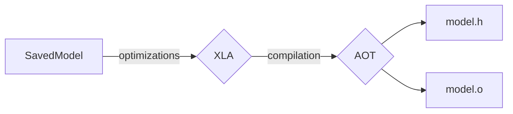

# AOT compilation of TensorFlow models
---

## Introduction

The *usual* way of evaluating TensorFlow models in CMSSW is through the TF C++ interface provided in `PhysicsTools/TensorFlow` as described in the [TensorFlow inference documentation](tensorflow2.md).
This way of model inference requires saving a trained model in the so-called frozen graph format, and then loading it through the TF C++ API within CMSSW which builds an internal representation of the computational graph.
While being straight forward and flexible, this approach entails two potential sources of overhead:

- The TF C++ library and runtime requires a sizeable amount of memory at runtime.
- The internal graph representation is mostly identical that defined during model training, meaning that it is not necessarily optimal for fast inference.

**Ahead-of-time (AOT) compilation of TensorFlow models is a way to avoid this overhead while potentially also reducing compute runtimes and memory footprint.**
It consists of three steps (==note that you do not have to run these steps manually as there are tools provided to automate them==):

1. First, computational graph is converted to a series of operations whose kernel implementations are based on the [Accelerated Linear Algebra (XLA)](https://en.m.wikipedia.org/wiki/Accelerated_Linear_Algebra) framework.
2. In this process, low-level optimization methods can be applied (kernel fusion, memory optimization, ...) that exploit the graph-structure of the model. More info can be found [here](https://github.com/tensorflow/tensorflow/blob/2ed62d85d1fd0baa23d7d9164976f42ada2bf558/tensorflow/compiler/jit/flags.cc#L93-L193) and [here](https://github.com/openxla/xla/blob/main/xla/xla.proto).
3. Using XLA, the sequence of operations can be compiled and converted to machine code which can then be invoked through a simple function call.



One should note that the model integration and deployment workflow is **signficantly different**.
Since self-contained executable code is generated, any custom code (e.g. a CMSSW plugin) that depends on the generated code needs to be compiled everytime a model changes - after each training, change of input / output signatures, or updated batching options.
==However==, the tools that are described below greatly simplify this process.

This approach works for [most models](#model-compatibility) and supports multiple inputs and outputs of different types.
In general, various compute backends are supported (GPU, TPU) but for now, the implementation in CMSSW focuses on CPU only.

Further info:

- [TensorFlow documentation](https://www.tensorflow.org/xla)
- [Summary gist](https://gist.github.com/riga/f9a18023d9f7fb647d74daa9744bb978) (summarizes the central steps of the compilation process and model usage)
- [Talk at Core Software Meeting](https://indico.cern.ch/event/1356289/#19-ahead-of-time-compilation-o)

The AOT mechanism was introduced in CMSSW\_14\_1\_0\_pre3 ([cmssw#43941](https://github.com/cms-sw/cmssw/pull/43941), [cmssw#44519](https://github.com/cms-sw/cmssw/pull/44519), [cmsdist#9005](https://github.com/cms-sw/cmsdist/pull/9005)).
The interface is located at [cmssw/PhysicsTools/TensorFlowAOT](https://github.com/cms-sw/cmssw/tree/master/PhysicsTools/TensorFlowAOT).

!!! info "Note on dynamic batching"

    The compiled machine code is created with a fixed layout for buffers storing input values, intermediate layer values, and final outputs.
    ==Due to this, models have to be compiled with one or more static batch sizes.==
    However, a mechanism is provided in the CMSSW interface that emulates dynamic batching by stitching the results of multiple smaller batch sizes for which the model was compiled.
    More info is given [below](#dynamic-batching-strategies).


## Software setup

To run the examples shown below, create a mininmal setup with the following snippet.
==Adapt== the `SCRAM_ARCH` according to your operating system and desired compiler.

```shell linenums="1"
export SCRAM_ARCH="el8_amd64_gcc12"
export CMSSW_VERSION="CMSSW_14_1_0_pre3"

source "/cvmfs/cms.cern.ch/cmsset_default.sh" ""

cmsrel "${CMSSW_VERSION}"
cd "${CMSSW_VERSION}/src"

cmsenv
scram b
```


## Saving your model

The AOT compilation process requires a TensorFlow model saved in the so-called [`SavedModel` format](https://www.tensorflow.org/guide/saved_model).
Its output is a directory that usually contains the graph structure, weights and meta data.

Instructions on how to save your model are shown below, depending on whether you use Keras or plain TensorFlow with `#!python tf.function`'s.
Also note that, in both examples, models are saved with a dynamic (that is, unspecified) batch size which is taken advantage of in the compilation process in the subsequent step.

=== "Keras"

    In order for Keras to built the internal graph representation before saving, make sure to either compile the model, or pass an `input_shape` to the first layer:

    ```python linenums="1" hl_lines="16"
    # coding: utf-8

    import tensorflow as tf
    import tf.keras.layers as layers

    # define your model
    model = tf.keras.Sequential()
    model.add(layers.InputLayer(input_shape=(10,), name="input"))
    model.add(layers.Dense(100, activation="tanh"))
    model.add(layers.Dense(3, activation="softmax", name="output"))

    # train it
    ...

    # save as SavedModel
    tf.saved_model.save(model, "/path/to/saved_model")
    ```

=== "tf.function"

    Let's consider you write your network model in a standalone function (usually a `tf.function`).
    In this case, you need to wrap it's invocation inside a `tf.Module` instance as shown below.

    ```python linenums="1" hl_lines="7 21 26 29"
    # coding: utf-8

    import tensorflow as tf

    # define the model
    @tf.function
    def model_func(x):
        # lift variable initialization to the lowest context so they are
        # not re-initialized on every call (eager calls or signature tracing)
        with tf.init_scope():
            W = tf.Variable(tf.ones([10, 1]))
            b = tf.Variable(tf.ones([1]))

        # define your "complex" model here
        h = tf.add(tf.matmul(x, W), b)
        y = tf.tanh(h, name="y")

        return y

    # wrap in tf.Module
    class MyModel(tf.Module):
        def __call__(self, x):
            return model_func(x)

    # create an instance
    model = MyModel()

    # save as SavedModel
    tf.saved_model.save(model, "/path/to/saved_model")
    ```

The following files should have been created upon success.

??? hint "SavedModel files"

    ```
    /path/to/saved_model
    │
    ├── variables/
    │   ├── variables.data-00000-of-00001
    │   └── variables.index
    │
    ├── assets/  # likely empty
    │
    ├── fingerprint.pb
    │
    └── saved_model.pb
    ```


## Model compatibility

Before the actual compilation, you can check whether your model contains any operation that is not XLA/AOT compatible.
For this, simply run

<!-- termynal -->

```shell
$ cmsml_check_aot_compatibility /path/to/saved_model --devices cpu

...
cpu: all ops compatible
```

and check its output.
If you are interested in the full list of operations that are available (independent of your model), append `--table` to the command.

??? hint "Full output"

    ```
    > cmsml_check_aot_compatibility /path/to/saved_model --devices cpu

    +----------------+-------+
    | Operation      | cpu   |
    +================+=======+
    | AddV2          | yes   |
    +----------------+-------+
    | BiasAdd        | yes   |
    +----------------+-------+
    | Const          | yes   |
    +----------------+-------+
    | Identity       | yes   |
    +----------------+-------+
    | MatMul         | yes   |
    +----------------+-------+
    | Mul            | yes   |
    +----------------+-------+
    | ReadVariableOp | yes   |
    +----------------+-------+
    | Rsqrt          | yes   |
    +----------------+-------+
    | Softmax        | yes   |
    +----------------+-------+
    | Sub            | yes   |
    +----------------+-------+
    | Tanh           | yes   |
    +----------------+-------+

    cpu: all ops compatible
    ```


## AOT compilation

The compilation of the model requires quite a few configuration options as the process that generates code is quite flexible.
Therefore, this step requires a configuration file in either yaml of json format.
An example is given below.

???+ hint "aot_config.yaml"

    ```yaml
    model:
        # name of the model, required
        name: test

        # version of the model, required
        version: "1.0.0"

        # location of the saved_model directory, resolved relative to this file,
        # defaults to "./saved_model", optional
        saved_model: ./saved_model

        # serving key, defaults to "serving_default", optional
        serving_key: serving_default

        # author information, optional
        author: Your Name

        # additional description, optional
        description: Some test model

    compilation:
        # list of batch sizes to compile, required
        batch_sizes: [1, 2, 4]

        # list of TF_XLA_FLAGS (for the TF -> XLA conversion), optional
        tf_xla_flags: []

        # list of XLA_FLAGS (for the XLA optimization itself), optional
        xla_flags: []
    ```

    An additional example can be found [here](https://github.com/cms-externals/cms-tfaot/tree/master/test_models/simple).

With that, we can initiate the compilation process.

<!-- termynal -->

```shell
$ cms_tfaot_compile \
$    --aot-config aot_config.yaml \
$    --output-directory "${CMSSW_BASE}/tfaot/test" \
$    --dev

saved model at '/tmp/tmpb2qnby72'
compiling for batch size 1
compiling for batch size 2
compiling for batch size 4
successfully AOT compiled model 'test' for batch sizes: 1,2,4
```

Upon success, all generated files can be found in `$CMSSW_BASE/tfaot/test` and should look like indicated below.

???+ hint "Generated files"

    ```
    ${CMSSW_BASE}/tfaot/test
    │
    ├── lib/
    │   ├── test_bs1.o        # object file compiled for batch size 1
    │   ├── test_bs2.o        # for batch size 2
    │   └── test_bs4.o        # for batch size 4
    │
    ├── include/
    │   └── tfaot-model-test
    │       ├── test_bs1.h    # header file generated for batch size 1
    │       ├── test_bs2.h    # for batch size 2
    │       ├── test_bs4.h    # for batch size 4
    │       └── model.h       # entry point that should be included by CMSSW plugins
    │
    └── tfaot-model-test.xml  # tool file that sets up your scram environment
    ```

**Note** that the name of the model is injected into `tfaot-model-NAME`, defining the names of the include directory as well as the tool file (xml).

At the end, the `cms_tfaot_compile` command prints instructions on how to proceed.
They are described in more detail below.


## Inference in CMSSW

The model integration and inference can be achieved in five steps.
Please find the full code example [below](#full-example).
Also, take a look at the [AOT interface unit tests](https://github.com/cms-sw/cmssw/blob/master/PhysicsTools/TensorFlowAOT/test/testInterface.cc) to get a better idea of the API.


### 1. Tool setup

As printed in the instructions at the end of `cms_tfaot_compile`, you should register the compiled model as a *software dependency* via scram.
For this reason, a custom tool file was created that you need to `setup`.

<!-- termynal -->

```shell
$ scram setup ${CMSSW_BASE}/tfaot/test/tfaot-model-test.xml
```


### 2. CMSSW module setup

In the next step, you should instruct your `BuildFile.xml` (in `SUBSYSTEM/MODULE/plugins/BuildFile.xml` if you are writing a CMSSW plugin, or in `SUBSYSTEM/MODULE/BuildFile.xml` if you intend to use the model inside `src/` or `interface/` directory of your module) to ==depend on the new tool==.
This could like like the following.

```xml linenums="1"
<use name="tfaot-model-test" />

<export>
    <lib name="1" />
</export>
```


### 3. Includes

In your source file, include the generated header file as well as the AOT interface.

```cpp linenums="1"
#include "PhysicsTools/TensorFlowAOT/interface/Model.h"
#include "tfaot-model-test/model.h"
// further framework includes ...
```


### 4. Initialize objects

Your model is accessible through a type named `#!cpp tfaot_model::NAME`.
You can access it by initializing a `#!cpp tfaot::Model<T>` instance, providing your type as a template parameter.

```cpp linenums="1"
auto model = tfaot::Model<tfaot_model::test>();
```

When used in a plugin such as an `#!cpp EDProducer`, you should create one model instance per plugin instance, that is, not as part of a `#!cpp GlobalCache` but as a normal instance member.
As shown below, the `#!cpp model.run()` call is not `#!cpp const` and thus, not thread-safe.
The memory overhead is minimal though, as the model is a just thin wrapper around the compiled machine code.

At this point, one would like to configure the dynamic batching strategies on the model.
However, this is optional and a performance optimization measure, and therefore shown [later](#dynamic-batching-strategies).


### 5. Inference

```cpp linenums="1"
// define input for a batch size of 1
// (just a single float input, with shape 1x4)
tfaot::FloatArrays input = { {0, 1, 2, 3} };

// define output
// (just a single float output, which will shape 1x2)
tfaot::FloatArrays output;

// evaluate the model
// the template arguments of run() correspond to the types of the outputs
// that are "tied" the "1" denote the batch size of 1
std::tie(output) = model.run<tfaot::FloatArrays>(1, input);

// print output
std::cout << "output[0]: " << output[0][0] << ", " << output[0][1] << std::endl;
// -> "output[0]: 0.648093, 0.351907"
```

Since we, by intention, do not have access to TensorFlow's `tf::Tensor` objects, the types `#!cpp tfaot::*Arrays` with `*` being `Bool`, `Int32`, `Int64`, `Float`, or `Double` are nested `#!cpp std::vector<std::vector<T>>` objects.
This means that access is simple, but ==please be aware of cache locality== when filling input values.

The `#!cpp model.run()` method is variadic in its inputs and outputs, both for the numbers and types of arguments.
This means that a model with two inputs, `#!cpp float` and `#!cpp bool`, and two outputs, `#!cpp double` and `#!cpp int32_t`, would be called like this.

```cpp linenums="1"
tfaot::FloatArrays in1 = ...;
tfaot::BoolArrays in2 = ...;
tfaot::DoubleArrays out1;
tfaot::Int32Arrays out2;

std::tie(out1, out2) = model.run<tfaot::DoubleArrays, tfaot::Int32Arrays>(
    1, in1, in2);
```

### Full example

??? hint "Click to expand"

    The example assumes the following directory structure:

    ```
    MySubsystem/MyModule/
    │
    ├── plugins/
    │   ├── MyPlugin.cpp
    │   └── BuildFile.xml
    │
    └── test/
        └── my_plugin_cfg.py
    ```

    === "plugins/MyPlugin.cpp"

        ```cpp linenums="1" hl_lines="2"
        --8<-- "content/inference/code/tensorflow_aot/tensorflow_aot_plugin.cpp"
        ```

    === "plugins/BuildFile.xml"

        ```xml linenums="1"
        --8<-- "content/inference/code/tensorflow_aot/tensorflow_aot_buildfile.xml"
        ```

    === "test/my_plugin_cfg.py"

        ```python linenums="1"
        --8<-- "content/inference/code/tensorflow_aot/tensorflow_aot_cfg.py"
        ```


## Dynamic batching strategies

Compiled models are specialized for a single batch size with buffers for inputs, intermediate layer values, and outputs being statically allocated.
As explained [earlier](#4-initialize-objects), the `#!cpp tfoat::Model<T>` class (with `#!cpp T` being the wrapper over all batch-size-specialized, compiled models) provides a mechanism that emulates dynamic batching.
More details were presented at a [recent Core Software meeting contribution](https://indico.cern.ch/event/1356289/#19-ahead-of-time-compilation-o).


### Batch rules and strategies

Internally, `#!cpp tfoat::Model<T>` distinguishes between the ==target batch size==, and ==composite batch sizes==.
The former is the batch size that the model should emulate, and the latter are the batch sizes for which the model was compiled.

`#!cpp BatchRule`'s define how a target batch size should be emulated.

- A batch rule of `5:1,4` (in its string representation) would state that the target batch size of 5 should be emulated by stitching together the results of batch sizes 1 and 4.
- A batch rule of `5:2,4` would mean that the models compiled for batch sizes 2 and 4 are evaluated, with the latter being zero-padded by 1.

The `#!cpp BatchStrategy` of a model defines the set of `#!cpp BatchRule`'s that are currently active.


### Default rules and optimization

==There is no general, a-priory choice of batch sizes that works best for all models==.
Instead, the optimal selection of batch sizes and batch rules depends on the model and the input data, and should be determined through profiling (e.g. using the [MLProf](https://github.com/cms-ml/MLProf) project).
However, the following guidelines can be used as a starting point.

- Unlike for other batch sizes, models compiled for a batch size of 1 (`model1`) are subject to an additional, internal optimization step due to reductions to one-dimensional arrays and operations. It is therefore recommended to always include a batch size of 1.
- For higher batch sizes, (single core) vectorization can be exploited, which can lead to a significant speed-up.
- ==The exact break-even points are model dependent==. This means that for a target batch size of, say, 8 it could be more performant to evaluate `model1` 8 times than to evaluate `model8` once, `model4` twice or `model2` four times. If this is the case, the optimization available for `model1` (taking into account the stitching overhead!) outweighs the vectorization gains entailed by e.g. `model8`.

==Also, it should be noted that not every possible target batch size must be configured through a batch rule==.
In fact, the `#!cpp tfoat::Model<T>` does not require any batch rule to be pre-defined as an algorithm is in place that, for yet unseen batch sizes, constructs default batch rules.

- If the target batch size matches one of the available, composite batch sizes, this size is used as is.
- Otherwise, the smallest available, composite batch size is repeated until the target batch size, or a larger value is reached. If the value is larger, zero-padding is applied to the last evaluation.

==For central, performance-critical models, an optimization study should be conducted to determine the optimal batch sizes and rules.==


## XLA optimization

As described [above](#introduction), the conversion from a TensorFlow graph to compiled machine code happens in two stages which can be separately optimized through various flags.
Both sets of flags can be controlled through the [`aot_config.yaml`](#aot-compilation).

- The TF-XLA boundary is configured through so-called `tf_xla_flags` in the `compilation` settings. Example: `#!yaml tf_xla_flags: ["--tf_xla_min_cluster_size=4"]`, The full list of possible flags can be found [here](https://github.com/tensorflow/tensorflow/blob/2ed62d85d1fd0baa23d7d9164976f42ada2bf558/tensorflow/compiler/jit/flags.cc#L93-L193).
- The XLA optimizer and code generator can be controlled through `xla_flags` in the `compilation` settings. Example: `#!yaml xla_flags: ["--xla_cpu_enable_fast_math=true"]`. The full list of possible flags can be found [here](https://github.com/openxla/xla/blob/main/xla/xla.proto).


## Production workflow

If you intend to integrate an AOT compiled model into CMSSW production code, you need to account for the differences with respect to deployment using other direct inference methods (e.g. [TF C++](tensorflow2.md) or [ONNX](onnx.md)).
Since the model itself is represented as compiled code rather than an external model file that can be read and interpreted at runtime, production models must be registered as a package in [CMSDIST](https://github.com/cms-sw/cmsdist).
The components are shown below.


The integration process takes place in four steps.

1. Push your model (in `SavedModel` format) to a central [CMSDATA](https://github.com/cms-data) repository.
2. Create a new spec in [CMSDIST](https://github.com/cms-sw/cmdsist) ([example](https://github.com/cms-sw/cmsdist/blob/HEAD/tfaot-model-test-simple.spec)), named `tfaot-model-NAME.spec`. This spec file should define two variables.
    - `%{aot_config}`: The path to an AOT configuration file (required).
    - `%{aot_source}`: A source to fetch, containing the model to compile (optional). When provided through a CMSDATA repository, you would typically delcare it as a build requirement via `BuildRequires: data-NAME` and just define `%{aot_config}`. See [`tfaot-compile.file`](https://github.com/cms-sw/cmsdist/blob/HEAD/tfaot-compile.file) for more info.
3. Add your spec to the list of [`tfaot` models](https://github.com/cms-sw/cmsdist/blob/HEAD/tfaot-models.file).
4. After integration into CMSDIST, a tool named `tfaot-model-NAME` will be provided centrally and the instructions for setting it up and using the compiled model in your plugin are identical to the ones described [above](#inference-in-cmssw).


## Links and further reading

- [`cmsml` package](https://cmsml.readthedocs.io)
- [`cms-tfaot` package](https://github.com/cms-externals/cms-tfaot)
- [MLProf project](https://github.com/cms-ml/MLProf)
- CMSSW
    - [TensorFlowAOT interface](https://github.com/cms-sw/cmssw/blob/master/PhysicsTools/TensorFlowAOT)
    - [CMSSW process options](https://twiki.cern.ch/twiki/bin/view/CMSPublic/SWGuideEDMParametersForModules#The_options_Parameter_Set)
    - [Talk at Core Software Meeting](https://indico.cern.ch/event/1356289/#19-ahead-of-time-compilation-o)
- TensorFlow
    - [TensorFlow 2 tutorial](https://indico.cern.ch/event/882992/contributions/3721506/attachments/1994721/3327402/TensorFlow_2_Workshop_CERN_2020.pdf)
    - [TensorFlow XLA documentation](https://www.tensorflow.org/xla)
    - [`TF_XLA` optimization options](https://github.com/tensorflow/tensorflow/blob/2ed62d85d1fd0baa23d7d9164976f42ada2bf558/tensorflow/compiler/jit/flags.cc#L93-L193)
    - [`XLA` optimization options](https://github.com/openxla/xla/blob/main/xla/xla.proto)
    - [XLA overview (by NVIDIA)](https://docs.nvidia.com/deeplearning/frameworks/tensorflow-user-guide/#controlling-xla)
- Keras
    - [API](https://keras.io/api)

---

Authors: [Marcel Rieger](mailto:marcel.rieger@cern.ch), [Bogdan Wiederspan](mailto:bogdan.wiederspan@cern.ch)
