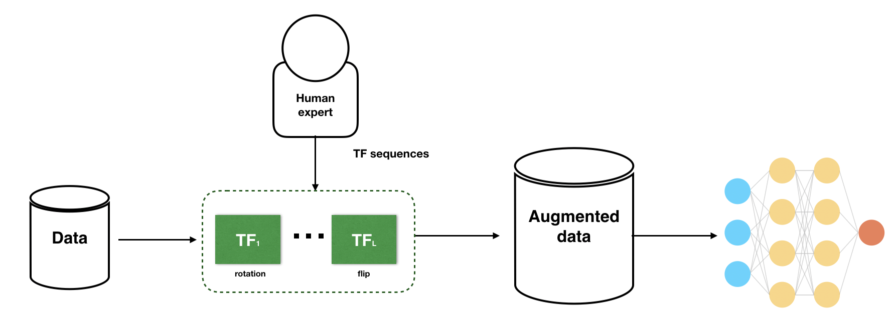
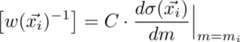

# Data augmentation
*The introduction is based on papers by [Shorten & Khoshgoftaar, 2019][0x] and [Rebuffi et al., 2021][0c] among others*

With the increasing complexity and sizes of neural networks one needs huge amounts of data in order to train a state-of-the-art model. However, generation of this data is often a very resource heavy and time consuming process. Thus one might either augment the existing data with more descriptive variables or combat the data scarcity problem by artificially increasing the size of the dataset by adding new instances without the resource heavy generation process. Both methods, augmenting the existing data without adding new instances and increasing the amount of training data in order to improve the accuracy and robustness of a given model are known in machine learning (ML) applications as *data augmentation (DA)* methods. The first of the methods is more widely known as *feature generation* or *feature engineering* and is done on instance level, whereas the latter one is done on dataset level.

As shown by [Freer & Yang, 2020][0a], then introducing noise into data to form additional data points improved the learning ability of several models which otherwise performed relatively poorly. Thus DA is creating variations that the model may see in the real world. If done [right](#tips-and-tricks), preprocessing the data with DA will result in a superior training as it also acts as a regularizer by reducing overfitting during training. As a further application of DA, datasets affected by [class imbalance](#class-imbalance) (one of the classes is under-represented) can be balanced.

The dataset level data augmentation techniques can generally be divided into two main categories: *synthetic data augmentation* (SDA) and *real data augmentation* (RDA). As the name suggests, then with SDA one generates new (genuine-like) data from scratch, whereas with RDA one makes minor changes to the already existing data in order to generate new samples.

Examples of RDA include rotating (e.g if we expect the event to be rotationally symmetric) and zooming among plethora of other methods detailed in this overview, whereas GAN and VAE are examples of SDA.


|  |
|:--:|
| *Generic pipeline of a heuristic DA (figure taken from [Li, 2020][0b])* |


<!-- 1. -->
## DA applications in HEP 


### Feature engineering for physics analysis
*This part is based mostly on [Erdmann et al., 2018][1x]*

Feature engineering is one of the key parts of machine learning workflow. Feature engineering transforms and augments training data with additional features in order to make the training more effective.
However, with deep learning one could start already with only raw features and the features will be created as the network learns.


**To be completed**


### Jet tagging
*This section and the following two subsections are based on the papers by [Dolan & Ore, 2021][1a] and [Bradshaw et al., 2019][1b]*

In order to tag jets over a wide range of transverse momenta of jet masses, one often needs multiple networks trained on a specific narrow range of transverse momenta. However this is undesirable, since  training data for the entire range over which the model will be used is necessary. Furthermore this introduces unnecessary complexity to the tagger. One way to overcome the problem is to train a mass-generalized jet tagger, where with a simple DA strategy we standardize the angular scale of jets with different masses - this kind of strategy is shown to produce a strong generalization by [Dolan & Ore, 2021][1a].

The DA strategy used by [Dolan & Ore, 2021][1a] to produce strong generalization for tagging jets with different jet transverse momenta used [planing](#planing) and [zooming](#zooming) wherewith they aim to produce a model whose learning would generalize to domains that are unseen during training. Both of those methods are described in this document.

Given the success of zooming, an alternative approach would be to consider scale transformations as a symmetry of the data and embed this information into the network architecture itself. There already exist work on jet taggers that are equivalent to other symmetries of jets as well as implementations of scaling-equivariant CNNs. Of course, in applications where the relationship between domains is less easily understood, it may not be possioble to identify the appropriate DA procedure.

In conclusion [Dolan & Ore, 2021][1a] found that mass-generalization is not necessarily a byproduct of decorrelation.
When jets are zoomed, all the models they compared behave similarly with far less correlation than the unzoomed baseline, where zooming provides a strong generalization for all models and leads to relatively small dependence on jet mass.


#### Planing
*This section is based on the papers by [Chang et al., 2018][1c] and [Oliveira et al., 2017][1d]*

Planing is one of many different approaches to understanding a networks discrimination power and is used  for identifying combinations of variables that can discriminate signal from background is done by removing information, where the performance degradation of the new network provides diagnostic value.
Additionally it allows the investigation of the linear versus nonlinear nature of the boundaries between signal and background.

Planing was one of the first methods for mass decorrelation that was explored in ML studies of jet physics. The planing procedure introduces reweighing of the data to smooth away the features in a given variable as shown in (1), which in practice corresponds to binning the variable and inverting it. However, doing this produces still some finite bin effects. This weighing results in having uniform distributions in signal and background such that the jet mass no longer provides discrimination. New networks trained on the modified data.

 ........................ (1)

By iteratively planing training data, it is possible to remove the machine's ability to classify. As a by-product, the planed variables determine combinations of input variables that explain the machine's discriminating power.

Another method of inferring the discrimination power of variables is *saturation*. It compares a network trained on only low level inputs with networks trained after adding higher-level variables. Saturation provides a tool to ensure that our networks are sufficiently deep, by checking that the new network's performance does not improve by much.

Yet another method would be to train networks using only the high-level variable(s) of interest as inputs, where in contrast to the saturation technique, no low level information is being provided to the network. The diagnostic test would be to compute if the resulting network can achieve performance similar to that of a deep network that has been trained on only the low level inputs.

However planing has two advantages over the previously described methods. First, the number of input parameters would typically change when going from only low level to only high level variables. Unlike planing this requires altering the network architecture. This in turn can impact the [optimization of hyperparameters](./model_optimization.md), thereby complicating the comparison. Furthermore this method suffers the same issue as saturation in that as the limit towards ideal performance is achieved, one is forced to take seriously small variations in the metrics. If there are not enough training trials to adequately determine the errors, these small variations could be incorrectly interpreted as consistent with zero. This can again be contrasted with planing in that our approach yields a qualitative drop in performance and is more straightforward to interpret.


#### Zooming
*This section is based on the papers by [Barnard et al., 2016][1e]*

Zooming is used in implementations of scale-invariant NN based taggers by reducing the pT dependence of the model. It leads to an improvement of around 10-20% in performance across a wide range of jet transverse momenta.

One of the more common applications of zooming is in the study of jet substructure by helping to identify (or *tag*) the hadronic decay products of a wide variety of resonances (Higgs, W, Z bosons among others).

Jets from boosted resonances with distinct masses differ from one another by the separation of the two subjets within them. This means that a NN trained on jets within a narrow mass window will not learn this scaling relationship, which then leads to poor generalization at new masses.

Here the zooming procedure reclusters the jet into subjets and then scales their separation by a factor that depends on the mass of the jet and the transverse momentum of it. In case of jet masses with wide variation, a different procedure without any reference to jet mass, transverse momentum or clustering radius is used, by scaling eta and phi of all jet constituents by a factor that ensures the average distance of each particle to be 0. This method of zooming was found to be very effective in [Dolan & Ore, 2021][1a].

It was also found that zooming is sufficient to produce near-optimal generalization and that the meta-leaning algorithms provide only a minor advantage when used in combination with zooming. If jets are not zoomed, the meta-learning algorithms behave similarly to the baseline and L1 regularization is able to maintain accurate classification at new masses.

Furthermore, [Bradshaw et al., 2019][1b] found that data augmentation using planing and other method based on principal component analysis worked as well as ML methods based on BDTs and adversarial networks.

For W-jets the zooming procedure results in a more regular and compact average shower shape, and the second (lower pT) subjet becomes better spatially defined as expected. Wile the average image of the QCD jet becomes more compact, the subjets remain somewhat smeared compared to the W-jets.

Advantage of using the zooming technique is that it makes the construction of scale invariant taggers easier. Scale invariant searches which are able to interpolate between the boosted and resolved parts of phase space have the advantage of being applicable over a broad range of masses and kinematics, allowing a single search or analysis to be effective where previously more than one may have been necessary.

As predicted the zoomed network outperforms the unzoomed one, particularly at low signal efficiency, where the background rejection rises by around 20%. Zooming has the greatest effect at high pT.

Here one can find the full jet image construction and preprocessing steps:
- Jet clustering and trimming
- translation
- pixelization
- rotation
- reflection
- **zooming**
- cropping and normalization


### Fast simulation with deep learning
*The following text is based on this [Chen et al., 2020][1f]*


We rely on accurate simulation of physics processes, however currently it is very common for LHC physics to be affected by large systematic uncertanties due to the limited amount of simulated data, especially for precise measurements of SM processes for which large datasets are already available. So far the most widely used simulator is GEANT4 that provides state-of-the-art of simulation accuracy. But running this is demanding in terms of time and resources. Consequently, delivering synthetic data at the pace at which LHC delivers real data is one of the most challenging tasks for computing infrastructures of the LHC experiments. The typical time it takes to simulate one single event is in the ballpark of 100 seconds.

Recently, generative algorithms based on deep learning (DL) have been proposed as a possible solution to speed up GEANT4, though one needs to work beyond the collision-as-image paradigm so that the DL-based simulation accounts for the irregular geometry of a typical detector while delivering a dataset in a format compatible with downstream reconstruction software.

Another method to solve the issue was proposed by [Chen et al., 2020][1f]. They adopt generative Deep Learning (DL) model to convert an analysis specific representation of collision events at generator level to the corresponding representation at reconstruction level. Thus, this novel fast-simulation workflow starts from a large amount of generator-level events to deliver large analysis-specific samples.

They trained a neural network to model detector resolution effects as a transfer function acting on an analysis-specific set of relevant features, computed at generation level, i.e, in absence of detector effects. However, their model does not sample events from a latent space (like a [GAN](#generative-adversarial-networks-gans) or a plain [VAE](#variational-autoencoders-vaes)). Instead, it works as a fast simulator of a given generator-level event, preserving the correspondence between the reconstructed and the generated event, which allows us to compare event-by-event residual distributions.
Furthermore, this model is much simpler than a generative model like a [GAN](#generative-adversarial-networks-gans).

Step one in this whole workflow, which is generating events in full format is the most resource heavy task, where, as noted before, generating one event takes roughly 100 seconds. However with this new proposed method O(1000) events are generated per second. Also one would save on storage: for the full format O(1) MB/event is needed, then for the DL model only 8MB was used to store 100000 events. To train the model, they used NVIDIA RTX2080 and it trained for 30 minutes, which in terms of overall production time is negligible. For generating N=1M events and n=10%N, one would save 90% of the CPU resources and 79% of the disk storage. Thus augmenting the centrally produced data is a viable method and could help the HEP community to face the computing challenges of the High-Luminosity LHC.

Another more extreme approach investigated the use of GANs and VAEs for generating physics quantities which are relevant to a specific analysis. In this case, one learns the N-dimensional density function of the event, in a space defined by the quantities of interest for a given analysis. So sampling from this function, one can generate new data. Trade-off between statistical precision (decreases with the increasing amount of generated events) and the systematic uncertainty that could be induced by a non accurate description of the n-dim pdf.

Qualitatively, no accuracy deterioration was observed due to scaling the dataset size for DL. This fact proves the robustness of the proposed methodology and its effectiveness for data augmentation.

---

<!-- 2. -->
## DA methods for increasing amount of training data

Some of the common techniques used in data augmentation include:

- Extrapolation Technique: Based on heuristics. The relevant fields are updated or provided with values.
- Tagging Technique: Common records are tagged to a group, making it easier to understand and differentiate for the group.
- Aggregation Technique: Using mathematical values of averages and means, values are estimated for relevant fields if needed
- Probability Technique: Based on heuristics and analytical statistics, values are populated based on the probability of events.

[https://www.techopedia.com/definition/28033/data-augmentation]

**To be completed**


### DA for images

Classic image processing activities for data augmentation are:

cropping
random rotating,
translation ( image is moved along X, Y direction)
padding,
re-scaling,
vertical and horizontal flipping
zooming
darkening & brightening/color modification
grayscaling
changing contrast
adding noise


- Geometric transformations (flip, crop, rotate, translate, etc.)
- Color space transformations (change RGB color channels, intensify color)
- Kernel filters (sharpen, blur)
- Random erasing (of a part of the image)
- Image mixing


### Generative Adversarial Networks (GANs)
*The following text is written based on the works by [Musella & Pandolfi, 2018][2a] and [Hashemi et al., 2019][2b] and [Kansal et al., 2022][2c] and [Rehm et al., 2021][2d] and [Choi & Lim, 2021][2e] and [Kansal et al., 2020][2f]*

More recently, data augmentation studies have begun to focus on the field of deep learning, more specifically on the ability of generative models to create artificial data which is then introduced during the classification model training process.

In data sciences data augmentation techniques are used to increase the amount by either synthetically creating (GAN) data from already existing samples or modifying the data at hand with small noise or rotation. ([Rebuffi et al., 2021][0c])


GANs have been proposed as a fast and accurate way of modeling high energy jet formation[23] and modeling showers through calorimeters of high-energy physics experiments.[24] [25] [26] [27] GANs have also been trained to accurately approximate bottlenecks in computationally expensive simulations of particle physics experiments. Applications in the context of present and proposed CERN experiments have demonstrated the potential of these methods for accelerating simulation and/or improving simulation fidelity.[28] [29]

**To be completed**


<!-- [GANs for generating EFT models](https://arxiv.org/pdf/1809.02612.pdf) -->

### Variational autoencoders (VAEs)
*The following section is partly based on [Otten et al., 2021][2g]*
<!-- also for GANs -->

**To be completed**


<!-- ### Transformation Adversarial Networks for Data Augmentations (TANDA) -->


## Class imbalance
*Text in part based on [He et al., 2010][2k]*

Generally speaking, imbalanced learning occurs whenever some type of data distribution dominates the instance space compared to other data distributions. The state-of-the-art research methodologies for handling imbalanced learning problems can be into the following five major directions:
- **[Sampling strategies](#sampling)**
- **Synthetic data generation ([SMOTE](#synthetic-minority-over-sampling-technique-smote) & [ADASYN](#adaptive-synthetic-sampling-approach) & DataBoost-IM)**  - aims to overcome the imbalance by artificially generating data samples.
- **Cost-sensitive learning** - uses cost-matrix for different types of errors or instance to facilitate learning from imbalanced data sets. This means that cost-sensitive learning does not modify the imbalanced data distribution directly, but targets this problem by using different cost-matrices that describe the cost for misclassifying any particular data sample.
- **Active learning** - conventionally used to solve problems related to unlabeled data, though recently it has been more actively used in learning imbalanced data sets. Instead of searching the entire training space, this method effectively selects informative instances from a random set of training populations, therefore significantly reducing the computational cost when dealing with large imbalanced data sets.
- **Kernel-based methods** - by integrating the regularized orthogonal weighed least squares (ROWLS) estimator, a kernel classifier construction algorithm is based on orthogonal forward selection (OFS) to optimize the model generalization for learning from two-class imbalanced data sets.


Classification tasks benefit when the class distribution of the response variable is well balanced. A popular method in addition to data augmentation to solve the problem of class imbalance is [sampling](#sampling).

technique used to adjust the class distribution of the dataset (i.e. the ratio between the different classes/categories represented).

Precision is a better measure of classifier performance for imbalanced dataset than accuracy.
Accuracy paradox for imbalance datasets.
Another way of overcoming this problem would be to sample.

### Sampling


The re-sampling techniques are implemented in four different categories: undersampling the majority class, oversampling the minority class, combining over- and undersampling, and ensembling sampling.

Oversampling and undersampling are found to work well in improving the classification for the imbalanced dataset. [Yap et al., 2013][2h]


When the percentage of the minority class is less than 5%, it is known as a rare event. When a dataset is imbalanced or when a rare event occurs, it will be difficult to get a meaningful and good predictive model due to lack of information to learn about the rare event [Au et al., 2010][2i]


**Random sampling**
<!-- [[ref]](https://www.aaai.org/Papers/KDD/1998/KDD98-011.pdf) -->

Today there are more promising techniques that try to improve the disadvantages of random-based approaches, such as synthetic data augmentation ([SMOTE](#synthetic-minority-over-sampling-technique-smote), [ADASYN](#adaptive-synthetic-sampling-approach-adasyn)) or clustering-based under-sampling techniques ([ENN](https://ieeexplore.ieee.org/document/4309137?TB_iframe=true&width=370.8&height=658.8)).


**Stratified sampling (STS)** is used in cases where the data can be partitioned into strata (subpopulations), where each strata should be collectively exhaustive and mutually exclusive. The process of dividing the data into homogeneus subgroups before samnpling is referred to as *stratification*. The two common strategies of STS are *proportionate allocation (PA)* and *optimum (disproportionate) allocation (OA)*, where the former uses a fraction in each of the stata that is proportional to that of the total populations and the latter uses additionally also the standard deviation of the distribution of the variable, so that the larger samples are taken from the strata that has the greatest variability to generate the least possible sampling variance. The advantages of using STS include smaller error in estimation (if measurements within strata have lower standard deviation) and ensurance that in case of great variablity of a given strata the estimates over all the data have similar uncertainties across all strata, this being more representative of the whole population than a simple [random sampling](#random-sampling) or [systematic sampling](#systematic-sampling). 

**NOTE:** STS is only useful the population can be exhaustively partitioned into disjoint sobgroups. Also in case of unknown class priors (the ratio of strata to the whole population) might have deleterious effects on the classification performance.

#### Over- and undersampling
Oversampling means (randmly) duplicating the minority class samples, while undersampling discards the majority class samples in order to modify the class distribution. Though oversampling might lead to overfittings [ref??], since it makes exact copies of the minority samples while undersampling may discard potentially useful majority samples.


Combination of SMOTE and undersampling performs better than only undersampling the majority class.

Over- and undersampoling remain popular as it is much easier to implement than some complex hybrid approaches.

Oversampling and undersampling are opposite and roughly equivalent techniques. There are also more complex oversampling techniques, including the creation of artificial data points with algorithms like Synthetic minority oversampling technique.

Both oversampling and undersampling involve introducing a bias to select more samples from one class than from another, to compensate for an imbalance that is either already present in the data, or likely to develop if a purely random sample were taken. Data Imbalance can be of the following types:

#### Synthetic Minority Over-sampling Technique (SMOTE)
*Text mostly based on [Chawla et al., 2002][2j] and in part on [He et al., 2010][2k]*

Synthetic Minority Over-sampling Technique (SMOTE) generates an arbitrary number of synthetic minority examples to shift the classifier learning bias toward the minority class. There also exist extensions of this work like SMOTE-Boost in which the syntetic procedure was integrated with adaptive boosting techniques to change the method of updating weights to better compensate for skewed distributions.

**To be completed**


#### Adaptive synthetic sampling approach (ADASYN)
*Text mostly based on [He et al., 2010][2k]*

Adaptive synthetic sampling approach (ADASYN) is a sampling approach for learning from imbalanced datasets, with the main idea of being to use a weighted distribution for different minority class examples according to their level of difficulty in learning, where more synthetic data is generated for minority class examples that are harder to learn compared to those minority examples that are easier to learn. Thus, ADASYN improves learning with respect to the data distributions in by reducing the bias introduced by the class imbalance and by adaptively shifting the classification boundary toward the difficult examples.

The objectives of ADASYN are reducing the bias and learn adaptively. The key idea of this algorithms is to use a density distribution as a criterion to automatically decide the number of synthetic samples that need to be generated for each minority data example. Physically this density distribution is a measurement of the distribution of weights for different minority class examples according to their level of difficulty in learning. The resulting dataset after using ADASYN will not only provide a balanced representation of the data distribution (according to the desired balance level defined in the configuration), but it also forces the learning algorithm to focus on those difficult to learn examples.

[He et al., 2010][2k] show, that this algorithm provides improved accuracy for both minority and majority classes and does not sacrifice one class in preference for another.

ADASYN is not limited to only two-class learning, but can also be generalized to multiple-class imbalanced learning problems as well as modified to facilitate incremental learning applications.

For more details and comparisons of ADASYN to other algorithms, please see [He et al., 2010][2k].

### Existing implementations
[Imbalanced-learn](https://imbalanced-learn.org/stable/user_guide.html) is an open-source Python library which provides a suite of algorithms for treating the class imbalance problem.

For augmentig image data, one can use of of the following:
- Albumentations
- ImgAug
- Autoaugment
- Augmentor
- DeepAugmnent

But it is also possible to use tools directly implemented by tensorflow, keras etc. For example:

```python
flipped_image = tf.image.flip_left_right(iamge)
```

## Tips and Tricks

- There is no 'one size fits all' in DA. Each dataset and usecase should be considered separately.
- Don't trust the augmented data blindly
- Make sure that the augmented data is representative of the problem at hand, otherwise it will negatively affect the model performance.
- There must be no unnecessary duplication of existing data, only by adding unique information we gain more insights.
- Ensure the validity of the augmented data before using it in ML models.
- If a real dataset contains biases, data augmented from it will contain biases, too. So, identification of optimal data augmentation strategy is important. So, double check your DA strategy.

## Benefits of DA

Among the many benefits that DA provides for the model training, the most notable ones are:

- Improvement of model prediction precision
- More training data for the model
- Preventing data scarcity for state-of-the-art models
- Reduction of over overfitting and creation of data variability
- Increased model generalization properties
- Help in resolving class imbalance problems in datasets
- Reduced cost of data collection and labeling
- Enabling rare event prediction


## Open challenges in Data Augmentation
*Excerpts are taken from [Li, 2020][0b]*

The limitations of conventional data augmentation approaches reveal huge opportunities for research advances. Below we summarize a few challenges that motivate some of the works in the area of data augmentation.

- From manual to automated search algorithms: As opposed to performing suboptimal manual search, how can we design learnable algorithms to find augmentation strategies that can outperform human-designed heuristics?
- From practical to theoretical understanding: Despite the rapid progress of creating various augmentation approaches pragmatically, understanding their benefits remains a mystery because of a lack of analytic tools. How can we theoretically understand various data augmentations used in practice?
- From coarse-grained to fine-grained model quality assurance: While most existing data augmentation approaches focus on improving the overall performance of a model, it is often imperative to have a finer-grained perspective on critical subpopulations of data. When a model exhibits inconsistent predictions on important subgroups of data, how can we exploit data augmentations to mitigate the performance gap in a prescribed way?


<!-- In deep learning, architecture engineering is the new feature engineering -->

<!-- 
Advanced models for data augmentation are

Adversarial training/Adversarial machine learning: It generates adversarial examples which disrupt a machine learning model and injects them into a dataset to train.
Generative adversarial networks (GANs): GAN algorithms can learn patterns from input datasets and automatically create new examples which resemble training data.
Neural style transfer: Neural style transfer models can blend content image and style image and separate style from content.
Reinforcement learning: Reinforcement learning models train software agents to attain their goals and make decisions in a virtual environment. -->


References:
-----

- [Shorten & Khoshgoftaar, 2019, "A survey on Image Data Augmentationfor Deep Learning"][0x]
- [Freer & Yang, 2020, "Data augmentation for self-paced motor imagery classification with C-LSTM"][0a]
- [Li, 2020, "Automating Data Augmentation: Practice, Theory and New Direction"][0b]
- [Rebuffi et al., 2021, "Data Augmentation Can Improve Robustness"][0c]
<!--  -->
- [Erdmann et al., 2018, "Lorentz Boost Networks: Autonomous Physics-Inspired Feature Engineering"][1x]
- [Dolan & Ore, 2021, "Meta-learning and data augmentation for mass-generalised jet taggers"][1a]
- [Bradshaw et al., 2019, "Mass agnostic jet taggers"][1b]
- [Chang et al., 2018, "What is the Machine Learning?"][1c]
- [Oliveira et al. 2017, "Jet-Images – Deep Learning Edition"][1d]
- [Barnard et al., 2016, "Parton Shower Uncertainties in Jet Substructure Analyses with Deep Neural Networks"][1e]
- [Chen et al., 2020, "Data augmentation at the LHC through analysis-specific fast simulation with deep learning"][1f]
<!--  -->
- [Musella & Pandolfi, 2018, "Fast and accurate simulation of particle detectors using generative adversarial networks"][2a]
- [Hashemi et al., 2019, "LHC analysis-specific datasets with Generative Adversarial Networks"][2b]
- [Kansal et al., 2022, "Particle Cloud Generation with Message Passing Generative Adversarial Networks"][2c]
- [Rehm et al., 2021, "Reduced Precision Strategies for Deep Learning: A High Energy Physics Generative Adversarial Network Use Case"][2d]
- [Choi & Lim, 2021, "A Data-driven Event Generator for Hadron Colliders using Wasserstein Generative Adversarial Network"][2e]
- [Kansal et al., 2020, "Graph Generative Adversarial Networks for Sparse Data Generation in High Energy Physics"][2f]
- [Otten et al., 2021, "Event Generation and Statistical Sampling for Physics with Deep Generative Models and a Density Information Buffer"][2g]
- [Yap et al., 2013, "An Application of Oversampling, Undersampling, Bagging and Boosting in Handling Imbalanced Datasets"][2h]
- [Au et al., 2010, "Mining Rare Events Data by Sampling and Boosting: A Case Study"][2i]
- [Chawla et al., 2002, "SMOTE: Synthetic Minority Over-sampling Technique"][2j]
- [He et al., 2010, "ADASYN: Adaptive Synthetic Sampling Approach for Imbalanced Learning"][2k]

[0x]: https://journalofbigdata.springeropen.com/track/pdf/10.1186/s40537-019-0197-0.pdf
[0a]: https://iopscience.iop.org/article/10.1088/1741-2552/ab57c0
[0b]: https://ai.stanford.edu/blog/data-augmentation/
[0c]: https://arxiv.org/pdf/2111.05328.pdf
<!--  -->
[1a]: https://arxiv.org/pdf/2111.06047.pdf
[1b]: https://arxiv.org/pdf/1908.08959.pdf
[1c]: https://arxiv.org/pdf/1709.10106.pdf
[1d]: https://arxiv.org/pdf/1511.05190.pdf
[1e]: https://arxiv.org/pdf/1609.00607.pdf
[1f]: https://arxiv.org/pdf/2010.01835.pdf
[1x]: https://arxiv.org/abs/1812.09722
<!--  -->
[2a]: https://arxiv.org/pdf/1805.00850.pdf
[2b]: https://arxiv.org/abs/1901.05282
[2c]: https://arxiv.org/pdf/2106.11535.pdf
[2d]: https://arxiv.org/pdf/2103.10142.pdf
[2e]: https://arxiv.org/pdf/2102.11524.pdf
[2f]: https://arxiv.org/pdf/2012.00173.pdf
[2g]: https://arxiv.org/pdf/1901.00875.pdf
[2h]: https://link.springer.com/chapter/10.1007/978-981-4585-18-7_2
[2i]: https://link.springer.com/chapter/10.1007/978-3-642-12035-0_38
[2j]: https://www.jair.org/index.php/jair/article/view/10302/24590
[2k]: http://sci2s.ugr.es/keel/pdf/algorithm/congreso/2008-He-ieee.pdf


<!-- [CLAMP: Class-conditional Learned Augmentations for Model Patching] -->


---


Content may be edited and published elsewhere by the author.

Page author: Laurits Tani, 2022