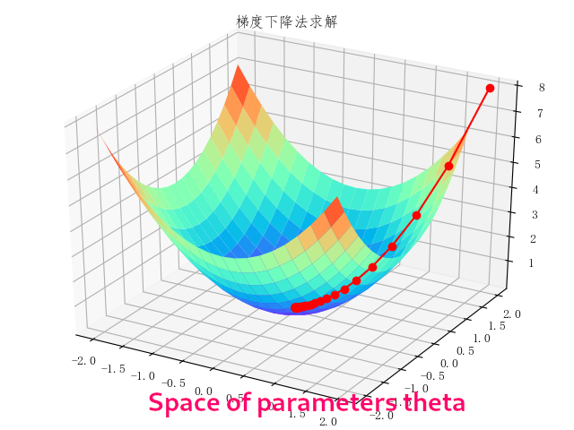
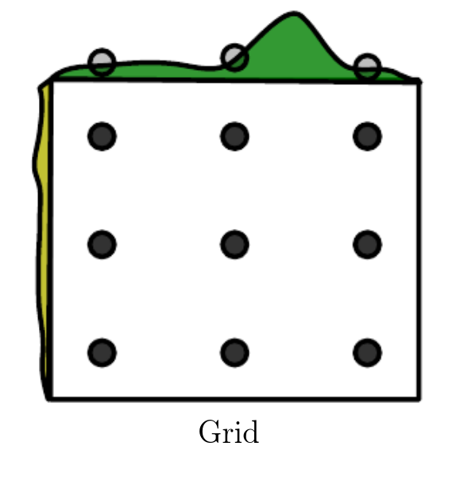
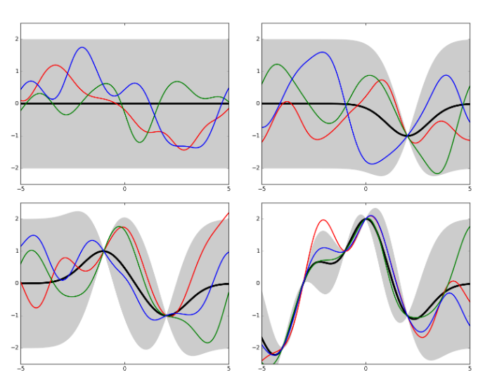

# Model optimization

This page summarizes the concepts shown in [a contribution on Bayesian Optimization to the ML Forum](https://indico.cern.ch/event/1084800/#4-bayesian-optimization) and may be edited and published elsewhere by the author.

## What we talk about when we talk about model optimization

Given some data `x` and a family of functionals parameterized by (a vector of) parameters `\theta` (e.g. for DNN training weights), the problem of learning consists in finding `argmin_\theta Loss(f_\theta(x) - y_{true})`.
The treatment below focusses on gradient descent, but the formalization is completely general, i.e. it can be applied also to methods that are not explicitly formulated in terms of gradient descent (e.g. BDTs).
The mathematical formalism for the problem of learning is briefly explained in [a contribution on statistical learning to the ML forum](https://indico.cern.ch/event/1036246/\#5-statistics-statistical-learn): for the purposes of this documentation we will proceed through two illustrations.

The first illustration, elaborated from an image by [the huawei forums](https://forum.huawei.com/enterprise/en/machine-learning-training-method-gradient-descent-method/thread/708303-895) shows the general idea behind learning through gradient descent in a multidimensional parameter space, where the minimum of a loss function is found by following the function's gradient until the minimum.

<figure>

<figcaption>The cartoon illustrates the general idea behind gradient descent to find the minimum of a function in a multidimensional parameter space (figure elaborated from an image by <a href="https://forum.huawei.com/enterprise/en/machine-learning-training-method-gradient-descent-method/thread/708303-895">the huawei forums</a>).</figcaption>
</figure>

The model to be optimized via a loss function typically is a parametric function, where the set of parameters (e.g. the *network weights* in neural networks) corresponds to a certain fixed structure of the network.
For example, a network with two inputs, two inner layers of two neurons, and one output neuron will have six parameters whose values will be changed until the loss function reaches its minimum.

When we talk about model optimization we refer to the fact that often we are interested in finding which model structure is the best to describe our data.
The main concern is to design a model that has a sufficient complexity to store all the information contained in the training data.
We can therefore think of parameterizing the network structure itself, e.g. in terms of the number of inner layers and number of neurons per layer: these *hyperparameters* define a space where we want
to again minimize a loss function.
Formally, the parametric function `f_\theta` is also a function of these hyperparameters `\lambda`: `f_{(\theta, \lambda)}`, and the `\lambda` can be optimized

The second illustration, also elaborated from an image by [the huawei forums](https://forum.huawei.com/enterprise/en/machine-learning-training-method-gradient-descent-method/thread/708303-895), broadly illustrates this concept:
for each point in the hyperparameters space (that is, for each configuration of the model), the individual model is optimized as usual. The global minimum over the hyperparameters space is then sought.

<figure>

<figcaption>The cartoon illustrates the general idea behind gradient descent to optimize the model complexity (in terms of the choice of hyperparameters) multidimensional parameter and hyperparameter space (figure elaborated from an image by <a href="https://forum.huawei.com/enterprise/en/machine-learning-training-method-gradient-descent-method/thread/708303-895">the huawei forums</a>).</figcaption>
</figure>

#### Caveat: which data should you use to optimize your model

In typical machine learning studies, you should divide your dataset into three parts. One is used for training the model (*training sample*), one is used for testing the performance of the model (*test sample*), and the third one is the one where you actually use your trained model, e.g. for inference (*application sample*). Sometimes you may get away with using test data as application data: Helge Voss (Chap 5 of Behnke et al.) states that this is acceptable under three conditions that must be simultaneously valid:

- no hyperparameter optimization is performed;
- no overtraining is found;
- the number of training data is high enough to make statistical fluctuations negligible.

If you are doing any kind of hyperparamters optimization, **thou shalt NOT use the test sample as application sample**. You should have at least three distinct sets, and ideally you should use four (training, testing, hyperparameter optimization, application).

## Grid Search

The most simple hyperparameters optimization algorithm is the *grid search*, where you train all the models in the hyperparameters space to build the full landscape of the global loss function, as illustrated in [Goodfellow, Bengio, Courville: "Deep Learning"](https://www.deeplearningbook.org/).

<figure>

<figcaption>The cartoon illustrates the general idea behind grid search (image taken from <a href="https://www.deeplearningbook.org">Goodfellow, Bengio, Courville: "Deep Learning"</a>).</figcaption>
</figure>

To perform a meaningful grid search, you have to provide a set of values within the acceptable range of each hyperparameters, then for each point in the cross-product space you have to train the corresponding model.

The main issue with grid search is that when there are nonimportant hyperparameters (i.e. hyperparameters whose value doesn't influence much the model performance) the algorithm spends an exponentially large time (in the number of nonimportant hyperparameters) in the noninteresting configurations: having `m` parameters and testing `n` values for each of them leads to `\mathcal{O}(n^m)` tested configurations. While the issue may be mitigated by parallelization, when the number of hyperparameters (the dimension of hyperparameters space) surpasses a handful, even parallelization can't help.

Another issue is that the search is binned: depending on the granularity in the scan, the global minimum may be invisible.

Despite these issues, grid search is sometimes still a feasible choice, and gives its best when done **iteratively**.
For example, if you start from the interval `\{-1, 0, 1\}`:

- if the best parameter is found to be at the boundary (1), then extend range (`\{1, 2, 3\}`) and do the search in the new range;
- if the best parameter is e.g. at 0, then maybe zoom in and do a search in the range `\{-0.1, 0, 0.1\}`.

## Random search

An improvement of the grid search is the *random search*, which proceeds like this:

- you provide a marginal p.d.f. for each hyperparameter;
- you sample from the joint p.d.f. a certain number of training configurations;
- you train for each of these configurations to build the loss function landscape.

This procedure has significant advantages over a simple grid search: random search is not binned, because you are sampling from a continuous p.d.f., so the pool of explorable hyperparameter values is larger;
random search is exponentially more efficient, because it tests a unique value for each influential hyperparameter on nearly every trial.

Random search also work best when done iteratively. The differences between grid and random search are again illustrated in [Goodfellow, Bengio, Courville: "Deep Learning"](https://www.deeplearningbook.org/).

<figure>

<figcaption>The cartoon illustrates the general idea behind random search, as opposed to grid search (image taken from <a href="https://www.deeplearningbook.org/">Goodfellow, Bengio, Courville: "Deep Learning"</a>).</figcaption>
</figure>

## Model-based optimization by gradient descent

Now that we have looked at the most basic model optimization techniques, we are ready to look into using gradient descent to solve a model optimization problem.
We will proceed by recasting the problem as one of *model selection*, where the hyperparameters are the input (decision) variables, and the model selection criterion is a differentiable validation set error.
The validation set error attempts to describe the complexity of the network by a single hyperparameter (details in [[a contribution on statistical learning to the ML forum](https://indico.cern.ch/event/1036246/\#5-statistics-statistical-learn)])
The problem may be solved with standard gradient descent, as illustrated above, if we assume that the training criterion `C` is continuous and differentiable with respect to both the parameters `\theta` (e.g. weights) and hyperparameters `\lambda`
Unfortunately, the gradient is seldom available (either because it has a prohibitive computational cost, or because it is non-differentiable as is the case when there are discrete variables).

A diagram illustrating the way gradient-based model optimization works has been prepared by [Bengio, doi:10.1162/089976600300015187](https://doi.org/10.1162/089976600300015187).

<figure>

<figcaption>The diagram illustrates the way model optimization can be recast as a model selection problem, where a model selection criterion involves a differentiable validation set error (image taken from <a href="https://doi.org/10.1162/089976600300015187">Bengio, doi:10.1162/089976600300015187</a>).</figcaption>
</figure>

### Model-based optimization by surrogates

Sequential Model-based Global Optimization (SMBO) consists in replacing the loss function with a surrogate model of it, when the loss function (i.e. the validation set error) is not available.
The surrogate is typically built as a Bayesian regression model, when one estimates the expected value of the validation set error for each hyperparameter **together with the uncertainty in this expectation**.
The pseudocode for the SMBO algorithm is illustrated by [Bergstra et al](https://papers.nips.cc/paper/4443-algorithms-for-hyper-parameter-optimization.pdf).

<figure>

<figcaption>The diagram illustrates the pseudocode for the Sequential Model-based Global Optimization (image taken from <a href="https://papers.nips.cc/paper/4443-algorithms-for-hyper-parameter-optimization.pdf">Bergstra et al</a>).</figcaption>
</figure>

This procedure results in a tradeoff between: **exploration**, i.e. proposing hyperparameters with high uncertainty, which may result in substantial improvement or not; and **exploitation** (propose hyperparameters that will likely perform as well as the current proposal---usually this mean close to the current ones). The disadvantage is that the whole procedure must run until completion before giving as an output any usable information. By comparison, manual or random searches tend to give hints on the location of the minimum faster.

## Bayesian Optimization

We are now ready to tackle in full what is referred to as *Bayesian optimization*.

Bayesian optimization assumes that the unknown function `f(\theta, \lambda)` was sampled from a Gaussian process (GP), and that after the observations it maintains the corresponding posterior.
In this context, *observations* are the various validation set errors for different values of the hyperparameters `\lambda`.
In order to pick the next value to probe, one maximizes some estimate of the expected improvement (see below).
To understand the meaning of "sampled from a Gaussian process", we need to define what a Gaussian process is.

#### Gaussian processes

Gaussian processes (GPs) generalize the concept of *Gaussian distribution over discrete random variables* to the concept of *Gaussian distribution over continuous functions*.
Given some data and an estimate of the Gaussian noise, by fitting a function one can estimate also the noise at the interpolated points. This estimate is made by similarity with contiguous points, adjusted by the distance between points.
A GP is therefore fully described by its mean and its covariance function.
An illustration of Gaussian processes is given in [Kevin Jamieson's CSE599 lecture notes](https://courses.cs.washington.edu/courses/cse599i/18wi/).

<figure>

<figcaption>The diagram illustrates the evolution of a Gaussian process, when adding interpolating points (image taken from <a href="https://courses.cs.washington.edu/courses/cse599i/18wi/">Kevin Jamieson's CSE599 lecture notes</a>).</figcaption>
</figure>

GPs are great for Bayesian optimization because they out-of-the-box provide the expected value (i.e. the mean of the process) and its uncertainty (covariance function).

### The basic idea behind Bayesian optimization

Gradient descent methods are intrinsically local: the decision on the next step is taken based on the local gradient and Hessian approximations-
Bayesian optimization (BO) with GP priors uses a model that uses all the information from the previous steps by encoding it in the model giving the expectation and its uncertainty.
The consequence is that GP-based BO can find the minimum of difficult nonconvex functions in relatively few evaluations, at the cost of performing more computations to find the next point to try in the hyperparameters space.

The BO prior is a prior over the space of the functions. GPs are especially suited to play the role of BO prior, because marginals and conditionals can be computed in closed form (thanks to the properties of the Gaussian distribution).

There are several methods to choose the acquisition function (the function that selects the next step for the algorithm), but there is no omnipurpose recipe: the best approach is problem-dependent.
The acquisition function involves an accessory optimization to maximize a certain quantity; typical choices are:

- maximize the probability of improvement over the current best value: can be calculated analytically for a GP;
- maximize the expected improvement over the current best value: can also be calculated analytically for a GP;
- maximize the GP Upper confidence bound: minimize ``regret'' over the course of the optimization.

#### Historical note
Gaussian process regression is also called *kriging* in geostatistics, after Daniel G. Krige (1951) who pioneered the concept later formalized by Matheron (1962)

## Bayesian optimization in practice

The figure below, taken by [a tutorial on BO by Martin Krasser](http://krasserm.github.io/2018/03/21/bayesian-optimization/), clarifies rather well the procedure.
The task is to approximate the target function (labelled *noise free objective* in the figure), given some noisy samples of it (the black crosses).
At the first iteration, one starts from a flat surrogate function, with a given uncertainty, and fits it to the noisy samples.
To choose the next sampling location, a certain acquisition function is computed, and the value that maximizes it is chosen as the next sampling location
At each iteration, more noisy samples are added, until the distance between consecutive sampling locations is minimized (or, equivalently, a measure of the value of the best selected sample is maximized).

<figure>

</figure>
<figure>

</figure>
<figure>

</figure>
<figure>

<figcaption>Practical illustration of Bayesian Optimization (images taken from <a href="http://krasserm.github.io/2018/03/21/bayesian-optimization/">a tutorial on BO by Martin Krasser]</a>).</figcaption>
</figure>

## Limitations (and some workaround) of Bayesian Optimization

There are three main limitations to the BO approach. A good overview of these limitations and of possible solutions can be found in [arXiv:1206.2944](https://arxiv.org/abs/1206.2944).

First of all, it is unclear what is an appropriate choice for the covariance function and its associated hyperparameters. In particular, the standard squared exponential kernel is often too smooth. As a workaround, alternative kernels may be used: a common choice is the Mat\'ern 5/2 kernel, which is similar to the squared exponential one but allows for non-smoothness.

Another issue is that, for certain problems, the function evaluation may take very long to compute. To overcome this, often one can replace the function evaluation with the Monte Carlo integration of the expected improvement over the GP hyperparameters, which is faster.

The third main issue is that for complex problems one would ideally like to take advantage of parallel computation. The procedure is iterative, however, and it is not easy to come up with a scheme to make it parallelizable. The referenced paper proposed sampling over the expected acquisition, *conditioned on all the pending evaluations*: this is computationally cheap and is intrinsically parallelizable.

## Alternatives to Gaussian processes: Tree-based models

Gaussian Processes model directly `P(hyperpar | data)` byt are not the only suitable surrogate models for Bayesian optimization

The so-called *Tree-structured Parzen Estimator* (TPE), described in [Bergstra et al](https://papers.nips.cc/paper/4443-algorithms-for-hyper-parameter-optimization.pdf), models separately `P(data | hyperpar)` and `P(hyperpar)`, to then obtain the posterior by explicit application of the Bayes theorem
TPEs exploit the fact that the choice of hyperparameters is intrinsically graph-structured, in the sense that e.g. you first choose the number of layers, then choose neurons per layer, etc.
TPEs run over this generative process by replacing the hyperparameters priors with nonparametric densities. These generative nonparametric densities are built by classifying them into those that result in worse/better loss than the current proposal.

TPEs have been used in CMS already around 2017 in a VHbb analysis (see [repository by Sean-Jiun Wang](https://github.com/swang373/vhbb_optimization)) and in a charged Higgs to tb search ([HIG-18-004, doi:10.1007/JHEP01(2020)096](http://dx.doi.org/10.1007/JHEP01(2020)096)).
 
## Implementations of Bayesian Optimization

- **Implementations in R** are readily available [as the R-studio `tuning` package](https://tensorflow.rstudio.com/tools/tfruns/tuning/);
- **Scikit-learn** provides a [handy implementation of Gaussian processes](\https://scikit-learn.org/stable/modules/gaussian_process.html);
- **scipy*  provides a handy implementation of the optimization routines;
- `hyperopt` provides a handy implementation of distributed [hyperparameter optimization routines](https://github.com/hyperopt/hyperopt);
    - GPs not coded by default, hence must rely on scikit-learn;
    - Parzen tree estimators are implemented by default (together with random search);
- Several handy tutorials online focussed on hyperparameters optimization
    - [Tutorial by Martin Krasser](http://krasserm.github.io/2018/03/21/bayesian-optimization/);
    - [Tutorial by Jason Brownlee](https://machinelearningmastery.com/what-is-bayesian-optimization/);
- Early example of `hyperopt` in CMS
    - VHbb analysis: [repository by Sean-Jiun Wang](https://github.com/swang373/vhbb_optimization)), for optimization of a BDT;
    - Charged Higgs [HIG-18-004, doi:10.1007/JHEP01(2020)096](http://dx.doi.org/10.1007/JHEP01(2020)096)) for optimization of a DNN (no public link for the code, contact me if needed)
- Several expansions and improvements (particularly targeted at HPC clusters) are available, see e.g. [this talk by Eric Wulff](https://indico.cern.ch/event/1084800/#3-hyper-parameter-tuning-of-th).

## Caveats: don't get too obsessed with model optimization

\begin{frame}{Caveats: don't get too obsessed with optimization}

In general, optimizing model structure is a good thing. F. Chollet e.g. says *"If you want to get to the very limit of what can be achieved on a given task, you can't be content with arbitrary choices made by a fallible human"*.
On the other side, for many problems hyperparameter optimization does result in small improvements, and there is a tradeoff between improvement and time spent on the task: sometimes the time spent on optimization may not be worth, e.g. when the gradient of the loss in hyperparameters space is very flat (i.e. different hyperparameter sets give more or less the same results), particularly if you already know that small improvements will be eaten up by e.g. systematic uncertainties.
On the other side, before you perform the optimization you don't know if the landscape is flat or if you can expect substantial improvements.
Sometimes broad grid or random searches may give you a hint on whether the landscape of hyperparameters space is flat or not.

Sometimes you may get good (and faster) improvements by *model ensembling* rather than by model optimization.
To do model ensembling, you first train a handful models (either different methods---BDT, SVM, NN, etc---or different hyperparameters sets): `pred\_a = model\_a.predict(x)`, ..., `pred\_d = model\_d.predict(x)`.
You then pool the predictions: `pooled\_pred = (pred\_a + pred\_b + pred\_c + pred\_d)/4.`.
THis works if all models are kind of good: if one is significantly worse than the others, then `pooled\_pred` may not be as good as the best model of the pool.

You can also find ways of ensembling in a smarter way, e.g. by doing weighted rather than simple averages: `pooled\_pred = 0.5\cdot pred\_a + 0.25\cdot pred\_b + 0.1\cdot pred\_c + 0.15\cdot pred\_d)/4.`.
Here the idea is to give more weight to better classifiers. However, you transfer the problem to having to choose the weights.
These can be found empirically empirically by using random search or other algorithms like Nelder-Mead (`result = scipy.optimize.minimize(objective, pt, method='nelder-mead'`), where you build simplexes (polytope with `N+1` vertices in `N` dimensions, generalization of triangle) and stretch them towards higher values of the objective. Nelder-Mead can converge to nonstationary points, but there are extensions of the algorithm that may help.

-----

This page summarizes the concepts shown in [a contribution on Bayesian Optimization to the ML Forum](https://indico.cern.ch/event/1084800/#4-bayesian-optimization). Content may be edited and published elsewhere by the author.
Page author: Pietro Vischia, 2022