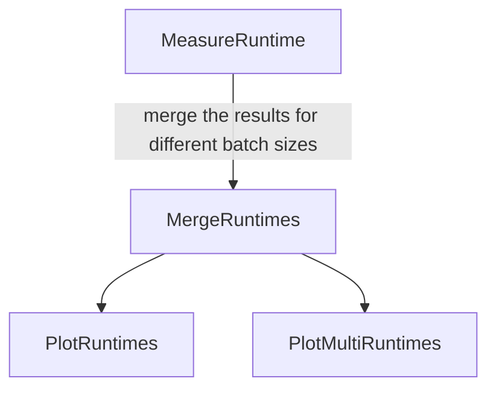

# MLProf: Orchestration tool for ML-profiling at CMS
---

## Introduction

In order to facilitate the development of new ML models for production in CMSSW, it is of primordial importance to simplify the measurement of the resource consumption of ML models in CMSSW.

[MLProf](https://github.com/cms-ml/MLProf) is a tool for automated ML model performance tests in CMSSW (CMSSW version 13 and above).
It allows users to easily test the runtime of their models with different inference engines and CMSSW versions by providing the graphs or SavedModels they want to profile and filling the corresponding yaml file with model/compilation informations.
Supported inference engines and their requirements are:

- TensorFlow: needs the frozen graph of the trained model in .pb format and the model information in yaml format.
- ONNX: needs the graph of the trained model in .onnx format and the model information in yaml format.
- AOT-compiled TensorFlow model: needs the SavedModel directory created with TensorFlow and the model as well as compilation information for CMSSW in yaml format.

MLProf uses the C++ `<chrono>` library for runtime measurements.

As of today, MLProf can feed the models to be tested different inputs during the measurements, but not custom preprocessed ones.
MLProf aims at providing a C++ plugin for custom preprocessing of the inputs in the future.
MLProf also aims at allowing different memory measurements using [IgProf](https://igprof.org/) in the future.


## Quickstart

To setup this tool, start by cloning the repository on your lxplus node, then install the required venv using the command:

```shell
source setup.sh
```

This command is also used to activate your venv at the start of each new bash session.

To check the setup and create a basic plot with this tool on an already existing graph, you may run the task [PlotRuntimes](#plotruntimes) with a simple call:

```shell
law run PlotRuntimes --version test_mlprof
```


### Law introduction

??? hint "Click to expand"

    As you can already see from the Quickstart section, this tool uses [law](https://github.com/riga/law) for the orchestration.
    Therefore, a short introduction to the most essential functions of law you should be aware of when using this tool is provided here.
    More informations are available for example in the "[Examples](https://github.com/riga/law#examples)" section of this [Github repository](https://github.com/riga/law).
    This section can be ignored if you are already familiar with law.

    In [law](https://github.com/riga/law), tasks are defined and separated by purpose and may have dependencies to each other.
    As an example, MLProf defines a task for the runtime measurement of a network for several batch sizes and a different task to make a plot of these data.
    The plotting task requires the runtime measurement task to have already run, in order to have data to plot.
    This is checked by the presence or absence of the corresponding output file from the required task.
    If the required file is not present, the required task will be automatically started with the corresponding parameters before the called task.

    The tree of runtime tasks in MLPROF is:

    ```mermaid
    flowchart TD
        A[MeasureRuntime]
        A --> |merge the results for different batch sizes| B[MergeRuntimes]
        B --> C[PlotRuntimes]
        B --> D[PlotMultiRuntimes]
    ```

    A task is run with the command `law run` followed by the name of the task.
    A version, given by the argument `--version`, followed by the name of the version, is required.
    Each `version` has its own set of outputs for the different existing tasks.

    In law, the intermediate results (=the outputs to the different tasks) are saved locally in the corresponding directory (default path in MLPROF is ```data/name_of_the_task/CMSSW_architecture/model_identifier_with_run_parameters/name_of_the_version/```).
    Hence the name of the version should be selected to match your purpose, for example `--version convolutional_nn_for_b_tagging`.

    Tasks in law are organized as a graph with dependencies.
    Therefore a "depth" for the different required tasks exists, depending on which task required which other task.
    In order to see the different required tasks for a single task, you might use the argument `--print-status -1`, which will show all required tasks and the existence or absence of their output for the given input parameters up to depth "-1", hence the deepest one.
    The called task with `law run` will have depth 0.
    You might check the output path of a task with the argument `--print-output`, followed by the depth of the task.
    If you want a finished task to be run anew without changing the version (e.g. do a new runtime measurement with a new training of the same original network), you might remove the previous outputs with the `--remove-output` argument, followed by the depth up to which to remove the outputs.
    There are three removal modes:
    - `a` (all: remove all outputs of the different tasks up to the given depth),
    - `i` (interactive: prompt a selection of the tasks to remove up to the given depth)
    - `d` (dry: show which files might be deleted with the same selection options, but do not remove the outputs).

    The `--remove-output` argument does not allow the depth "-1", check the task tree with `--print-output` before selecting the depth you want.
    The removal mode can be already selected in the command, e.g. with `--remove-output 1,a` (remove all outputs up to depth 1).

    Once the output has been removed, it is possible to run the task again.
    It is also possible to rerun the task in the same command as the removal by adding the `y` argument at the end.
    Therefore, removing all outputs of a selected task (but not its dependencies) and running it again at once would correspond to the following command:

    ```shell
    law run name_of_the_task --version name_of_the_version --remove-output 0,a,y
    ```

    An example command to see the location of the plot from this tool using only law functions and the default arguments for the tasks would be:

    ```shell
    law run PlotRuntimes --version test_mlprof --print-output 0
    ```


## Model file in YAML format


[MLProf](https://github.com/cms-ml/MLProf) can provide measurements for three inference tools already implemented in CMSSW.
For an inference in tensorflow, a frozen graph  of the model to be tested is needed (in .pb-format, created for example with [cmsml.tensorflow.save_graph](https://cmsml.readthedocs.io/en/latest/api/tensorflow.html#cmsml.tensorflow.save_graph)).
For an inference in ONNX, the .onnx file of the model to be tested is needed.
For an inference in AOT, the model will be compiled using the [CMSSW-AOT tool](https://cms-ml.github.io/documentation/inference/tensorflow_aot.html), therefore a saved_model, for example created with [tf.saved_model.save](https://www.tensorflow.org/api_docs/python/tf/saved_model/save), is needed.


In MLProf, the parameters of the models to be tested are to be given to a config file in .yaml format.
Depending on the inference tool to be used, there are two possible formats for the model file.
If tensorflow or onnx is to be used as inference engine, the yaml file should be in the following format:

```yaml
model:
  name: optional_default_name_of_the_network_for_the_storage_path
  label: optional default label of the network for the plots
  version: optional_version_number # (e.g. "1.0.0")
  inference_engine: name_of_inference_engine  # (either "tf" or "onnx")
  file: path_to_your_pb_or_onnx_model_file
  inputs:
    - name: name_input_layer_1
      shape: [size_dimension_1, size_dimension_2, ...]
    - name: name_input_layer_2
      shape: [size_dimension_1, size_dimension_2, ...]
    ...
  outputs:
    - name: name_of_the_output_layer_1
    - name: name_of_the_output_layer_2
    ...
```

For a model to be compiled in AOT, the parameters for the compilation in CMSSW are needed.
Therefore, for each model-file with tfaot as inference engine, CMSSW will be compiled anew, with the corresponding AOT-compilation parameters.
On the other hand, the inputs and outputs will be taken from the saved model and are therefore not needed.
Hence, the yaml file should be in the following format:

```yaml
model:
  name: optional_default_name_of_the_network_for_the_storage_path
  label: optional default label of the network for the plots
  version: version_number  # (e.g. "1.0.0")
  inference_engine: tfaot
  saved_model: path_to_your_saved_model_directory
  serving_key: serving_default  # key of model to take from saved_model drectory

compilation:  # defines the way the saved_model should be compiled in CMSSW, only for AOT models, arguments from CMSSW
  batch_sizes: [batch_size_1, batch_size_2, ...]  # the batch sizes for which the model is compiled
  tf_xla_flags: []  # flags for the conversion to XLA
  xla_flags: []  # flags for the optimization in XLA

```

More information on AOT-compilation and the compilation parameters can be found in the [cms-ml AOT documentation](https://cms-ml.github.io/documentation/inference/tensorflow_aot.html).

A few examples of such configs with working paths for the networks can be found in the "[examples](https://github.com/cms-ml/MLProf/tree/master/examples)" folder, along with the python scripts to create and save these models.

## AOT models

While the inference on graphs (done for TensorFlow and ONNX models) is fairly easily understandable conceptually, as it consists of running the MLProf Plugin for a compiled CMSSW version, the whole mechanism is much more complicated for AOT-compiled model.
AOT-compiled models are directly compiled within CMSSW.
Therefore, a new instance of CMSSW with the corresponding compiled models must be created and compiled for each `model-file`.
The compilation parameters are given through the `compilation` key in the model-file, as shown in [Model file in YAML format](#model-file-in-yaml-format).

The automatized procedure to run an AOT-compiled model with an MLProf Plugin is as follows:

- First, the SavedModel is pre-compiled in CMSSW (available from CMSSW_14_1_0_pre3 on).
- Then, a script modifies the MLProf AOT Plugin such that the plugin is adapted to the compiled model.
- CMSSW is then compiled with the modified MLProf AOT Plugin and the corresponding models.
- Finally, the inference can run on the compiled models using the MLProf AOT Plugin.

Or shown as graphs:

- inference on graphs:


- inference with AOT-compilation:


All these steps are done in the backgrounds, so the user only needs to provide the model-file and start a meassurement for this to happen.

It is possible to test the AOT models with different batch sizes than the ones they were compiled with in CMSSW, using stitching and padding.
The default behaviour for this procedure is described in the [cms-ml AOT documentation](https://cms-ml.github.io/documentation/inference/tensorflow_aot.html#default-rules-and-optimization).
Users can also define with compiled models should be stitched together/padded for the inference by using the `--tfaot-batch-rules` parameter described below.


## Runtime measurement

The dependency graph for the runtime measurement looks as follows:



It is composed of three major types of tasks:

1. [MeasureRuntime](#measureruntime): This task runs the network as many times as demanded in the arguments for a single batch size and outputs a .csv file with the results of the timing measurements. The parameters from the model-file and the given arguments are parsed to the cmssw environment using the template configs in the repository.

2. [MergeRuntimes](#mergeruntimes): This task merges the .csv output files with the required multiple batch sizes from the [MeasureRuntime](#measureruntime) tasks to obtain a single .csv file containing the informations to plot.

3. [PlotRuntimes](#plotruntimes), [PlotMultiRuntimes](#plotmultiruntimes): These tasks create the plots with the values stored in the .csv file from [MergeRuntimes](#mergeruntimes).

Calling the [PlotRuntimes](#plotruntimes) task triggers the whole pipeline with the correct arguments.

The way to give the necessary informations about your model to MLProf is by using a yaml file.
Its structure is presented below in [Model file in yaml format](#model-file-in-yaml-format).


## MeasureRuntime

Task to provide the time measurements of the inference of a network in CMSSW, given the input parameters, the model-file and a single batch size.
The batch size and the (```n-calls * n-events```) measured values in milliseconds are saved in csv format.
For AOT-compiled models, the `--tfaot-batch-rules` parameter allows to choose which compiled models are to be used to compose the batch size to be measured.

### Parameters:

??? hint "Click to expand"

    - batch-size: int. the batch size to measure the runtime for. default: `1`.

    - model-file: str. The absolute path of the yaml file containing the informations of the model to be tested. default: `$MLP_BASE/examples/dnn/model_tf_l10u128.yaml`.

    - model-name: str. When set, use this name for the path used when storing outputs instead of a hashed version of `--model-file`. default: empty.

    - model-label: str. When set, use this string for the model label in the plots from the plotting tasks. When empty, the `label` field in the model yaml data is used when existing, else the `name` field in the model yaml data is used when existing and model-name otherwise. default: empty.

    - n-events: int. The number of events to read from each input file for averaging measurements. default: `1`.

    - n-calls: int. The number of calls to be performed per evaluation for averaging. default: `100`.

    - input-data: str. Define the kind of inputs used during the measurement, either 'random', 'incremental', 'zeros', 'ones', or a path to a root file. default: random

    - cmssw-version: str. The CMSSW version used for the inference. default: `CMSSW_14_1_0_pre4`.

    - scram-arch: str. The SCRAM architecture used for the inference. default: `el9_amd64_gcc12`.

    - tfaot-batch-rules: str. The dash-separated batch rules used for the inference on tfaot models with each being in the format `target_size:size_1,size_2,...`. default: empty

### Output:
- `runtime_bs_{batch-size}.csv`: The batch size and measured values of the runtime
for each repetition and event.

### Example:

```shell
law run MeasureRuntime --version test_simple_dnn \
                       --model-file $MLP_BASE/examples/dnn/model_tf_l10u128.yaml \
                       --model-name dnn \
                       --n-calls 500 \
                       --cmssw-version CMSSW_14_1_0_pre4 \
                       --batch-size 1
```

AOT model:

```shell
law run MeasureRuntime --version test_aot_model \
                       --model-file $MLP_BASE/examples/dnn/model_tfaot_l10u128.yaml \
                       --model-name AOT_dnn \
                       --n-calls 500 \
                       --cmssw-version CMSSW_14_1_0_pre4 \
                       --batch-size 1
```

AOT model with different batch sizes for compilation and inference, without using default behaviour:

```shell
law run MeasureRuntime --version test_aot_model \
                       --model-file $MLP_BASE/examples/dnn/model_tfaot_l10u256_bs.yaml \
                       --model-name AOT_dnn \
                       --n-calls 500 \
                       --cmssw-version CMSSW_14_1_0_pre4 \
                       --batch-size 15 \
                       --tfaot-batch-rules "15:1,2,1,1,2,8"
```


## MergeRuntimes

This task merges the .csv output files with the required multiple batch sizes from the different occurences of the `MeasureRuntime` task to obtain a single .csv file containing the informations to plot.

### Requires:
- The .csv files from the several occurences of `MeasureRuntime` (one for each batch size).

### Parameters:

??? hint "Click to expand"

    - batch-sizes: int. The comma-separated list of batch sizes to be tested; default: `1,2,4`.

    - model-file: str. The absolute path of the yaml file containing the informations of the model to be tested. default: `$MLP_BASE/examples/dnn/model_tf_l10u128.yaml`.

    - model-name: str. When set, use this name for the path used when storing outputs instead of a hashed version of `--model-file`. default: empty.

    - model-label: str. When set, use this string for the model label in the plots from the plotting tasks. When empty, the `label` field in the model yaml data is used when existing, else the `name` field in the model yaml data is used when existing, and model-name otherwise. default: empty.

    - n-events: int. The number of events to read from each input file for averaging measurements. default: `1`.

    - n-calls: int. The number of calls to be performed per evaluation for averaging. default: `100`.

    - input-data: str. Define the kind of inputs used during the measurement, either 'random', 'incremental', 'zeros', 'ones', or a path to a root file. default: random

    - cmssw-version: str. The CMSSW version used for the inference. default: `CMSSW_14_1_0_pre4`

    - scram-arch: str. The SCRAM architecture used for the inference. default: `el9_amd64_gcc12`

    - tfaot-batch-rules: str. The dash-separated batch rules used for the inference on tfaot models with each being in the format `target_size:size_1,size_2,...`. default: empty

### Output:
- `runtimes_bs_{batch_size_1}_{batch_size_2}_{...}.csv`: The batch size and measured values of the runtime for each repetition and event in the several measurements.

### Example:

```shell
law run MergeRuntimes --version test_simple_dnn \
                      --model-file $MLP_BASE/examples/dnn/model_tf_l10u128.yaml \
                      --model-name dnn \
                      --n-calls 500 \
                      --cmssw-version CMSSW_14_1_0_pre4 \
                      --batch-sizes 1,2,4,8,16,32,64,128,256,512,1024
```

## PlotRuntimes

This task plots the results of the runtime measurement against the given batch sizes.
The points are given by the median of the data series and the boundaries of the uncertainty bands are given by the 16 and 84 percentiles of the data series (Therefore the uncertainty band contains 68% of the data points, which corresponds to a $1\sigma$ uncertainty for gaussian uncertainties).
The number of inferences behind one plotted data point is given by `n-events * n-calls`.

### Requires:
- The .csv file from the `MergeRuntimes` task.

### Parameters:

??? hint "Click to expand"

    - y-log: bool. Plot the y-axis values logarithmically; default: `False`.

    - x-log: bool. Plot the x-axis values logarithmically; default: `False`.

    - y-min: float. Minimum y-axis value. default: empty

    - y-max: float. Maximum y-axis value. default: empty

    - bs-normalized: bool. Normalize the measured values with the batch size before plotting; default: `True`.

    - error-style: str. Style of errors / uncertainties due to averaging; choices: `bars`,`band`; default: `band`.

    - top-right-label: str. When set, stick this string as label over the top right corner of the plot. default: empty.

    - batch-sizes: int. The comma-separated list of batch sizes to be tested; default: `1,2,4`.

    - model-file: str. The absolute path of the yaml file containing the informations of the model to be tested. default: `$MLP_BASE/examples/dnn/model_tf_l10u128.yaml`.

    - model-name: str. When set, use this name for the path used when storing outputs instead of a hashed version of `--model-file`. default: empty.

    - model-label: str. When set, use this string for the model label in the plots from the plotting tasks. When empty, the `label` field in the model yaml data is used when existing, else the `name` field in the model yaml data is used when existing, and model-name otherwise. default: empty.

    - n-events: int. The number of events to read from each input file for averaging measurements. default: `1`.

    - n-calls: int. The number of calls to be performed per evaluation for averaging. default: `100`.

    - input-data: str. Define the kind of inputs used during the measurement, either 'random', 'incremental', 'zeros', 'ones', or a path to a root file. default: random

    - cmssw-version: str. The CMSSW version used for the inference. default: `CMSSW_14_1_0_pre4`

    - scram-arch: str. The SCRAM architecture used for the inference. default: `el9_amd64_gcc12`

    - file_types: str. Comma-separated types of the output plot files. default: "pdf".

    - plot_postfix: str. An arbitrary postfix that is added with two underscores to all paths of produced plots. default: empty.

    - view_cmd: str. A command to execute after the task has run to visualize plots right in the terminal (e.g. "imgcat" if installed). default: empty.

    - tfaot-batch-rules: str. The dash-separated batch rules used for the inference on tfaot models with each being in the format `target_size:size_1,size_2,...`. default: empty


### Output:
- `runtimes_bs_{batch_size_1}_{batch_size_2}_{...}.pdf`: The plot of the runtime measurement against the different batch sizes given.

### Example:

```shell
law run PlotRuntimes --version test_simple_dnn \
                     --model-file $MLP_BASE/examples/dnn/model_tf_l10u128.yaml \
                     --model-name dnn \
                     --model-label "dnn with CMSSW_14_1_0_pre4" \
                     --n-calls 500 \
                     --cmssw-version CMSSW_14_1_0_pre4 \
                     --batch-sizes 1,2,4,8,16,32,64,128,256,512,1024 \
                     --y-log False \
                     --bs-normalized True
```

AOT model:

```shell
law run MeasureRuntime --version test_aot_model \
                       --model-file $MLP_BASE/examples/dnn/model_tfaot_l10u256_bs.yaml \
                       --model-name AOT_dnn \
                       --n-calls 500 \
                       --cmssw-version CMSSW_14_1_0_pre4 \
                       --batch-sizes 1,2,4,8,16\
                       --y-log False \
                       --bs-normalized True \
                       --tfaot-batch-rules "1:1-2:2-4:1,1,2-8:2,2,2,2-16:1,1,1,1,2,2,2,2,2,2"
```

## PlotMultiRuntimes

This task plots the results of the runtime measurement against the given batch sizes for several values of the given parameters.
The model-files argument is required and replaces the module-file argument.
The cmssw-versions argument replaces the cmssw-version arguments, but both have the same default.
The scram-archs argument replaces the scram-arch argument, but both have the same default.
These arguments accept brace expansions, see below in the Example subsection.
The model-names and model-labels arguments replace repectively the model-name and model-label arguments and are empty by default.
The points are given by the median of the data series and the boundaries of the uncertainty bands are given by the 16 and 84 percentiles of the data series (Therefore the uncertainty band contains 68% of the data points, which corresponds to a $1\sigma$ uncertainty for gaussian uncertainties).
The number of inferences behind one plotted data point is given by `n-events * n-calls`.

### Requires:
- The .csv files from the `MergeRuntimes` task.

### Parameters:

??? hint "Click to expand"

    - model-files: str. The comma-separated list of the absolute paths of the yaml files containing the informations of the model to be tested. No default value.

    - cmssw-versions: str. The comma-separated list of CMSSW versions used for the inference. default: `CMSSW_14_1_0_pre4`

    - scram-archs: str. The comma-separated list of SCRAM architectures used for the inference. default: `el9_amd64_gcc12`

    - model-names: str. The comma-separated list of model names. When set, use these names for the path used when storing outputs instead of a hashed version of `--model-file`. default: empty.

    - model-labels: str. The comma-separated list of model labels. When set, use these strings for the model labels in the plots from the plotting tasks. When empty, the `label` fields in the models yaml data are used when existing, else the `name` fields in the models yaml data are used when existing, and model-names otherwise. default: empty.

    - y-log: bool. Plot the y-axis values logarithmically; default: `False`.

    - x-log: bool. Plot the x-axis values logarithmically; default: `False`.

    - y-min: float. Minimum y-axis value. default: empty

    - y-max: float. Maximum y-axis value. default: empty

    - bs-normalized: bool. Normalize the measured values with the batch size before plotting; default: `True`.

    - error-style: str. Style of errors / uncertainties due to averaging; choices: `bars`,`band`; default: `band`.

    - top-right-label: str. When set, stick this string as label over the top right corner of the plot. default: empty.

    - batch-sizes: int. The comma-separated list of batch sizes to be tested; default: `1,2,4`.

    - n-events: int. The number of events to read from each input file for averaging measurements. default: `1`

    - n-calls: int. The number of calls to be performed per evaluation for averaging. default: `100`

    - input-data: str. Define the kind of inputs used during the measurement, either 'random', 'incremental', 'zeros', 'ones', or a path to a root file. default: random.

    - file_types: str. Comma-separated types of the output plot files. default: "pdf".

    - plot_postfix: str. An arbitrary postfix that is added with two underscores to all paths of produced plots. default: empty.

    - view_cmd: str. A command to execute after the task has run to visualize plots right in the terminal (e.g. "imgcat" if installed). default: empty.

### Output:
- `runtimes_{param_1}_{param_2}_{...}_bs_{batch_size_1}_{batch_size_2}_{...}.pdf`: The plot of the runtime measurements against the different batch sizes given.

### Example:

```shell
law run PlotMultiRuntimes --version test_several_networks \
                          --model-files $MLP_BASE/examples/dnn/model_tf_l10u128.yaml,$MLP_BASE/examples/dnn/model_onnx_l10u128.yaml\
                          --model-names "dnn","dnn_onnx"\
                          --model-labels "dnn","dnn onnx"\
                          --cmssw-versions CMSSW_13_3_1,CMSSW_13_2_4 \
                          --n-calls 500 \
                          --batch-sizes 1,2,4,8,16,32,64,128,256,512,1024 \
                          --y-log False \
                          --bs-normalized True \
                          --top-right-label "$\sqrt{s}=13.6$ TeV"
```

equivalent to the brace expanded version:

```shell
law run PlotMultiRuntimes --version test_several_networks \
                          --model-files "$MLP_BASE/examples/dnn/model_{tf,onnx}_l10u128.yaml"\
                          --model-names "dnn","dnn_onnx"\
                          --model-labels "dnn","dnn onnx"\
                          --cmssw-versions "CMSSW_13_{3_1,2_4}" \
                          --n-calls 500 \
                          --batch-sizes 1,2,4,8,16,32,64,128,256,512,1024 \
                          --y-log False \
                          --bs-normalized True \
                          --top-right-label "$\sqrt{s}=13.6$ TeV"
```

## Example with result

To show what you might expect when running these tasks, an example command and the resulting plot are shown below:

```shell
law run PlotMultiRuntimes  --version test_several_networks \
                           --model-files "$MLP_BASE/examples/dnn/model_{tf,tfaot,onnx}_l10u256.yaml" \
                           --cmssw-versions CMSSW_14_1_0_pre3 \
                           --batch-sizes 1,2,4,8,16 \
                           --y-log False \
                           --bs-normalized True \
                           --top-right-label "$\sqrt{s}=13.6$ TeV"
```


For this plot, the network architecture has been used three times in the same CMSSW environment: Once as a TensorFlow frozen graph, once converted to ONNX and once compiled with AOT-compilation for TensorFlow.
This plot shows that, as expected, ONNX performs slightly better than TensorFlow for small batch sizes.
Additionally, this AOT-compiled model performs better than the ONNX model for the batch size 1, which is the main use case for production in CMSSW.
Therefore, for this very simple model, the AOT-compiled version is to be recommended.
