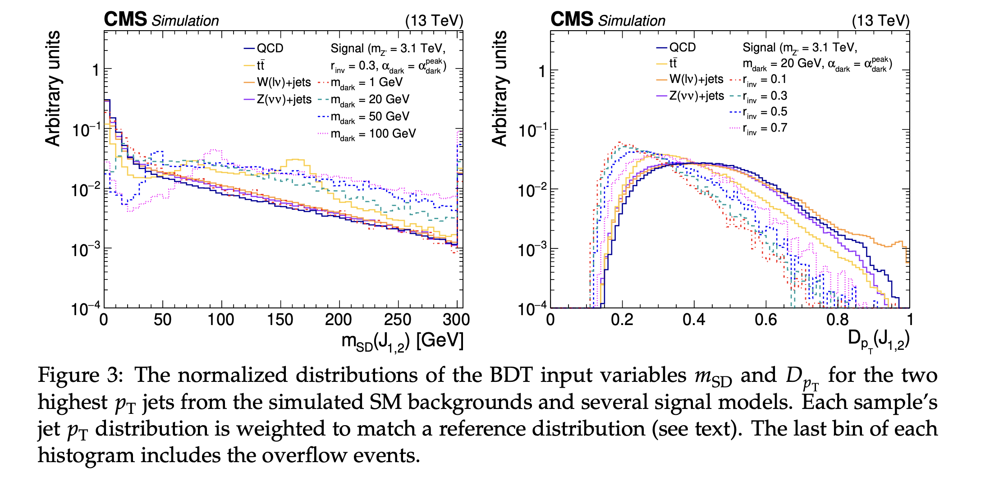
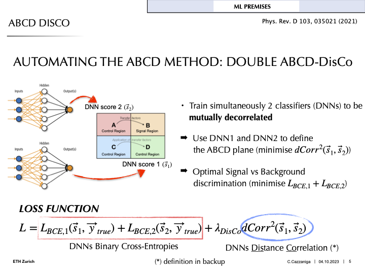
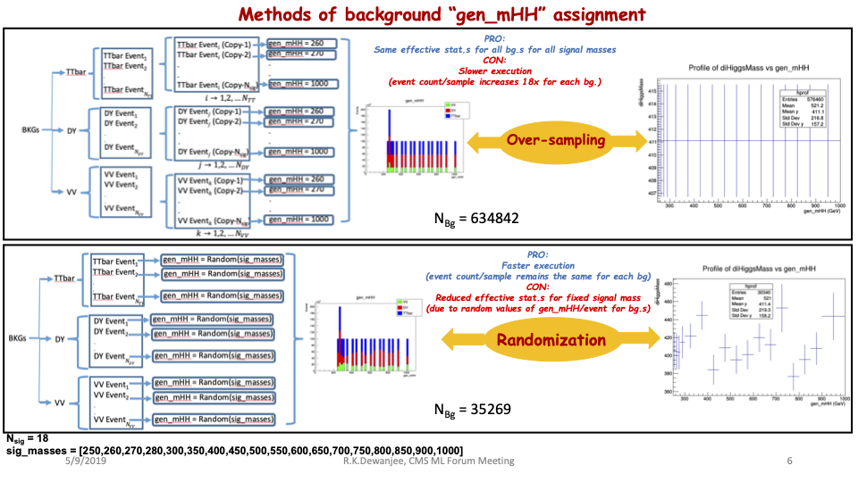

# Decorrelation
When preparing to train a machine learning algorithm, it is important to think about the correlations of the output and their impact on how the trained model is used.
Generally, the goal of any training is to maximize correlations with variables of interests.
For example, a classifier is trained specifically to be highly correlated with the classification categories. 
However, there is often another set of variables that high correlation with the ML algorithm's output is not desirable and could make the ML algorithm useless regardless of its overall performance.

There are numerous methods that achieve the goal of minimizing correlations of ML algorithms.
Choosing the correct decorrelation method depends on the situation, e.g., which ML algorithm is being used and the type of the undesirable variables. 
Below, we detail various methods for common scenarios focusing on BDT (boosted decision tree) and neural network algorithms. 

## Impartial Training Data
Generally, the best method for making a neural network's or BDT's output independent of some known variable is to remove any bias in the training dataset, which is commonly done by adding or removing information.

### Adding Information
- Training on a mix of signals with different masses can help prevent the BDT from learning the mass.

### Removing Information
- If you have any input variables that are highly correlated with the mass, you may want to omit them. There may be a loss of raw discrimination power with this approach, but the underlying interpretation will be more sound.

## Reweighting
- One method to achieve correlation by weighting data is reweighting the network's input samples to match a reference distribution. Examples input variables include mass, or an input to invariant mass, like the $p_T$. This method is distinct from flattening the data since it is weighted to match a target distribution rather than a flat distribution. Flattening can also require very large weights that could potentially affect training. This is one way to avoid having the network sculpt, or learn, a certain kinematic quantity, like the background mass. An example of this technique is given in [EXO-19-020](https://arxiv.org/abs/2112.11125).
    - This is what is done for the ImageTop tagger and ParticleNet group of taggers.

BDT scores from EXO-10-020 where the jet $p_T$ distribution is reweighted to match a reference distribution for each sample.

## Adversarial Approach
Adversarial approaches to decorrelation revolve around including a penalty, or regularization, term in the loss function in training. The loss function can be modified to enforce uniformity in the variable of interest (i.e. mass). Check out these links ([1](https://arxiv.org/abs/1410.4140), [2](https://github.com/arogozhnikov/hep_ml), [3](https://github.com/arogozhnikov/hep_ml/blob/master/notebooks/BoostingToUniformity.ipynb)) for some examples of this. One way to technically implement this type of approach is using the "flatness loss function" (i.e. [BinFlatnessLossFunction](https://arogozhnikov.github.io/hep_ml/losses.html?highlight=binflatnesslossfunction#hep_ml.losses.BinFlatnessLossFunction) in the hep-ml package). This type of decorrelation what is done for the DeepAK8-MD taggers.

Another type of regularization one can do to acheive decorrelation is penalizing the loss function on a certain type of correlation, for example distance. In the seminal distance correlation in HEP-ML paper (([DisCo Fever: Robust Networks Through Distance Correlation](https://arxiv.org/pdf/2001.05310.pdf))), distance is in this case is defined as distance correlation (DisCo), a measure derived from distance covariance, first introduced [here](https://projecteuclid.org/journals/annals-of-applied-statistics/volume-3/issue-4/Brownian-distance-covariance/10.1214/09-AOAS312.full). This distance correlation function calculates the non-linear correlation between the NN output and some variables that you care about, e.g. jet mass, that you can force the network to minimize which decorrelates the two variables by including it as a penalty term in the loss function. An extension of this can be found in the Double-DisCo method, given below, which highlights the distance correlation term in the loss function at the bottom.

Source: [ABCD Disco with MDMM](https://indico.cern.ch/event/1330198/contributions/5599632/attachments/2727547/4740694/presentation_MLForum.pdf) (ML Forum)
Many thanks to Kevin Pedro for his input on this section and the previous one.

## Parametric Cut
When designing jet taggers, variables of interest for discriminators include N-subjettiness derived quantities. Often, these quantities will be correlated with, for example, the $p_T$ of the jet. One example of this type of correlation is called "mass scuplting" and happens when the distribution of the discriminating variable in background begins to exhibit a shape similar to that of the signal with successive cuts. This correlation can have confounding effects in the tagger and one way to remove these effects is to parametrically cut on the discriminant. 

One such prescription to remove these correlations is described [here](https://arxiv.org/abs/1603.00027) and focuses on removing the $p_T$ dependence in the soft-drop mass variable $\rho$. The authors note that there is a $p_T$ dependence in the N-subjettiness ratio $\tau_2/\tau_1$ as a function of the QCD jet scaling (soft-drop) variable, defined as $\rho = log(m^2)(p_T^2)$, which leads to mass sculpting. In order to alleviate this issue, the authors introduce a modified version of the soft-drop variable, $\rho' = \rho + log(p_T/\mu)$ where $\mu$ is chosen to be 1 GeV. It can also be noted that there is a linear depedence between $\tau_2/\tau_1$ and $\rho'$. Here, the authors remedy this by modelling the linear depedence with $\tau_{21}' + \tau_2/\tau_1 - M \times \rho'$ where $M$ is fit from the data. Applying both these transformations flattens out the relationship between the ratio and the soft-drop variable and removes the mass sculpting effects. It is imperative that the transformation between variables are smooth, as discontinuous functions may lead to artificial features in the data.

## Methods for mass parameterized BDTs
Finally, when using a BDT that is parameterized by a mass quantity of interest, the output can be decorrelated from that mass by three different methods: randomization, oversampling, and variable profiling. Randomization entails randomly pairing a mass quanitity to a background training event so the BDT does not learn any meaningful associations between the mass and the output. For oversampling, this is a bootstrapping method where every input background event is paired with a potential mass point so the effective statistics for all the mass points are the same. Finally, variable profiling has the user profile each BDT input as a function of the mass quantity of interest. Examples of each of these methods is given below in the context of a di-higgs search.

A di-higgs multilepton search (HIG-21-002) made use of a BDT for signal discrimination, parameterized by the di-higgs invariant mass. In order to avoid correlations in the BDT output and invariant mass of the di-higgs system, they looked at decorrelation via randomization, oversampling, and variable profiling. All of the methods utilized a (more or less) 50/50 dataset train/test split where one iteration of the BDT was trained on "even" numbered events and the datacards were produced with the "odd" numbered events. This procedure was repeated for the opposite configuration. Then, to deteremine if the BDT was correctly interpolating the signal masses, one mass point was omitted from training and the results of this BDT were compared to a BDT trained on only this single, omitted mass point. For each train/test configuration (even/odd or odd/even), the BDT's performance gain, as well as loss, were evaluated with ROC curves with two ommitted mass points (done separately).

In the randomization method, a generator-level di-higgs invariant mass was randomly assigned to each background event the BDT was trained on. For the oversampling method, every signal mass point was assigned to a duplicate of each background event. Obviously the oversampling method leads to slower execution but the same effective statistics for all backgrounds and each signal mass. Conversely, the randomization approach is quicker, but leads to reduced effective statistics. Lastly, to improve performance over lower signal masses, each BDT input variable was profiled as a function of $m_{HH}$. This profile was fit with a polynomial function, and then each point in the input distribution is divided by the fit function value. This corrected ratio is used as the new input to the BDT. The authors also found that splitting the BDT training into high and low mass regions helped.

In the end, oversampling, especially when combined with input variable corrections, provided a sizable performance gain (5.6%) over the randomization method. This gain is determined from ROC curves made for each training iteration (even/odd or odd/event) and each method. The performance loss is also a 5% improvement over the randomization method. 

For more information on these methods, see the HIG-21-002 [ML forum presentation](https://indico.cern.ch/event/818774/contributions/3420466/attachments/1840727/3019731/ML_Forum_talk_May8_2019.pdf)).

Source: HIG-21-002 ML forum presentation

So far we have seen decorrelation achieved by using inputs that are decorrelated for the classifier and regularizing the output to penalize learning correlations. Another approach can be to learn decorrelation by maximizing performance metrics that more closely align with the sensitivity of the analysis, like in [this paper](https://link.springer.com/article/10.1007/JHEP03(2021)291) and their corresponding Python-based package, [ThickBrick](https://prasanthcakewalk.gitlab.io/thickbrick/). In this case, the authors study the dependence of the event selection threshold on the signal purity in a given bin of the distribution of an observable. They demonstrate that the threshold increases with signal purity, "implying that the threshold is stronger in the x-'bins' of higher purity." This parametric event selection threshold "naturally leads to decorrelation of the event selection criteria from the event variable x." The failure to incorporate the dependencies on observable distributions is framed as a misalignment between the ML-based selector and the sensitivity of the physics analysis. A demo of their package, ThickBrick, was given at [PyHEP2020](https://www.youtube.com/watch?v=rM19CoMNkfA).

