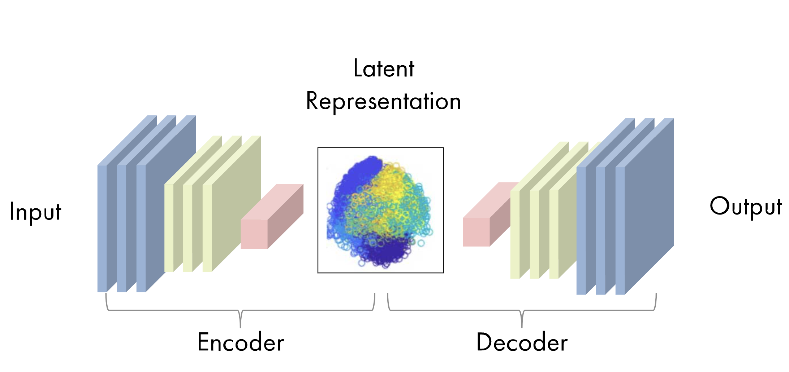

# Autoencoders

## Introduction
Autoencoders are a powerful tool that has gained popularity in HEP and beyond recently. These types of algorithms are neural networks that learn to decompress data with minimal reconstruction error ([Goodfellow, et. al.][1a]).

The idea of using neural networks for dimensionality reduction or feature learning dates back to the early 1990s. Autoencoders, or "autoassociative neural networks," were originally proposed as a nonlinear generalization of principle component analysis (PCA) ([Kramer][3a]). More recently, connections between autoencoders and latent variable models have brought these types of algorithms into the generative modeling space.

The two main parts of an autoencoder algorithm are the encoder function $f(x)$ and the decoder function $g(x)$. The learning process of an autoencoder is a minimization of a loss function, $L(x,g(f(x)))$, that compares the original data to the output of the decoder, similar to that of a neural network. As such, these algorithms can be trained using the same techniques, like minibatch gradient descent with backpropagation. Below is a representation of an autoencoder from Mathworks.

### Constrained Autoencoders (Undercomplete and Regularized)
*Information in this section can be found in [Goodfellow, et. al.][1a]*

An autoencoder that is able to perfectly reconstruct the original data one-to-one, such that $g(f(x)) = x$, is not very useful for extracting salient information from the data. There are several methods imposed on simple autoencoders to encourage them to extract useful aspects of the data.

One way of avoiding perfect data reconstruction is by constraining the dimension of the encoding function $f(x)$ to be less than the data $x$. These types of autoencoders are called *undercomplete autoencoders*, which force the imperfect copying of the data such that the encoding and decoding networks can prioritize the most useful aspects of the data. 

However, if undercomplete encoders are given too much capacity, they will struggle to learn anything of importance from the data. Similarly, this problem occurs in autoencoders with encoder dimensionality greater than or equal to the data (the overcomplete case). In order to train any architecture of AE successfully, constraints based on the complexity of the target distribution must be imposed, apart from small dimensionality. These *regularized autoencoders* can have constraints on  sparsity, robustness to noise, and robustness to changes in data (the derivative).

#### Sparse Autoencoders
Sparse autoencoders place a penalty to enforce sparsity in the encoding layer $\mathbf{h} = f(\mathbf{x})$ such that $L(\mathbf{x}, g(f(\mathbf{x}))) + \Omega(\mathbf{h})$. This penalty prevents the autoencoder from learning the identity transformation, extracting useful features of the data to be used in later tasks, such as classification. While the penalty term can be thought of as a regularizing term for a feedforward network, we can expand this view to think of the entire sparse autoencoder framework as approximating the maximum likelihood estimation of a generative model with latent variables $h$. When approximating the maximum likelihood, the joint distribution $p_{\text{model}}(\mathbf{x}, \mathbf{h})$ can be approximated as

$$
\text{log} [ p_{\text{model}}(\mathbf{x})] = \text{log} [p_{\text{model}}(\mathbf{h})] + [\text{log} p_{\text{model}}(\mathbf{x} | \mathbf{h})]
$$

where $p_{\text{model}}(\mathbf{h})$ is the prior distribution over the latent variables, instead of the model's parameters. Here, we approximate the sum over all possible prior distribution values to be a point estimate at one highly likely value of $\mathbf{h}$. This prior term is what introduces the sparsity requirement, for example with the Laplace prior,
$$
p_{\text{model}}(h_i) = \frac{\lambda}{2}e^{-\lambda|h_i|}.
$$

The log-prior is then

$$
\text{log} [p_{\text{model}}(\mathbf{h})] = \sum_i (\lambda|h_i| - \text{log}\frac{\lambda}{2}) = \Omega(\mathbf{h}) + \text{const}.
$$
This example demonstrates how the model's distribution over latent variables (prior) gives rise to a sparsity penalty.

#### Penalized Autoencoders
Similar to sparse autoencoders, a traditional penalty term can be introduced to the cost function to regularize the autoencoder, such that the function to minimize becomes
$$
L(\mathbf{x},g(f(\mathbf{x}))) + \Omega(\mathbf{h},\mathbf{x}).
$$
where 
$$
\Omega(\mathbf{h},\mathbf{x}) = \lambda\sum_i ||\nabla_{\mathbf{x}}h_i||^2.
$$
Because of the dependence on the gradient of the latent variables with respect to the input variables, if $\mathbf{x}$ changes slightly, the model is penalized for learning those slight variations. This type of regularization leads to a *contractive autoencoder* (CAE).

#### Denoising Autoencoders
Another way to encourage autoencoders to learn useful features of the data is training the algorithm to minimize a cost function that compares the original data ($\mathbf{x}$) to encoded and decoded data that has been injected with noise ($f(g(\mathbf{\tilde{x}}))$, 
$$
L(\mathbf{x},g(f(\mathbf{\tilde{x}})))
$$
Denoising autoencoders then must learn to undo the effect of the noise in the encoded/decoded data. The autoencoder is able to learn the structure of the probability density function of the data ($p_{\text{data}}$) as a function of the input variables ($x$) through this process ([Alain, Bengio][2a], [Bengio, et. al.][2b]). With this type of cost function, even overcomplete, high-capacity autoencoders can avoid learning the identity transformation.

## Variational Autoencoders
Variational autoencoders (VAEs), introduced by [Kigma and Welling][4a], are similar to normal AEs. They are comprised of neural nets, which maps the input to latent space (encoder) and back (decoder), where the latent space is a low-dimensional, variational distribution. VAEs are bidirectional, generating data or estimating distributions, and were initially designed for unsupervised learning but can also be very useful in semi-supervised and fully supervised scenarios ([Goodfellow, et. al.][1a]).

VAEs are trained by maximizing the variational lower bound associated with data point $\mathbf{x}$, which is a function of the approximate posterior (inference network, or encoder), $q(\mathbf{z})$. Latent variable $\mathbf{z}$ is drawn from this encoder distribution, with $p_\text{model}(\mathbf{x} | \mathbf{z})$ viewed as the decoder network. The variational lower bound (also called the evidence lower bound or ELBO) is a trade-off between the join log-likelihood of the visible and latent variables, and the KL divergence between the model prior and the approximate posterior, shown below ([Goodfellow, et. al.][1a]).

$$
\mathcal{L}(q) = E_{\mathbf{z} \sim q(\mathbf{z} | \mathbf{x})} \text{log}p_\text{model}(\mathbf{x} | \mathbf{z}) - D_\text{KL}(q || p)
$$.

Methods for optimizing the VAE by learning the variational lower bound include EM meta-algorithms like probabilistic PCA ([Goodfellow, et. al.][1a]).

<!--
- optimizes model parameters $\theta$ via *amoritzed inference* to reduce reconstruction error between input and output and to get approximate posterior as close as possible to real one
	- approximate posterior to avoid intractability
	- likelihood conditioned on latent variables is calculated by a probabilistic decoder and approximated posterior is calculated by probabilistic encoder
-->

## Applications in HEP
One of the more popular applications of AEs in HEP include anomaly detection. Because autoencoders are trained to learn latent features of a dataset, any new data that does not match those features could be classified as an anomaly and picked out by the AE. Examples of AEs for anomaly detection in HEP are listed below:

- [Anomaly detection in high-energy physics using a quantum autoencoder](https://arxiv.org/abs/2112.04958)
- [Particle Graph Autoencoders and Differentiable, Learned Energy Mover's Distance
](https://arxiv.org/abs/2111.12849)
- [Bump Hunting in Latent Space](https://arxiv.org/abs/2103.06595)

Another application of (V)AEs in HEP is data generation, as once the likelihood of the latent variables is approximated it can be used to generate new data. Examples of this application in HEP for simulation of various physics processes are listed below:

- [Deep generative models for fast shower simulation in ATLAS](http://cds.cern.ch/record/2630433)
- [Sparse Data Generation for Particle-Based Simulation of Hadronic Jets in the LHC
](https://arxiv.org/abs/2109.15197)
- [Variational Autoencoders for Jet Simulation
](https://arxiv.org/abs/2009.04842)
- [Anomaly detection using Deep Autoencoders for the assessment of the quality of the data acquired by the CMS experiment](https://cds.cern.ch/record/2650715/files/Fulltext.pdf)
- [Autoencoders on FPGAs for real-time, unsupervised new physics detection at 40 MHz
at the Large Hadron Collider](https://arxiv.org/pdf/2108.03986.pdf)

Finally, the latent space learned by (V)AEs give a parsimonious and information-rich phase space from which one can make inferences. Examples of using (V)AEs to learn approximate and/or compressed representations of data are given below:

- [An Exploration of Learnt Representations of W Jets](https://arxiv.org/abs/2109.10919)
- [Machine-Learning Compression for Particle Physics Discoveries](https://arxiv.org/abs/2210.11489)
- [Decoding Photons: Physics in the Latent Space of a BIB-AE Generative Network](https://arxiv.org/abs/2102.12491)

More examples of (V)AEs in HEP can be found at the [HEP ML Living Review](https://iml-wg.github.io/HEPML-LivingReview/).

<!--
## Tensorflow Example
-->

References
--
- [Goodfellow, et. al., 2016, *Deep Learning*][1a]
- [Alain, Bengio, 2013, "What Regularized Auto-Encoders Learn from the Data Generating Distribution"][2a]
- [Bengio, et. al., 2013, "Generalized Denoising Auto-Encoders as Generative Models"][2b]
- [Kramer, 1991, "Nonlinear principle component analysis using autoassociative neural networks"][3a]
- [Kingma, Welling, 2013, "Auto-Encoding Variational Bayes"][4a]

[1a]: https://www.deeplearningbook.org
[2a]: https://arxiv.org/abs/1211.4246
[2b]: https://arxiv.org/abs/1305.6663
[3a]: https://aiche.onlinelibrary.wiley.com/doi/10.1002/aic.690370209
[4a]: https://arxiv.org/abs/1312.6114

